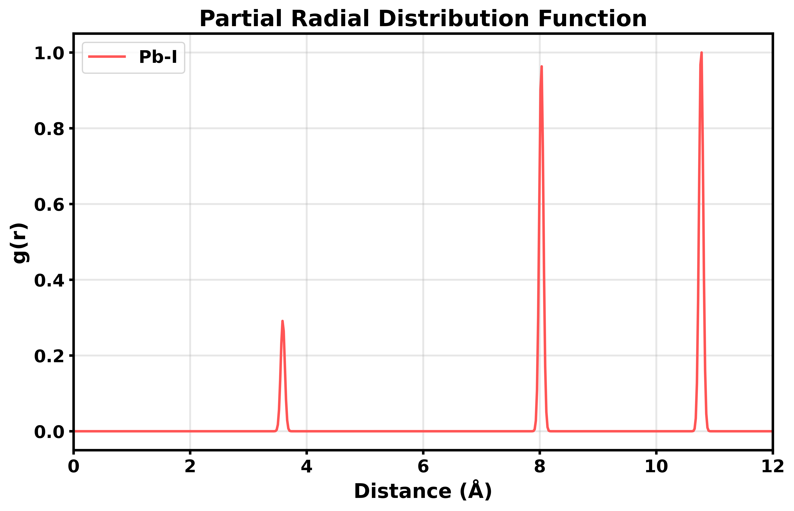
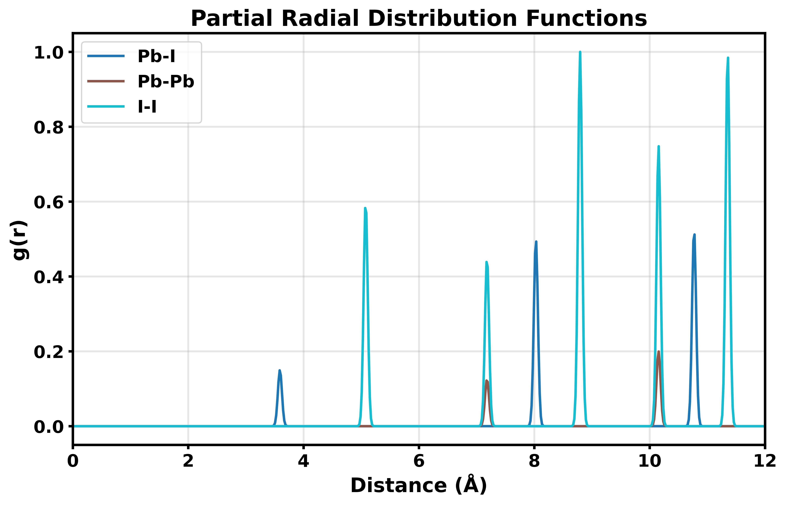

# 14. Radial Distribution Functions — pair correlations

Radial distribution functions (RDF) describe the probability of finding atom pairs at specific distances. The analyzer computes partial RDFs for element pairs, revealing local structure, coordination environments, and bonding distances.

## Basic Usage

Compute RDF for a single element pair:

```python
from q2D_Materials.analyzer import q2D_analyzer
from q2D_Materials.core.creator import q2D_creator

# Create and analyze structure
q2d = q2D_creator()
structure = q2d.create_structure(
    structure_type="monolayer",
    A_ions="MA", B_ions="Pb", X_ions="I",
    xy_expansion=(2, 2), template="cubic",
    thickness=2, vacuum=15.0,
)

analyzer = q2D_analyzer(structure)
analyzer.analyze()

# Compute RDF for Pb-I pairs
rdf = analyzer.get_partial_rdf([["Pb", "I"]])

# Access results
distances = rdf['Pb-I']['distances']  # Distance array (Å)
rdf_values = rdf['Pb-I']['rdf']       # RDF values
print(f"Pb-I RDF: {len(distances)} points")
print(f"First peak at: {distances[np.argmax(rdf_values[:100])]:.2f} Å")
```



## Multiple Element Pairs

Compute RDFs for multiple pairs simultaneously:

```python
# Multiple pairs
rdf = analyzer.get_partial_rdf([
    ["Pb", "I"],
    ["Pb", "Pb"],
    ["I", "I"]
])

# Access each pair
for pair_name, data in rdf.items():
    distances = data['distances']
    rdf_values = data['rdf']
    print(f"{pair_name} RDF: {len(distances)} points")
    print(f"  First peak: {distances[np.argmax(rdf_values[:100])]:.2f} Å")
```



## RDF Parameters

Control RDF computation with parameters:

```python
rdf = analyzer.get_partial_rdf(
    element_pairs=[["Pb", "I"]],
    max_dist=15.0,      # Maximum distance (Å)
    npoints=300,        # Number of grid points (optional)
    ss_norm=False       # Self-scattering normalization (optional)
)
```

**Parameter explanations:**

- `max_dist`: Maximum distance for RDF computation (default: 10.0 Å)
- `npoints`: Number of grid points. If `None`, automatically determined based on distance range
- `ss_norm`: Whether to apply structure-specific normalization (default: False)

## Interpreting RDF Results

RDF peaks indicate preferred distances:

```python
import numpy as np

rdf = analyzer.get_partial_rdf([["Pb", "I"]])

distances = rdf['Pb-I']['distances']
rdf_values = rdf['Pb-I']['rdf']

# Find first coordination shell (first major peak)
first_peak_idx = np.argmax(rdf_values[:200])  # Search first 200 points
first_peak_dist = distances[first_peak_idx]

print(f"First coordination shell: {first_peak_dist:.2f} Å")
print(f"Peak height: {rdf_values[first_peak_idx]:.2f}")

# Find all peaks above threshold
peak_threshold = np.max(rdf_values) * 0.3  # 30% of max
peaks = []
for i in range(1, len(rdf_values) - 1):
    if (rdf_values[i] > rdf_values[i-1] and 
        rdf_values[i] > rdf_values[i+1] and 
        rdf_values[i] > peak_threshold):
        peaks.append((distances[i], rdf_values[i]))

print(f"\nFound {len(peaks)} peaks:")
for dist, height in peaks[:5]:  # Show first 5
    print(f"  {dist:.2f} Å (height: {height:.2f})")
```

## Common Use Cases

### Bond Distance Analysis

```python
# Analyze Pb-I bond distances
rdf = analyzer.get_partial_rdf([["Pb", "I"]], max_dist=5.0)

distances = rdf['Pb-I']['distances']
rdf_values = rdf['Pb-I']['rdf']

# First peak is typically the bond distance
bond_distance = distances[np.argmax(rdf_values[:100])]
print(f"Pb-I bond distance: {bond_distance:.2f} Å")
```

### Coordination Environment

```python
# Analyze coordination by integrating RDF
rdf = analyzer.get_partial_rdf([["Pb", "I"]], max_dist=4.0)

distances = rdf['Pb-I']['distances']
rdf_values = rdf['Pb-I']['rdf']

# Integrate to first minimum (coordination number estimate)
first_min_idx = None
for i in range(50, len(rdf_values) - 1):
    if rdf_values[i] < rdf_values[i-1] and rdf_values[i] < rdf_values[i+1]:
        first_min_idx = i
        break

if first_min_idx:
    coordination_radius = distances[first_min_idx]
    print(f"Coordination shell radius: {coordination_radius:.2f} Å")
```

### Structure Comparison

```python
# Compare RDFs from different structures
rdf1 = analyzer1.get_partial_rdf([["Pb", "I"]])
rdf2 = analyzer2.get_partial_rdf([["Pb", "I"]])

# Compare first peak positions
peak1 = rdf1['Pb-I']['distances'][np.argmax(rdf1['Pb-I']['rdf'][:100])]
peak2 = rdf2['Pb-I']['distances'][np.argmax(rdf2['Pb-I']['rdf'][:100])]

print(f"Structure 1 first peak: {peak1:.2f} Å")
print(f"Structure 2 first peak: {peak2:.2f} Å")
print(f"Difference: {abs(peak1 - peak2):.2f} Å")
```

## Plotting RDFs

The analyzer provides RDF data that you can use to create custom plots:

```python
import matplotlib.pyplot as plt
import numpy as np

# Get RDF data (auto-detects B-X pairs if element_pairs is None)
rdf_data = analyzer.get_partial_rdf(max_dist=12.0)

# Create custom plot
fig, ax = plt.subplots(figsize=(10, 6))
colors = plt.cm.tab10(np.linspace(0, 1, len([k for k in rdf_data.keys() if k.endswith('_rdf')])))

idx = 0
for key in sorted(rdf_data.keys()):
    if key.endswith('_rdf'):
        pair_key = key.replace('_rdf', '')
        x_key = f"{pair_key}_x"
        if x_key in rdf_data:
            # Extract element pair from key (e.g., "PbI" -> "Pb-I")
            label = f"{pair_key[0]}-{pair_key[1]}" if len(pair_key) == 2 else pair_key
            ax.plot(rdf_data[x_key], rdf_data[key], 
                   label=label, color=colors[idx], linewidth=2)
            idx += 1

ax.set_xlabel('Distance (Å)', fontsize=12)
ax.set_ylabel('g(r)', fontsize=12)
ax.set_title('Partial Radial Distribution Functions', fontsize=14)
ax.legend(loc='best')
ax.grid(alpha=0.3)
ax.set_xlim(0, 12.0)
plt.tight_layout()
plt.savefig("rdf_plot.png", dpi=300, bbox_inches='tight')
plt.close()
```

**Return type:** `get_partial_rdf()` returns a dict with:
- `'{pair}_x'`: numpy array of distance values (x-axis)
- `'{pair}_rdf'`: numpy array of RDF values (y-axis)
- For example: `'PbI_x'`, `'PbI_rdf'`, `'PbPb_x'`, `'PbPb_rdf'`, etc.

The RDF calculation automatically:
- Applies Gaussian smoothing for smooth RDFs
- Auto-detects B-X element pairs if not specified

## Complete Example

```python
from q2D_Materials.analyzer import q2D_analyzer
from q2D_Materials.core.creator import q2D_creator
import numpy as np

# Create and analyze structure
q2d = q2D_creator()
structure = q2d.create_structure(
    structure_type="monolayer",
    A_ions="MA", B_ions="Pb", X_ions="I",
    xy_expansion=(2, 2), template="cubic",
    thickness=2, vacuum=15.0,
)

analyzer = q2D_analyzer(structure)
analyzer.analyze()

# Method 1: Programmatic access to RDF data
rdf = analyzer.get_partial_rdf(
    element_pairs=[
        ["Pb", "I"],
        ["Pb", "Pb"],
        ["I", "I"]
    ],
    max_dist=15.0
)

# Analyze each pair
for pair_name, data in rdf.items():
    distances = data['distances']
    rdf_values = data['rdf']

    # Find first peak
    first_peak_idx = np.argmax(rdf_values[:200])
    first_peak_dist = distances[first_peak_idx]
    first_peak_height = rdf_values[first_peak_idx]

    print(f"{pair_name} RDF:")
    print(f"  First peak: {first_peak_dist:.2f} Å (height: {first_peak_height:.2f})")
    print(f"  Total points: {len(distances)}")

# Method 2: Custom visualization
rdf_data = analyzer.get_partial_rdf(
    element_pairs=[["Pb", "I"], ["Pb", "Pb"], ["I", "I"]],
    max_dist=15.0
)

import matplotlib.pyplot as plt
fig, ax = plt.subplots(figsize=(10, 6))
colors = plt.cm.tab10(np.linspace(0, 1, 3))
pairs = [("PbI", "Pb-I"), ("PbPb", "Pb-Pb"), ("II", "I-I")]

for idx, (pair_key, pair_label) in enumerate(pairs):
    x_key = f"{pair_key}_x"
    rdf_key = f"{pair_key}_rdf"
    if x_key in rdf_data and rdf_key in rdf_data:
        ax.plot(rdf_data[x_key], rdf_data[rdf_key], 
               label=pair_label, color=colors[idx], linewidth=2)

ax.set_xlabel('Distance (Å)', fontsize=12)
ax.set_ylabel('g(r)', fontsize=12)
ax.set_title('Partial Radial Distribution Functions', fontsize=14)
ax.legend(loc='best')
ax.grid(alpha=0.3)
ax.set_xlim(0, 15.0)
plt.tight_layout()
plt.savefig("rdf_comparison.png", dpi=300, bbox_inches='tight')
plt.close()
```

## API Summary

**Data extraction method:**

| Method | Purpose | Returns |
|--------|---------|---------|
| `get_partial_rdf(element_pairs, max_dist)` | Get RDF data for analysis and plotting | dict with `{pair}_x` and `{pair}_rdf` arrays |

**Return type structure:**
```python
{
    'PbI_x': np.ndarray,    # Distance values (x-axis)
    'PbI_rdf': np.ndarray,  # RDF values (y-axis)
    'PbPb_x': np.ndarray,   # For each element pair
    'PbPb_rdf': np.ndarray,
    ...
}
```

Use `get_partial_rdf()` to get the data, then create custom plots with matplotlib for full control over visualization.

