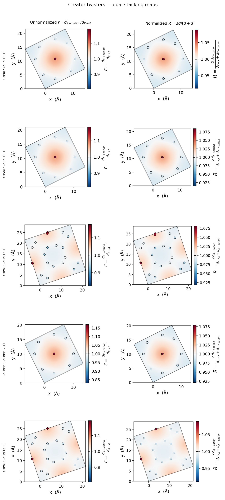
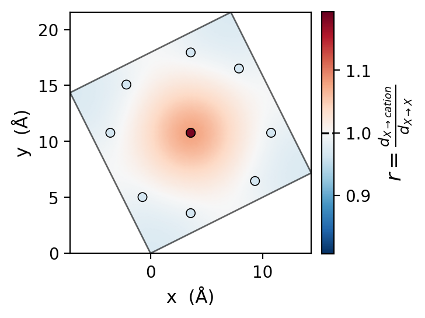
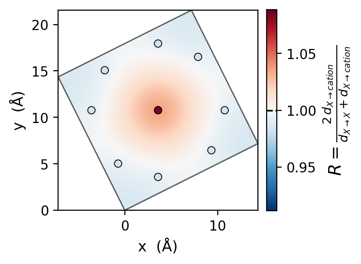
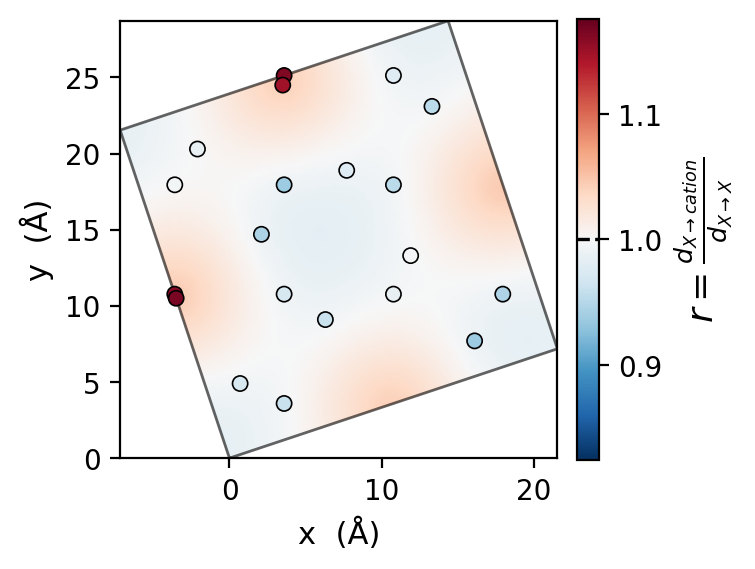
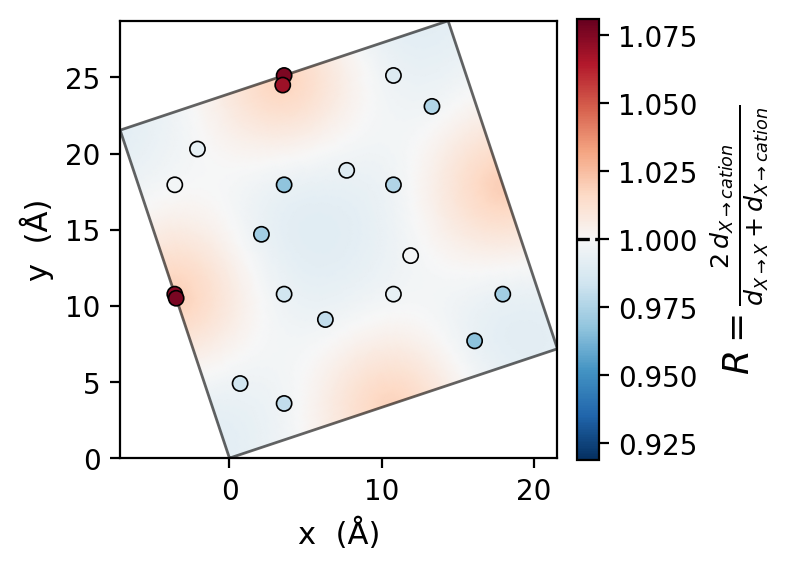

# 18. Twister analyzer — stacks, interfaces, and stacking registry

This example shows how to **analyze** a twisted bilayer (twister) after building it with the creator. The analyzer extends the graph ontology with **slab** nodes (independent perovskite stacks) and provides stacking metrics at the interface between stacks.

See [6_Twist.md](6_Twist.md) for commensurate angles and supercell details. Refresh the maps in this guide with:

```bash
devenv shell -- python Examples/generate_twister_stacking_maps.py
```

## Build a twisted bilayer

```python
from q2D_Materials.core.creator import q2D_creator

q2d = q2D_creator()

mono1 = q2d.create_structure(
    structure_type="monolayer",
    A_ions="Cs", B_ions="Pb", X_ions="I",
    xy_expansion=(1, 1), template="cubic", vacuum=12.0,
)
mono2 = q2d.create_structure(
    structure_type="monolayer",
    A_ions="Cs", B_ions="Sn", X_ions="I",
    xy_expansion=(1, 1), template="cubic", vacuum=12.0,
)

bilayer = q2d.twist(
    monolayers=[mono1, mono2],
    twist_angles=[(3, 1)],
    interlayer_distances=[8.0],
    vacuum=12.0,
)
print(bilayer.structure_type)  # 'twister'
```

The integers `(m, n)` set the commensurate twist. Small pairs such as `(2, 1)` and `(3, 1)` keep the supercell small (`m² + n²` expansion). Large pairs such as `(13, 1)` produce realistic moiré cells but are expensive to analyze and plot.

## Analyze with the graph ontology

```python
from q2D_Materials.analyzer import q2D_analyzer

analyzer = q2D_analyzer(bilayer)
analyzer.analyze()

print(analyzer.structure_type)  # 'twister' (preserved from creator declaration)
print(analyzer.is_twister)      # True — only because structure_type was declared
print(analyzer.n_slabs)         # 2

slabs = analyzer.get_slabs()
for sid, info in slabs.items():
    print(f"Slab {sid}: layers={info['layer_ids']}, octahedra={info['octahedra_count']}")
```

### Graph hierarchy

```
structure_0  (is_twister only if user/creator declared structure_type='twister')
├── slab_0 → layer_0 → octahedra …
├── slab_1 → layer_1 → octahedra …
└── a_site / spacer (bridges_slabs=(0,1) at the vdW / spacer interface)
```

`detect_stacks` partitions the inorganic framework into **z-discontinuous slabs**.
Ordinary RP and DJ unit cells commonly also have `n_slabs >= 2` (layers separated
by the organic spacer bilayer). Those structures are classified as `rp` / `dj`
(or other inferred types); **`is_twister` is True only when the user/creator
declared `structure_type='twister'`**. Multi-slab geometry alone does not make a
twister. `get_stacking_registry()` works whenever `n_slabs >= 2`, regardless of
`structure_type`. A single continuous inorganic stack gets one `slab_0` node.

## Per-stack layer analysis

Use `analyzer.slabs` to run existing layer tools on one stack only:

```python
# Intra-layer B-X-B within stack 0
bxb = analyzer.slabs.layers_of('0').get_bxb(index=0)
print(f"Stack 0 layer 0 B-X-B mean: {bxb['bxb_mean']:.2f}°")

# Interface molecules between stacks 0 and 1
iface = analyzer.get_stack_interface('0', '1')
print(iface['bridging_nodes'], iface['formulas'])
```

## What the stacking analysis measures

The registry is a **geometric** descriptor of how the two slabs line up laterally. It is **not** a chemical formula ratio such as Cs:Sn:I.

For each selected interface X atom (I or Br), the analyzer finds the nearest opposite-slab neighbor under periodic boundary conditions:

- \(d_{X \to \mathrm{cation}}\): distance to the nearest A-site cation (typically Cs) in the other slab
- \(d_{X \to X}\): distance to the nearest X atom in the other slab
- \(d_{\mathrm{cation} \to \mathrm{cation}}\): the same idea for interface cations

### How atoms are selected

1. Split the bilayer into bottom and top using the gap between the requested slabs (fallback: largest B-site z-gap).
2. Place the interface plane at the midpoint between the topmost X of the bottom slab and the bottommost X of the top slab. That also defines `registry.vdw_gap`.
3. Keep only the atoms closest to that plane:
   - `x_frac=0.25` — about one of four X planes per slab (the facing terminal plane)
   - `cation_frac=0.5` — about one of two cation planes per slab
4. Compute minimum-image nearest-neighbor distances across the gap (PBC on a, b, and c).

Pass `x_symbols` and `cation_symbols` explicitly for mixed chemistry. Auto-detection uses graph X ligands and A-site formulas; a mixed I/Br bilayer queried as `x_symbols=['I']` can yield an empty interface set.

## Two registry ratios

Both ratios use the **same distances**. They only rescale the per-X values used in heatmaps.

**Raw / notebook ratio** (not the API default):

\[
r = \frac{d_{X \to \mathrm{cation}}}{d_{X \to X}}
\]

**Normalized ratio** stored in `registry.ratio_per_x`:

\[
R = \frac{2\, d_{X \to \mathrm{cation}}}{d_{X \to X} + d_{X \to \mathrm{cation}}} = \frac{2r}{1+r}
\]

| Value | Meaning |
|-------|---------|
| \(r, R < 1\) | Opposite-slab cation is closer than X — I-over-Cs-like registry |
| \(r, R = 1\) | Equal distances |
| \(r, R > 1\) | Opposite-slab X is closer — I-over-I-like registry |

Normalization keeps \(0 \le R \le 2\), centers equal distances at 1, and is better for a diverging heatmap. It **compresses contrast**: hotspot locations stay the same, but means move toward 1 and the color range shrinks.

Both \(r\) and \(R\) include the **vertical** vdW gap as well as XY alignment. Report `registry.vdw_gap` and the raw distance summaries (`x_to_cation`, `x_to_x`, `cation_to_cation`) with the map.



Left: \(r\). Right: \(R\). `(2, 1)` cells show one central high-ratio site in a ring of I-over-Cs-like points. `(3, 1)` cells sample a larger moiré and place high-ratio sites on the cell edge. Normalization does not move those domains.

## Stacking registry API

```python
registry = analyzer.get_stacking_registry(
    slab_id1='0',
    slab_id2='1',
    x_frac=0.25,
    cation_frac=0.5,
    x_symbols=['I'],       # or ['Br']; pass both for mixed-halide defaults
    cation_symbols=['Cs'],
)

print(f"X→cation mean: {registry.x_to_cation.mean:.3f} Å  (n={registry.x_to_cation.n})")
print(f"X→X mean:      {registry.x_to_x.mean:.3f} Å")
print(f"Cs→Cs mean:    {registry.cation_to_cation.mean:.3f} Å")
print(f"vdW gap:       {registry.vdw_gap:.3f} Å")
print(f"z interface:   {registry.z_interface:.3f} Å")
print(f"normalized R mean: {registry.ratio_per_x.mean():.3f}")
```

`StackingRegistryResult` fields:

| Field | Contents |
|-------|----------|
| `x_to_cation`, `x_to_x`, `cation_to_cation` | `SummaryStats` with `n`, `mean`, `std`, `min`, `max` (Å) |
| `ratio_per_x` | Per-X **normalized** \(R\) (API default) |
| `xy_x_interface`, `xy_cation_interface` | XY coordinates of selected interface atoms |
| `z_interface`, `vdw_gap` | Interface plane and facing-X gap (Å) |
| `slab_pair`, `lattice` | Slab IDs and cell matrix |
| `raw` | Distance arrays `d_x_to_cation`, `d_x_to_x`, `d_cation_to_cation`, plus selection counts |

### Plot the normalized map (API default)

```python
analyzer.plot_stacking_heatmap(
    registry,
    output_path="stacking_heatmap.png",
    grid_pts=120,
)
```

Requires matplotlib and scipy. `grid_pts=120` is enough for documentation cells; `300` matches the original notebook.

### Plot the unnormalized (notebook) map

`ratio_per_x` stays normalized. Rebuild the notebook array from raw distances:

```python
from dataclasses import replace
from q2D_Materials.analyzer.twister_processing.stacking_plots import (
    plot_stacking_heatmap,
    unnormalized_ratio,
    RATIO_LABEL_UNNORMALIZED,
)

r = unnormalized_ratio(registry)
plot_stacking_heatmap(
    replace(registry, ratio_per_x=r),
    output_path="stacking_heatmap_raw.png",
    grid_pts=120,
    colorbar_label=RATIO_LABEL_UNNORMALIZED,
)
```

## Five creator examples

All five use cubic Cs monolayers, `xy_expansion=(1, 1)`, `interlayer_distances=[8.0]`, and `vacuum=12.0`.

| Example | Chemistry | Twist | Unnormalized \(r\) | Normalized \(R\) |
|---------|-----------|-------|--------------------|------------------|
| CsPbI homobilayer | CsPbI / CsPbI | `(2, 1)` | [map](images/twister/cspbi_homobilayer_2_1_unnormalized.png) | [map](images/twister/cspbi_homobilayer_2_1_normalized.png) |
| CsSnI homobilayer | CsSnI / CsSnI | `(2, 1)` | [map](images/twister/cssni_homobilayer_2_1_unnormalized.png) | [map](images/twister/cssni_homobilayer_2_1_normalized.png) |
| CsPbI / CsSnI heterobilayer | CsPbI / CsSnI | `(3, 1)` | [map](images/twister/cspbi_cssni_heterobilayer_3_1_unnormalized.png) | [map](images/twister/cspbi_cssni_heterobilayer_3_1_normalized.png) |
| CsPbBr homobilayer | CsPbBr / CsPbBr | `(2, 1)` | [map](images/twister/cspbbr_homobilayer_2_1_unnormalized.png) | [map](images/twister/cspbbr_homobilayer_2_1_normalized.png) |
| CsPbI homobilayer (larger cell) | CsPbI / CsPbI | `(3, 1)` | [map](images/twister/cspbi_homobilayer_3_1_unnormalized.png) | [map](images/twister/cspbi_homobilayer_3_1_normalized.png) |




The `(2, 1)` CsPbI cell has one central high-ratio (I-over-I-like) site and a ring of I-over-Cs-like interface X atoms. The normalized map is the same pattern with a tighter color scale around 1.




The `(3, 1)` heterobilayer is a larger supercell (`m² + n² = 10`) with more interface samples. High-ratio domains sit on the cell edge; normalization again only rescales the colorbar.

## Export analyzed structure

```python
exported = analyzer.to_q2DStructure()
assert exported.is_twister
assert exported.n_slabs >= 2
```

## Notes

- **Twister vs DJ/RP**: DJ and RP have one continuous inorganic stack with organic spacers between octahedral layers. Twisters have **two or more disconnected stacks** joined only by vdW/interface cations or molecules.
- **Single monolayers** get one `slab_0` node; `is_twister` is `False`; `get_stacking_registry()` raises.
- For batch studies (twist angle vs \(R\)), loop over structures and call `get_stacking_registry()`; keep raw distances in `registry.raw` so both \(r\) and \(R\) can be reconstructed.
- Do not commit `(13, 1)`-scale cells to this example: the heatmap RBF is much slower than `(2, 1)` / `(3, 1)`.
