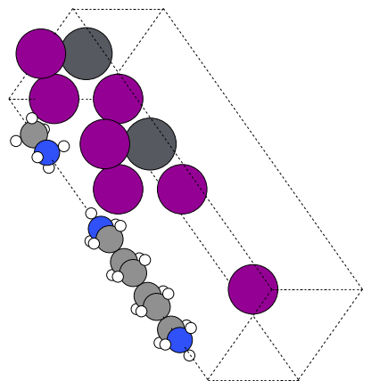
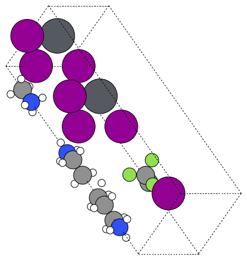

# 19. Molecule Modifier — Fragment Replacement in Perovskite Structures

The `q2D_Materials.modifier` module provides a graph-based API for identifying and modifying molecular fragments in perovskite structures. It allows you to replace specific atoms in spacer molecules or A-site cations with custom molecular fragments using SMILES notation.

## Overview

The modifier module works by:
1. **Analyzing the structure** to build a graph representation
2. **Identifying molecules** (spacers and A-site cations) as subgraphs
3. **Replacing atoms** in molecules with fragments specified via SMILES strings
4. **Reconstructing the full structure** with the modified molecules

## Key Concepts

### GraphView
The `GraphView` class provides access to molecules in the analyzed structure:
- `view.spacers` - List of spacer molecules
- `view.a_sites` - List of A-site cation molecules
- `view.molecules` - All molecules (spacers + A-sites)

### MoleculeGraph
Each molecule is represented as a `MoleculeGraph` object with:
- `original_indices` - Atom indices in the original structure
- `smiles` - SMILES representation of the molecule
- `to_json()` - Detailed molecular information
- `replace()` - Method to replace an atom with a fragment

### Fragment Specification
Fragments are specified using **SMILES notation** with **explicit attachment points**:
- `[CH0]` - Carbon with 0 hydrogens (explicit attachment point)
- `[CH0]=C` - Vinyl group (ethene) with explicit attachment
- `[CH0]=O` - Carbonyl group with explicit attachment
- `CC(F)(F)F` - Trifluoromethyl group

**Important**: Use explicit notation like `[CH0]` to avoid ambiguity. The native SMILES format supports this.

## Basic Usage

### Step 1: Create and Analyze Structure

```python
from q2D_Materials.core.creator import q2D_creator
from q2D_Materials.analyzer import q2D_analyzer
from q2D_Materials.modifier import GraphView, from_smiles
from ase.io import write

# Create a DJ structure with spacer
creator = q2D_creator()
structure = creator.create_structure(
    structure_type="bulk",
    A_ions="MA",
    B_ions="Pb",
    X_ions="I",
    template="cubic",
    layer_sequence="DJ",
    thickness=2,
    spacer="[NH3+]CCCCCC[NH3+]",  # Diammonium hexane
    xy_expansion=(1, 1),
)

# Analyze to build graph representation
analyzer = q2D_analyzer(structure)
analyzer.analyze()
```

### Step 2: Access Molecules

```python
# Create GraphView to access molecules
view = GraphView(analyzer)

# Get spacer molecules
spacers = view.spacers.list()
print(f"Found {len(spacers)} spacer molecules")

# Get first spacer
spacer = spacers[0]
print(f"Spacer SMILES: {spacer.smiles}")
print(f"Spacer has {len(spacer.original_indices)} atoms")
```

### Step 3: Inspect Molecule Structure

```python
# Get detailed molecule information
spacer_info = spacer.to_json()
print(f"Molecule type: {spacer_info['molecule_type']}")
print(f"Number of atoms: {spacer_info['n_atoms']}")
print(f"Attachment points: {spacer_info['attachment_points']}")

# List all atoms in the molecule
for atom in spacer_info['atoms']:
    print(f"  Atom {atom['index']}: {atom['symbol']}, "
          f"neighbors: {atom['neighbors']}, "
          f"is_attachment: {atom['is_attachment']}")
```

### Step 4: Replace Atom with Fragment

```python
# Find carbon atoms in the spacer
carbon_indices = [
    atom['index'] for atom in spacer_info['atoms']
    if atom['symbol'] == 'C'
]
print(f"Carbon atoms at indices: {carbon_indices}")

# Select the third carbon (index 2)
target_carbon = carbon_indices[2]

# Create fragment from SMILES (vinyl group)
fragment = from_smiles("[CH0]=C")  # Explicit attachment point

# Replace the carbon atom
modified_structure = spacer.replace(
    atom_index=target_carbon,
    fragment_graph=fragment,
    fragment_index=0,  # Use first atom of fragment as attachment
)

# Save modified structure
write("modified_structure.vasp", modified_structure, format="vasp")
```

## Example: Multiple Fragment Replacements

```python
from q2D_Materials.core.creator import q2D_creator
from q2D_Materials.analyzer import q2D_analyzer
from q2D_Materials.modifier import GraphView, from_smiles
from ase.io import write

# Create structure
creator = q2D_creator()
structure = creator.create_structure(
    structure_type="bulk",
    A_ions="MA", B_ions="Pb", X_ions="I",
    template="cubic",
    layer_sequence="DJ",
    thickness=2,
    spacer="[NH3+]CCCCCC[NH3+]",
    xy_expansion=(1, 1),
)

# Analyze
analyzer = q2D_analyzer(structure)
analyzer.analyze()

# Access molecules
view = GraphView(analyzer)
spacer = view.spacers.list()[0]

# Find target carbon
spacer_info = spacer.to_json()
carbon_indices = [a['index'] for a in spacer_info['atoms'] if a['symbol'] == 'C']
target_carbon = carbon_indices[2]

# Define fragments to test
fragments = [
    ("[CH0]=C", "vinyl"),           # Ethene/vinyl group
    ("CC(F)(F)F", "trifluoromethyl"), # Trifluoromethyl
    ("[CH0]=O", "carbonyl"),        # Carbonyl group
]

# Replace with each fragment
for smiles, name in fragments:
    try:
        fragment = from_smiles(smiles)
        modified = spacer.replace(
            atom_index=target_carbon,
            fragment_graph=fragment,
            fragment_index=0,
        )
        write(f"modified_{name}.vasp", modified, format="vasp")
        print(f"✓ Created modified_{name}.vasp")
    except Exception as e:
        print(f"✗ Error with {name}: {e}")
```

## Fragment Validation

The module validates fragments before use:

```python
from q2D_Materials.modifier import validate_fragment

# Validate a fragment
is_valid, message = validate_fragment("[CH0]=C", fragment_index=0)
if is_valid:
    print(f"Fragment is valid: {message}")
else:
    print(f"Fragment validation failed: {message}")
```

Validation checks:
- SMILES string is valid and can be parsed
- Fragment can be converted to a molecular graph
- Specified `fragment_index` corresponds to a valid atom with bonds

## Valence-Aware Replacement

The replacement process is **valence-aware** and follows these rules:

1. **Heavy atoms are preserved**: All heavy atoms (C, N, O, etc.) in the structural skeleton are kept
2. **Hydrogens can be removed**: Hydrogens may be removed if the new atom has lower valence
3. **Compatibility checking**: The system validates that the replacement is chemically feasible
4. **Explicit hydrogen specification**: If a fragment explicitly specifies 0 hydrogens (e.g., `[CH0]`), no hydrogens from the original structure are kept

### Example: Understanding Hydrogen Handling

```python
# Fragment with explicit 0 hydrogens
fragment = from_smiles("[CH0]=O")  # Carbonyl: C=O with 0 H on C

# When replacing a carbon that had hydrogens:
# - The fragment's explicit "0 H" specification is respected
# - No hydrogens from the original structure are kept
# - Result: Clean carbonyl group without extra hydrogens
```

## Geometry-Aware Positioning

Fragment positioning considers:
- **Bonding geometry** (sp, sp2, sp3 hybridization)
- **Bond lengths** (calculated from covalent radii)
- **Bond angles** (preserved from original structure)
- **Periodic boundary conditions** (PBC-aware)

The system automatically:
- Calculates ideal bond lengths
- Aligns fragments based on hybridization
- Preserves neighbor geometry
- Handles periodic boundaries correctly

## Visualizations

The following images show examples of molecule modification:


*Base DJ structure with diammonium hexane spacer*


*Third carbon replaced with vinyl group ([CH0]=C)*


*Third carbon replaced with trifluoromethyl group (CC(F)(F)F)*


*Third carbon replaced with carbonyl group ([CH0]=O)*

## Limitations

### 1. Explicit Fragment Specification Required
- **Fragments must use explicit SMILES notation** with unambiguous attachment points
- Use `[CH0]` notation instead of just `C` to specify attachment points
- Ambiguous fragments will be rejected during validation

### 2. Single Atom Replacement
- Currently supports replacing **one atom at a time**
- Multiple simultaneous replacements require multiple calls

### 3. Valence Constraints
- Replacement is **rejected if chemically incompatible**
- The system checks that the new atom can accommodate all heavy atom neighbors
- If too many heavy atoms are connected, replacement fails with a clear error

### 4. Fragment Attachment Point
- Must specify which atom in the fragment is the attachment point (`fragment_index`)
- Default is `0` (first atom)
- The attachment atom must have at least one bond within the fragment

### 5. Structure Analysis Required
- Structure must be **analyzed first** using `analyzer.analyze()`
- Graph representation must be built before accessing molecules

### 6. Molecule Identification
- Only molecules **identified by the analyzer** can be modified
- If molecules are not detected, they cannot be accessed via GraphView

### 7. RDKit Dependency
- SMILES conversion requires **RDKit** to be installed
- Fragment validation requires RDKit
- Install with: `pip install rdkit-pypi`

### 8. Hydrogen Handling
- Hydrogen distribution follows valence rules
- Fragments with explicit `[CH0]` notation (0 hydrogens) will not keep structure hydrogens
- Other cases may keep some hydrogens if valence allows

### 9. Complex Fragments
- Very large or complex fragments may have geometry issues
- Bond detection relies on distance-based heuristics
- Some edge cases in bond order detection may occur

### 10. Periodic Boundary Conditions
- PBC is handled, but complex cases with multiple unit cells may need careful testing

## Best Practices

1. **Always use explicit SMILES notation**:
   ```python
   # Good
   fragment = from_smiles("[CH0]=C")
   
   # Avoid (ambiguous)
   fragment = from_smiles("C=C")
   ```

2. **Validate fragments before use**:
   ```python
   is_valid, message = validate_fragment(smiles, fragment_index=0)
   if not is_valid:
       raise ValueError(f"Invalid fragment: {message}")
   ```

3. **Check molecule structure first**:
   ```python
   spacer_info = spacer.to_json()
   # Inspect atoms, neighbors, attachment points
   ```

4. **Handle errors gracefully**:
   ```python
   try:
       modified = spacer.replace(...)
   except ValueError as e:
       print(f"Replacement failed: {e}")
       # Check valence, compatibility, etc.
   ```

5. **Test with simple fragments first**:
   - Start with small, well-defined fragments
   - Verify results before using complex fragments

## Complete Example

```python
from q2D_Materials.core.creator import q2D_creator
from q2D_Materials.analyzer import q2D_analyzer
from q2D_Materials.modifier import GraphView, from_smiles, validate_fragment
from ase.io import write

# 1. Create structure
creator = q2D_creator()
structure = creator.create_structure(
    structure_type="bulk",
    A_ions="MA", B_ions="Pb", X_ions="I",
    template="cubic",
    layer_sequence="DJ",
    thickness=2,
    spacer="[NH3+]CCCCCC[NH3+]",
    xy_expansion=(1, 1),
)

# 2. Analyze structure
analyzer = q2D_analyzer(structure)
analyzer.analyze()

# 3. Access molecules
view = GraphView(analyzer)
spacers = view.spacers.list()

if len(spacers) == 0:
    raise ValueError("No spacers found in structure")

spacer = spacers[0]

# 4. Inspect molecule
spacer_info = spacer.to_json()
print(f"Spacer: {spacer_info['smiles']}")
print(f"Atoms: {spacer_info['n_atoms']}")

# 5. Find target atom
carbon_atoms = [a for a in spacer_info['atoms'] if a['symbol'] == 'C']
if len(carbon_atoms) < 3:
    raise ValueError("Not enough carbon atoms")

target_index = carbon_atoms[2]['index']
print(f"Target atom: index {target_index}")

# 6. Validate fragment
fragment_smiles = "[CH0]=C"
is_valid, message = validate_fragment(fragment_smiles, fragment_index=0)
if not is_valid:
    raise ValueError(f"Fragment invalid: {message}")

# 7. Create fragment and replace
fragment = from_smiles(fragment_smiles)
modified_structure = spacer.replace(
    atom_index=target_index,
    fragment_graph=fragment,
    fragment_index=0,
)

# 8. Save result
write("modified.vasp", modified_structure, format="vasp")
print(f"Modified structure saved: {len(modified_structure)} atoms")
```

## API Reference

### GraphView

```python
view = GraphView(analyzer)
```

**Properties:**
- `view.spacers` - `MoleculesList` of spacer molecules
- `view.a_sites` - `MoleculesList` of A-site molecules
- `view.molecules` - `MoleculesList` of all molecules

### MoleculeGraph

```python
molecule = view.spacers[0]
```

**Methods:**
- `molecule.to_json()` - Return detailed molecule information as dict
- `molecule.replace(atom_index, fragment_graph, fragment_index=0)` - Replace atom with fragment
- `molecule.smiles` - SMILES representation (property)

**Properties:**
- `molecule.original_indices` - List of atom indices in original structure
- `molecule.attachment_points` - List of attachment point indices

### Functions

```python
from_smiles(smiles: str, validate: bool = True) -> nx.Graph
```
Convert SMILES string to NetworkX graph.

```python
validate_fragment(smiles: str, fragment_index: int = 0) -> Tuple[bool, str]
```
Validate that a SMILES fragment is valid and ready for use.

```python
atoms_to_smiles(atoms: Atoms) -> Optional[str]
```
Convert ASE Atoms object to SMILES string (requires RDKit).

## Troubleshooting

### "No spacers found in structure"
- Ensure structure was analyzed: `analyzer.analyze()`
- Check that structure actually contains spacer molecules
- Verify structure type supports spacers (DJ, RP)

### "Fragment validation failed"
- Use explicit SMILES notation: `[CH0]=C` not `C=C`
- Check that SMILES is valid
- Ensure RDKit is installed

### "Invalid replacement: ..."
- Check valence compatibility
- Verify target atom has compatible neighbors
- Fragment may be too large for the attachment point

### "Fragment index out of range"
- Check fragment has enough atoms
- Verify `fragment_index` is correct
- Use `validate_fragment()` to check

## See Also

- [Example 12: Analysis](12_Analysis.md) - Graph decomposition and analysis
- [Example 17: Molecule Analyzer](17_MoleculeAnalyzer.md) - Molecular classification
- [VALENCE_AWARE_REPLACEMENT.md](../VALENCE_AWARE_REPLACEMENT.md) - Detailed valence rules

