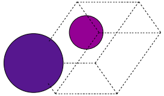
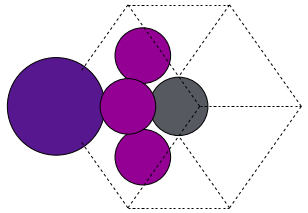
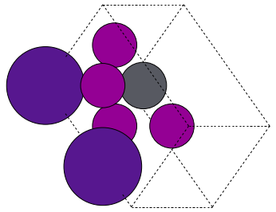

# q2D-Materials Creator — how it fits together

Think of the creator as a separation-of-concerns tool: templates carry geometry, your inputs carry chemistry. You pick a template (e.g., `cubic.json`), optionally swap the layer order, and pour in A/B/X species. The rest—bond distances, XY tiling, and site filling—is handled for you. Pattern lists let you sweep compositions without touching geometry.

### The core picture
- Geometry lives in the template (layers `L1`, `L2`, lattice multipliers).
- Chemistry lives in your call (`A_ions`, `B_ions`, `X_ions`, `BX_dist`).
- XY tiling via `xy_expansion=(nx, ny)` scales the pattern you supply.
- Layer order can change with `layer_sequence` (reuse one template, many stacks).

### One recipe to anchor on
```python
from q2D_Materials.core.creator import q2D_creator
q2d = q2D_creator()

base = dict(structure_type="bulk", A_ions="MA", B_ions="Pb", X_ions="I", xy_expansion=(1, 1))

# Same geometry, different chemistry
cubic = q2d.create_structure(template="cubic", **base)
csbr = q2d.create_structure(template="cubic", A_ions="Cs", B_ions="Sn", X_ions="Br", xy_expansion=(1, 1))

# Same chemistry, different geometry
cubic_geom   = q2d.create_structure(template="cubic", **base)
reduced_geom = q2d.create_structure(template="reduced", **base)

# DJ spacer example (two spacer layers with S#)
dj = q2d.create_structure(
    template="cubic",
    structure_type="bulk",
    layer_sequence="DJ",
    thickness=2,
    A_ions="MA", B_ions="Pb", X_ions="I",
    spacer="[NH3+]CCCC[NH3+]",
    glazer_angles=[0, 0, 3],
    glazer_pattern=["0", "0", "+"],
)
```

### Visual cue (cubic storyboard)

**Atomic A-site (Cs):**

  

**Molecular A-site (MA):**

  

### Pattern mixing in one line
```python
mixed = q2d.create_structure(
    template="cubic",
    structure_type="bulk",
    A_ions=["Cs", "MA", "FA", "Cs"],   # maps to 4 A-sites when xy_expansion=(2,2)
    B_ions=["Pb", "Sn"],                   # cycles Pb/Sn over 4 B-sites
    X_ions=["Br", "I", "I"],             # cycles over 12 X-sites
    xy_expansion=(2, 2),
)
```
Patterns just cycle to fill positions: short lists repeat, matching the count implied by `xy_expansion`.

### Custom bond distances
If you need experimental matching, pass `BX_dist=3.18` (Å). Otherwise it auto-calculates from the ion tables.

### Custom interlayer distances
Control the vertical spacing between layers with explicit distances in the `layer_sequence` string:
```python
# Explicit distances override BX-based spacing for specific gaps
custom_gaps = q2d.create_structure(
    template="cubic",
    structure_type="bulk",
    A_ions="MA", B_ions="Pb", X_ions="I",
    layer_sequence="L1-(1.5)-L2-(2.0)-L1"  # 1.5Å between L1-L2, 2.0Å between L2-L1
)

# Mix explicit distances with defaults
mixed_gaps = q2d.create_structure(
    template="cubic",
    structure_type="bulk",
    A_ions="MA", B_ions="Pb", X_ions="I",
    layer_sequence="L1-(2.5)-L2-L1-(1.8)-L2"  # First and third gaps explicit, second uses BX
)
```
Numbers in parentheses are absolute distances in Å. Gaps without numbers use the standard BX-based spacing.

### What to remember
- Template = where; your args = what.
- `layer_sequence` lets you reuse one template for many stacks.
- Patterns are per sublattice (independent for A, B, X).
- Start small (`xy_expansion=(1,1)`), then scale when you need supercells.
- Save outputs with ASE’s `write(..., sort=True)` for tidy VASP files.

Regenerate the storyboard images any time:
```bash
nix develop -c python3 Examples/plot.py
```
