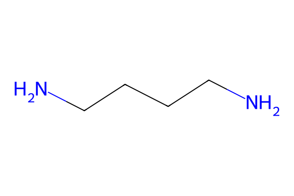
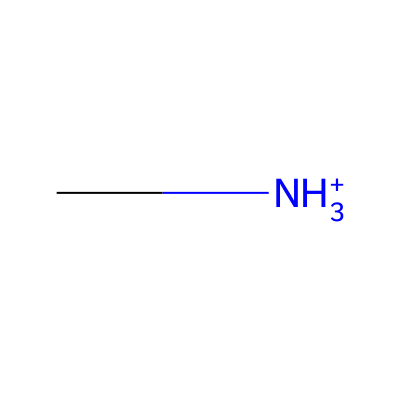

# Molecule Validator — Checking if Molecules Work as Spacers

Check if molecules are suitable as DJ (Dion-Jacobson) or RP (Ruddlesden-Popper) spacers. Works with SMILES strings, files, or Atoms objects—no structure needed.

**New in v2.3**: Unified molecular graph system with backbone identification
- `create_molecule_graph()` - Create standardized molecular graphs from any input
- `identify_backbone()` - Identify backbone atoms and count NH3 groups
- Atoms marked as `role='backbone'` or `role='functional_group'`
- Molecule nodes store `nh3_count` attribute for downstream analysis

**New in v2.2**: Pattern-based validation with configurable SMILES patterns for terminal groups. Backbone element validation filters out molecules with unwanted elements (P, S, metals, etc.)

**Updated**: 
- Unified API: Use `mol_validate()` with `spacer_type="DJ"` or `spacer_type="RP"` parameter
- Now uses RDKit for all SMILES parsing and pattern matching (no custom parser). RDKit provides robust SMARTS pattern matching and better chemical validation.

## Quick Start

```python
from q2D_Materials.analyzer import q2D_analyzer

analyzer = q2D_analyzer()

# Check DJ spacer (needs 2 terminal NH2/NH3 groups)
result = analyzer.mol_validate("NCCCCN", spacer_type="DJ")
print(f"Valid: {result.is_valid}")  # True

# Check RP spacer (needs 1+ terminal NH2/NH3 group)
result = analyzer.mol_validate("NCCCCC", spacer_type="RP")
print(f"Valid: {result.is_valid}")  # True
```

## Unified Molecular Graph System (v2.3+)

The new unified molecular graph system provides a standardized way to work with molecules from any source (SMILES, XYZ, Atoms, or structure-extracted):

```python
from q2D_Materials.analyzer.molecular_processing import create_molecule_graph

# Create molecular graph from SMILES
graph = create_molecule_graph("C(CC[NH3+])C[NH3+]")

# Access molecule properties
mol_data = graph.nodes['molecule_0']
print(f"Formula: {mol_data['formula']}")
print(f"NH3 count: {mol_data['nh3_count']}")  # Automatically detected

# Access atom properties
for node in graph.nodes():
    if node != 'molecule_0':
        atom_data = graph.nodes[node]
        symbol = atom_data['symbol']
        role = atom_data.get('role')  # 'backbone' or 'functional_group'
        if role:
            print(f"Atom {node} ({symbol}): {role}")
```

**Key Features:**
- **Automatic backbone identification**: Finds longest path between NH3 groups
- **Atom role marking**: Atoms marked as `backbone` or `functional_group`
- **NH3 counting**: Stored as `nh3_count` on molecule node
- **Unified format**: Same graph structure for standalone and structure-extracted molecules

## Simple Examples



### Basic Check

```python
analyzer = q2D_analyzer()
result = analyzer.mol_validate("NCCCCN", spacer_type="DJ")

if result.is_valid:
    print(f"✓ Valid! {len(result.terminal_groups)} terminals, {len(result.valid_paths)} paths")
else:
    print(f"✗ Invalid: {result.reason}")
```

### Compare DJ vs RP

```python
analyzer = q2D_analyzer()

# Molecule with 2 terminals (works for both)
dj = analyzer.mol_validate("NCCCCN", spacer_type="DJ")  # True
rp = analyzer.mol_validate("NCCCCN", spacer_type="RP")  # True

# Molecule with 1 terminal (only RP)
dj = analyzer.mol_validate("NCCCCC", spacer_type="DJ")  # False
rp = analyzer.mol_validate("NCCCCC", spacer_type="RP")  # True

# Small molecule with 1 terminal (RP spacer) - works with both SMILES and Atoms
from q2D_Materials.utils import smiles_to_ase_atoms

# Using SMILES
rp_smiles = analyzer.mol_validate("C[NH3+]", spacer_type="RP", initial_pattern='[NH3+]C')  # True

# Using Atoms object - now works correctly!
atoms = smiles_to_ase_atoms("C[NH3+]")
rp_atoms = analyzer.mol_validate(atoms, spacer_type="RP", initial_pattern='[NH3+]C')  # True
```



### From Files

```python
from ase.io import read
analyzer = q2D_analyzer()

molecule = read("spacer.xyz")
result = analyzer.mol_validate(molecule, spacer_type="DJ")
```

## Understanding Results

```python
result = analyzer.mol_validate("NCCCCN", spacer_type="DJ")

# Basic info
result.is_valid          # True/False
result.reason            # Explanation
result.spacer_type       # "DJ" or "RP"

# Terminal groups
for group in result.terminal_groups:
    print(f"{group.group_type} at index {group.n_index}")
    print(f"  H atoms: {group.h_indices}")
    print(f"  Carbon neighbor: {group.carbon_neighbor}")

# Paths (DJ only)
result.valid_paths      # List of valid paths between terminals

# Original molecule
atoms = result.original_atoms  # ASE Atoms object
```

## Pattern-Based Matching


### Custom Terminal Patterns

The new pattern-based API allows you to specify custom SMILES patterns for terminal groups:

```python
analyzer = q2D_analyzer()

# Use ammonium pattern [NH3+]C
result = analyzer.mol_validate(
    molecule,
    spacer_type="DJ",
    initial_pattern='[NH3+]C',
    final_pattern='[NH3+]C'
)

# Use multiple patterns (matches any of them)
result = analyzer.mol_validate(
    molecule,
    spacer_type="DJ",
    initial_pattern=['NH2C', '[NH3+]C'],
    final_pattern=['NH2C', '[NH3+]C']
)

# Asymmetric spacers (different initial and final patterns)
result = analyzer.mol_validate(
    molecule,
    spacer_type="DJ",
    initial_pattern='[NH3+]C',
    final_pattern='NH2C'
)
```

### Converting and Elongating

### NH2 → NH3 Conversion

```python
from q2D_Materials.analyzer.molecular_processing.molecule_candidates import convert_nh2_to_nh3

analyzer = q2D_analyzer()
result = analyzer.mol_validate("NCCN", spacer_type="DJ", initial_pattern='NH2C')

# Convert NH2 to NH3 (requires nitrogen index)
# Note: With pattern-based API, you may need to identify N indices from pattern matches
from q2D_Materials.analyzer.molecular_processing.molecule_candidates import clean_molecule

# Use clean_molecule to automatically convert all NH2 to NH3
modified = clean_molecule(result.original_atoms, convert_nh2_to_nh3_flag=True)
    from ase.io import write
    write("spacer_nh3.xyz", modified)
```

### Elongate DJ Spacers

```python
result = analyzer.mol_validate("NCCN", spacer_type="DJ")

# Elongate to target distance
elongated = analyzer.elongate_dj_spacer(
    result.original_atoms,
    target_distance=12.0
)

# Or maximize elongation
elongated = analyzer.elongate_dj_spacer(result.original_atoms)
```

## Intermediate Examples

### Batch Processing

```python
analyzer = q2D_analyzer()

candidates = {
    "Butanediamine": "NCCCCN",
    "Ethylenediamine": "NCCN",
    "Pentylamine": "NCCCCC"
}

valid_dj = [name for name, smiles in candidates.items() 
            if analyzer.mol_validate(smiles, spacer_type="DJ").is_valid]
valid_rp = [name for name, smiles in candidates.items() 
            if analyzer.mol_validate(smiles, spacer_type="RP").is_valid]

print(f"Valid DJ: {valid_dj}")
print(f"Valid RP: {valid_rp}")
```

### Complete Workflow

```python
from q2D_Materials.analyzer import q2D_analyzer
from ase.io import write

analyzer = q2D_analyzer()

# 1. Analyze
result = analyzer.mol_validate("NCCCCN", spacer_type="DJ")
if not result.is_valid:
    exit()

# 2. Convert NH2 to NH3 if needed
molecule = result.original_atoms
if any(g.group_type == "NH2" for g in result.terminal_groups):
    molecule = analyzer.convert_molecule_nh2_to_nh3(molecule)

# 3. Elongate
elongated = analyzer.elongate_dj_spacer(molecule, target_distance=15.0)
write("spacer_final.xyz", elongated)
```

### With Modifier Module

```python
from q2D_Materials.analyzer import q2D_analyzer
from q2D_Materials.modifier import from_smiles

analyzer = q2D_analyzer()
molecule = from_smiles("NCCCCN")
result = analyzer.mol_validate(molecule, spacer_type="DJ")
```

## Advanced Examples

### Filter by Terminal Group Type

```python
analyzer = q2D_analyzer()

molecules = ["NCCCCN", "C[NH3+]", "NCCN"]

# Find molecules with exactly 2 NH3 groups
dj_with_2_nh3 = []
for smiles in molecules:
    result = analyzer.mol_validate(smiles, spacer_type="DJ")
    if result.is_valid:
        nh3_count = sum(1 for g in result.terminal_groups if g.group_type == "NH3")
        if nh3_count == 2:
            dj_with_2_nh3.append(smiles)
```

### Custom Validation

```python
def is_good_dj_spacer(smiles, min_path_length=3):
    result = analyzer.mol_validate(
        smiles, spacer_type="DJ", min_chain_length=min_path_length
    )
    if not result.is_valid or len(result.valid_paths) == 0:
        return False
    return max(len(p) for p in result.valid_paths) >= min_path_length + 2

# Test
for smiles in ["NCCCCN", "NCCN", "NCCCCCCN"]:
    print(f"{smiles}: {is_good_dj_spacer(smiles, min_path_length=4)}")
```

### Pattern-Based Validation with Custom Patterns

```python
# Validate with custom patterns
result = analyzer.mol_validate(
    molecule,
    spacer_type="DJ",
    initial_pattern='[NH3+]C',
    final_pattern='[NH3+]C',
    min_chain_length=3,
    allowed_backbone_elements={'C', 'N', 'O'},
    forbidden_backbone_elements={'P', 'S'},
    max_non_carbon_ratio=0.2
)
```

### Understanding SMARTS Pattern Matching

The validation system uses RDKit's SMARTS (SMILES Arbitrary Target Specification) pattern matching to identify terminal groups. Here's how it works:

**How SMARTS Matching Works**:
1. **Pattern Matching**: RDKit searches for subgraph matches of your pattern in the molecule
2. **Anchor Detection**: For each match, the system identifies "anchor" atoms—atoms in the match that connect to the rest of the molecule
3. **Terminal Group Filtering**: Only matches with appropriate anchor configuration are kept:
   - **Single anchor**: Pattern matches a terminal group attached to a backbone (e.g., `[NH3+]C` in `CC[NH3+]`)
   - **No anchors**: Pattern matches the entire molecule (e.g., `[NH3+]C` matching `C[NH3+]`)
   - **Multiple anchors**: Pattern matches most of the molecule (e.g., `[NH3+]C` matching both C and N in `C[NH3+]`)

**Example: Small Molecules**:
```python
# For C[NH3+] (Methylammonium), the pattern [NH3+]C matches both C and N
# Both atoms have external neighbors (H atoms), so both become anchors
# The system automatically selects Carbon as the anchor for validation
result = analyzer.mol_validate("C[NH3+]", spacer_type="RP", initial_pattern='[NH3+]C')
print(result.is_valid)  # True - correctly identified as RP spacer
```

**SMARTS Syntax Examples**:
```python
# Basic patterns
'[NH3+]C'      # Ammonium bonded to carbon
'NH2C'         # Amine (NH2) bonded to carbon
'[NH2]C'       # Explicit NH2 group (RDKit notation)

# Advanced SMARTS syntax
'[NH3+;D1]'    # Ammonium with degree 1 (terminal only)
'[N;+1]C'      # Charged nitrogen (+1) bonded to carbon
'[NH2,NH3+]C'  # Match either NH2 or NH3+ (not valid SMARTS, use list instead)
```

**Important Notes**:
- Patterns are matched as subgraphs, so `[NH3+]C` will match both `C[NH3+]` and `CC[NH3+]`
- Anchor detection ensures only terminal groups are identified (not internal matches)
- For small molecules where the pattern matches the entire molecule, Carbon is automatically selected as the anchor
- Both SMILES strings and Atoms objects now produce consistent results for SMARTS pattern matching

### Integration with Structure Creation

```python
from q2D_Materials.analyzer import q2D_analyzer
from q2D_Materials.core.creator import q2D_creator

analyzer = q2D_analyzer()
creator = q2D_creator()

spacer_smiles = "C(CC[NH3+])C[NH3+]"  # 1,4-butanediammonium
result = analyzer.mol_validate(spacer_smiles, spacer_type="DJ")

if result.is_valid:
    # Prepare spacer
    molecule = result.original_atoms
    # Convert NH2 to NH3 if needed (using clean_molecule)
    from q2D_Materials.analyzer.molecular_processing.molecule_candidates import clean_molecule
    molecule = clean_molecule(molecule, convert_nh2_to_nh3_flag=True)
    molecule = analyzer.elongate_dj_spacer(molecule, target_distance=12.0)
    
    # Use in structure
    structure = creator.create_structure(
        template="cubic",
        structure_type="dj",
        A_ions="MA", B_ions="Pb", X_ions="I",
        spacer=spacer_smiles,
        xy_expansion=(1, 1)
    )
```

## Backbone Element Validation

### Overview

Control which chemical elements are allowed in the backbone path between terminal groups. This helps filter out molecules with unwanted elements (phosphorus, metals, etc.) that aren't suitable as spacers.

### Default Settings

```python
# Default allowed backbone elements
allowed_backbone_elements = {'C', 'N', 'O'}

# Default forbidden backbone elements
forbidden_backbone_elements = {
    'P', 'Si', 'B', 'Se', 'I', 'As', 'Ge',
    'Sn', 'Pb', 'Bi', 'Al', 'Ti', 'Fe', 'Cu', 'Zn'
}

# Default maximum non-carbon ratio (excluding H, N)
max_non_carbon_ratio = 0.3  # 30% max
```

### Basic Usage

```python
from q2D_Materials.analyzer import q2D_analyzer

analyzer = q2D_analyzer()

# Use defaults (allows only C, N, O in backbone)
result = analyzer.mol_validate("NCCCCN", spacer_type="DJ")
print(result.is_valid)  # True

# Molecule with phosphorus (P) in backbone - REJECTED
result = analyzer.mol_validate(
    molecule_with_P,
    spacer_type="DJ",
    forbidden_backbone_elements={'P', 'Si', 'B', 'Se', 'I', 'As', 'Ge', 'Sn', 'Pb', 'Bi', 'Al', 'Ti', 'Fe', 'Cu', 'Zn'}
)
print(result.is_valid)  # False
print(result.reason)    # "No valid backbone path found between pattern matches"
```

### Custom Element Validation

**Example 1: Allow only carbon and nitrogen**

```python
analyzer = q2D_analyzer()

# Strict: only C and N in backbone
result = analyzer.mol_validate(
    "NCCCCN",
    spacer_type="DJ",
    allowed_backbone_elements={'C', 'N'}
)
```

**Example 2: Forbid specific elements**

```python
# Explicitly forbid phosphorus and sulfur
result = analyzer.mol_validate(
    molecule,
    spacer_type="DJ",
    forbidden_backbone_elements={'P', 'S', 'Si'}
)
```

**Example 3: Control carbon ratio**

```python
# Require at least 80% carbon in backbone (excluding H, N)
result = analyzer.mol_validate(
    molecule,
    spacer_type="DJ",
    max_non_carbon_ratio=0.2  # Max 20% non-carbon
)
```

**Example 4: Custom terminal patterns with element validation**

```python
# Use ammonium pattern with strict backbone validation
result = analyzer.mol_validate(
    molecule,
    spacer_type="DJ",
    initial_pattern='[NH3+]C',
    final_pattern='[NH3+]C',
    allowed_backbone_elements={'C', 'N', 'O'},
    forbidden_backbone_elements={'P', 'S'},
    max_non_carbon_ratio=0.25
)
```

### Complete Example: Batch Validation with Custom Rules

```python
from q2D_Materials.analyzer import q2D_analyzer
from ase.io import read
import os

analyzer = q2D_analyzer()

# Custom validation rules
ALLOWED_ELEMENTS = {'C', 'N', 'O'}
FORBIDDEN_ELEMENTS = {'P', 'S', 'Si', 'B'}
MAX_NON_CARBON = 0.25

valid_molecules = []
rejected_molecules = []

# Process all molecules in directory
for pkl_file in os.listdir("spacer_molecules/"):
    if not pkl_file.endswith(".pkl"):
        continue

    molecule = read(f"spacer_molecules/{pkl_file}")

    result = analyzer.mol_validate(
        molecule,
        spacer_type="DJ",
        allowed_backbone_elements=ALLOWED_ELEMENTS,
        forbidden_backbone_elements=FORBIDDEN_ELEMENTS,
        max_non_carbon_ratio=MAX_NON_CARBON
    )

    if result.is_valid:
        valid_molecules.append(pkl_file)
    else:
        rejected_molecules.append((pkl_file, result.reason))

# Report results
print(f"✓ Valid molecules: {len(valid_molecules)}")
print(f"✗ Rejected molecules: {len(rejected_molecules)}")

for filename, reason in rejected_molecules:
    print(f"  {filename}: {reason}")
```

### Why This Matters

**Problem**: Some molecules pass structural validation (have NH2/NH3 groups, continuous paths) but contain problematic elements:

- **Phosphorus (P)**: Nucleotide derivatives, phosphates
- **Sulfur (S)**: Sulfones, sulfonates
- **Metals**: Coordination complexes
- **Silicon (Si)**: Siloxanes, silanes

**Solution**: Backbone element validation automatically filters these out:

```python
# Example: Nucleotide-like molecule (has P in backbone)
# Formula: C28H34N10O23P3
# Has 2 valid NH2 groups, but path goes through phosphorus

result = analyzer.mol_validate(
    nucleotide_molecule,
    spacer_type="DJ",
    forbidden_backbone_elements={'P', 'Si', 'B', 'Se', 'I', 'As', 'Ge', 'Sn', 'Pb', 'Bi', 'Al', 'Ti', 'Fe', 'Cu', 'Zn'}
)
# Result: is_valid=False
# Reason: "No valid backbone path found between pattern matches"
```

### Advanced: Per-Project Custom Validators

```python
class SpacerValidator:
    """Custom validator for specific project requirements."""

    def __init__(self, project_type="organic"):
        self.analyzer = q2D_analyzer()

        if project_type == "organic":
            self.allowed = {'C', 'N', 'O'}
            self.forbidden = {'P', 'Si', 'B', 'As', 'Se'}
            self.carbon_ratio = 0.3
        elif project_type == "halogenated":
            self.allowed = {'C', 'N', 'O', 'F', 'Cl', 'Br'}
            self.forbidden = {'P', 'Si', 'B'}
            self.carbon_ratio = 0.4

    def validate_dj(self, molecule, initial_pattern=None, final_pattern=None):
        return self.analyzer.mol_validate(
            molecule,
            spacer_type="DJ",
            initial_pattern=initial_pattern,
            final_pattern=final_pattern,
            allowed_backbone_elements=self.allowed,
            forbidden_backbone_elements=self.forbidden,
            max_non_carbon_ratio=self.carbon_ratio
        )

# Usage
validator = SpacerValidator(project_type="organic")
result = validator.validate_dj("NCCCCN")
```

### Direct API Access

For advanced users, import the functions directly:

```python
from q2D_Materials.analyzer.molecular_processing.molecule_candidates import (
    analyze_molecule_candidate,
    DEFAULT_ALLOWED_BACKBONE_ELEMENTS,
    DEFAULT_FORBIDDEN_BACKBONE_ELEMENTS,
    DEFAULT_MAX_NON_CARBON_RATIO
)

# Check current defaults
print(f"Allowed: {DEFAULT_ALLOWED_BACKBONE_ELEMENTS}")
print(f"Forbidden: {DEFAULT_FORBIDDEN_BACKBONE_ELEMENTS}")
print(f"Max non-C ratio: {DEFAULT_MAX_NON_CARBON_RATIO}")

# Use directly
result = analyze_molecule_candidate(
    molecule,
    spacer_type="DJ",
    allowed_backbone_elements={'C', 'N'},
    forbidden_backbone_elements={'P', 'S', 'Si'},
    max_non_carbon_ratio=0.2
)
```

## Key Concepts

**DJ Spacers**: Bifunctional, need 2 terminal groups matching specified patterns, connected through carbon backbone. Pattern: `{pattern} - C - {chain} - C - {pattern}`. Example: `C(CC[NH3+])C[NH3+]` (1,4-butanediammonium).

**RP Spacers**: Monofunctional, need 1+ terminal group matching specified pattern bonded to carbon. Pattern: `{pattern} - C`. Example: `C[NH3+]` (Methylammonium).

**Pattern-Based Matching**: Uses RDKit SMARTS pattern matching to identify terminal groups. Default patterns: `'NH2C'` (matches both NH2 and NH3 groups). Custom patterns: `'[NH3+]C'` for ammonium, `'NH2C'` for amine. RDKit provides robust chemical pattern matching.

**Terminal Groups**: Detected via RDKit SMARTS pattern matching. Common patterns: `'NH2C'` (amine), `'[NH3+]C'` (ammonium). For advanced patterns, use SMARTS syntax (e.g., `'[NH3+;D1]'` for terminal ammonium with degree 1).

**Anchor Detection**: After SMARTS pattern matching, the system identifies "anchor" atoms—atoms in the matched pattern that connect to the rest of the molecule (the backbone). For small molecules where the pattern matches the entire molecule (e.g., `C[NH3+]` matching `[NH3+]C`), the system automatically selects the Carbon atom as the anchor. This ensures that simple molecules like Methylammonium (`C[NH3+]`) are correctly validated as RP spacers, even when using Atoms objects.

## Common Patterns

**Diamines (DJ)**: `C(C[NH3+])[NH3+]`, `C(CC[NH3+])C[NH3+]`, `C(CCCC[NH3+])CCC[NH3+]`

**Monoamines (RP)**: `C[NH3+]`, `CC[NH3+]`, `CCCC[NH3+]`, `C1=CC=C(C=C1)CC[NH3+]`

## Tips & Troubleshooting

- Start with simple molecules: `"NCCCCN"`, `"C[NH3+]"`
- Check `result.reason` if invalid
- Works standalone—no structure needed
- Accepts SMILES, ASE Atoms, or file paths
- Use backbone element validation to filter out unwanted chemical elements
- **RDKit is required** - All SMILES parsing uses RDKit for robust chemical validation

**Common issues**:
- Invalid SMILES → RDKit will raise `ValueError` with clear error message
- No pattern matches → molecule doesn't match specified terminal patterns
- No valid path (DJ) → terminals not connected via carbon backbone
- Valid structure but rejected → check if backbone contains forbidden elements (P, S, metals)
- Molecule has pattern matches but no valid paths → try adjusting `allowed_backbone_elements` or `forbidden_backbone_elements` if defaults are too strict
- Pattern not found → try different patterns like `'[NH3+]C'` for ammonium groups
- RDKit import error → Install RDKit: `pip install rdkit-pypi`
- SMILES vs Atoms mismatch → Both SMILES strings and Atoms objects should now produce consistent results for most molecules (see known limitation for 5-membered ring nitrogen compounds)

**Known Limitation - 5-Membered Ring Nitrogen Compounds**:
- Molecules containing 5-membered aromatic rings with charged nitrogen (e.g., imidazolium `C[N+]1=CSC=C1`,
  thiazolium `C1=CSC=[NH+]1`) may fail validation when using ASE Atoms objects due to charge inference issues.
- **Workaround**: Use SMILES strings directly instead of Atoms objects for these molecules:
  ```python
  # ✅ Works: Use SMILES directly
  result = analyzer.mol_validate("C[N+]1=CSC=C1", spacer_type="DJ", initial_pattern='[NH3+]C')
  
  # ❌ May fail: Using Atoms object
  atoms = smiles_to_ase_atoms("C[N+]1=CSC=C1")
  result = analyzer.mol_validate(atoms, spacer_type="DJ", initial_pattern='[NH3+]C')
  ```
- Affected molecule types: imidazolium (MIC1, MIC2, MIC3), thiazolium (ThA), and similar 5-membered ring structures.

**Note**: As of v2.2, validation with Atoms objects now works correctly for simple molecules like `C[NH3+]` (Methylammonium) and other small molecules. The anchor detection logic has been improved to handle cases where the pattern matches the entire molecule or most of it.
