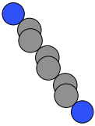
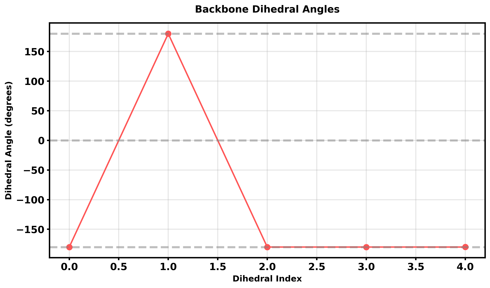
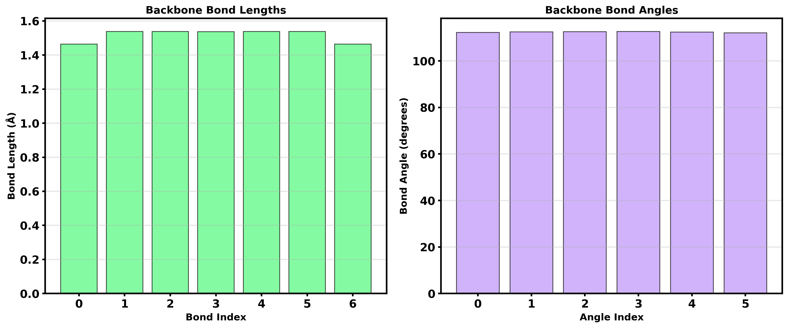

# 21. Backbone Query — Analyze DJ Spacer Backbones

The spacer analysis module provides a queryable interface for analyzing DJ spacer backbones, including dihedral angles, bond lengths, bond angles, and element composition.

## Overview

After analyzing a spacer molecule, you can query its backbone properties using the `backbone` property, which returns a `BackboneQuery` object with chainable methods.

## Basic Backbone Analysis

### Step 1: Analyze Structure and Spacer

```python
from q2D_Materials.analyzer import q2D_analyzer
from q2D_Materials.modifier import GraphView
from q2D_Materials.core.creator import q2D_creator

# Create DJ structure
creator = q2D_creator()
structure = creator.create_structure(
    structure_type="bulk",
    A_ions="MA",
    B_ions="Pb",
    X_ions="I",
    template="cubic",
    layer_sequence="DJ",
    thickness=2,
    spacer="[NH3+]CCCCCC[NH3+]",  # Hexanediammonium
    xy_expansion=(1, 1),
)

# Analyze structure
analyzer = q2D_analyzer(structure)
analyzer.analyze()

# Get spacer analysis
view = GraphView(analyzer)
spacer = view.spacers[0]
result = spacer.analyze_spacer()
```

### Step 2: Query Backbone Properties

```python
# Access backbone query interface
backbone = result.backbone

# Get element symbols
elements = backbone.elements()
print(f"Backbone elements: {''.join(elements)}")
# Output: Backbone elements: NCCCCCCN

# Get atom indices
indices = backbone.indices()
print(f"Backbone indices: {indices}")

# Get positions
positions = backbone.positions()
print(f"Backbone shape: {positions.shape}")
# Output: Backbone shape: (8, 3)
```



## Geometric Analysis

### Bond Lengths

```python
# Calculate bond lengths along backbone
bond_lengths = backbone.bond_lengths()

print(f"Number of bonds: {len(bond_lengths)}")
for i, length in enumerate(bond_lengths):
    print(f"  Bond {i}: {length:.3f} Å")

# Average bond length
avg_length = sum(bond_lengths) / len(bond_lengths)
print(f"Average bond length: {avg_length:.3f} Å")
```

### Bond Angles

```python
# Calculate bond angles along backbone
bond_angles = backbone.bond_angles()

print(f"Number of angles: {len(bond_angles)}")
for i, angle in enumerate(bond_angles):
    print(f"  Angle {i}: {angle:.2f}°")

# Average bond angle
avg_angle = sum(bond_angles) / len(bond_angles)
print(f"Average bond angle: {avg_angle:.2f}°")
```

### Dihedral Angles

```python
# Calculate dihedral angles along backbone
dihedrals = backbone.dihedrals()

print(f"Number of dihedrals: {len(dihedrals)}")
for i, dihedral in enumerate(dihedrals):
    print(f"  Dihedral {i}: {dihedral:.2f}°")

# Identify trans/cis conformations
for i, dihedral in enumerate(dihedrals):
    if abs(dihedral) > 150:
        conformation = "trans"
    elif abs(dihedral) < 30:
        conformation = "cis"
    else:
        conformation = "gauche"
    print(f"  Dihedral {i}: {dihedral:.2f}° ({conformation})")
```



## Filtering Backbone Atoms

### Filter by Element

```python
# Get all carbon atoms in backbone
carbon_indices = backbone.filter(element='C')
print(f"Carbon atoms: {len(carbon_indices)}")

# Get all nitrogen atoms in backbone
nitrogen_indices = backbone.filter(element='N')
print(f"Nitrogen atoms: {len(nitrogen_indices)}")
```

## Complete Backbone Data

### Export as Dictionary

```python
# Get all backbone data at once
backbone_data = backbone.to_dict()

print("Complete Backbone Data:")
print(f"  Length: {backbone_data['length']} atoms")
print(f"  Elements: {''.join(backbone_data['elements'])}")
print(f"  Bond lengths: {backbone_data['bond_lengths']}")
print(f"  Bond angles: {backbone_data['bond_angles']}")
print(f"  Dihedrals: {backbone_data['dihedrals']}")
```

## Batch Analysis

### Analyze Multiple Spacers

```python
# Batch analyze all spacers
results = analyzer.analyze_spacer_molecules()

for i, result in enumerate(results):
    print(f"\nSpacer {i} Backbone Analysis:")

    # Get backbone data
    backbone = result.backbone

    # Summary statistics
    bond_lengths = backbone.bond_lengths()
    bond_angles = backbone.bond_angles()
    dihedrals = backbone.dihedrals()

    print(f"  Elements: {''.join(backbone.elements())}")
    print(f"  Avg bond length: {sum(bond_lengths)/len(bond_lengths):.3f} Å")
    print(f"  Avg bond angle: {sum(bond_angles)/len(bond_angles):.2f}°")
    print(f"  Avg dihedral: {sum(dihedrals)/len(dihedrals):.2f}°")
```

## Advanced Analysis

### Planarity Analysis

```python
import numpy as np

# Check backbone planarity using dihedral angles
dihedrals = backbone.dihedrals()

# Planar if all dihedrals are close to 0° or 180°
is_planar = all(abs(d) < 30 or abs(d) > 150 for d in dihedrals)
print(f"Backbone is planar: {is_planar}")

# Calculate planarity score (0 = planar, higher = non-planar)
planarity_score = sum(min(abs(d), abs(180 - abs(d))) for d in dihedrals) / len(dihedrals)
print(f"Planarity score: {planarity_score:.2f}°")
```

### Torsional Strain Analysis

```python
# Identify strained torsions
strained_dihedrals = [
    (i, d) for i, d in enumerate(dihedrals)
    if 30 < abs(d) < 150  # Gauche conformations
]

print(f"Strained torsions: {len(strained_dihedrals)}")
for i, dihedral in strained_dihedrals:
    print(f"  Dihedral {i}: {dihedral:.2f}° (gauche)")
```

### Backbone Extension Analysis

```python
# Compare backbone extension with ideal length
bond_lengths = backbone.bond_lengths()
actual_length = sum(bond_lengths)

# Ideal length (fully extended, all trans)
ideal_length = len(bond_lengths) * 1.54  # Typical C-C bond length

extension_ratio = actual_length / ideal_length
print(f"Extension ratio: {extension_ratio:.3f}")
print(f"Backbone is {'extended' if extension_ratio > 0.95 else 'coiled'}")
```



## Visualization Data Export

### Export for Plotting

```python
import matplotlib.pyplot as plt
import numpy as np

# Get backbone data
positions = backbone.positions()
elements = backbone.elements()
dihedrals = backbone.dihedrals()

# Plot dihedral angles along backbone
plt.figure(figsize=(10, 6))
plt.plot(range(len(dihedrals)), dihedrals, 'o-', linewidth=2)
plt.axhline(y=0, color='gray', linestyle='--', alpha=0.5)
plt.axhline(y=180, color='gray', linestyle='--', alpha=0.5)
plt.axhline(y=-180, color='gray', linestyle='--', alpha=0.5)
plt.xlabel('Dihedral Index')
plt.ylabel('Dihedral Angle (degrees)')
plt.title('Backbone Dihedral Angles')
plt.grid(True, alpha=0.3)
plt.tight_layout()
plt.savefig('backbone_dihedrals.png', dpi=300)
```

## Comparison with Reference Code

The backbone query system is designed to be more comprehensive than the reference code:

### Reference Code
```python
# Reference: calculate_linker_position_descriptor
amat = Chem.GetDistanceMatrix(mol)
disNN = amat[charged_atom_1][charged_atom_2]
```

### Our Implementation
```python
# q2D-Materials: Full geometric analysis
result = spacer.analyze_spacer()

# All geometric properties available
bond_lengths = result.backbone.bond_lengths()
bond_angles = result.backbone.bond_angles()
dihedrals = result.backbone.dihedrals()
positions = result.backbone.positions()

# Compression analysis (similar to reference)
compression = result.compression_factor
euclidean = result.euclidean_distance
path_length = result.path_length
```

**Advantages**:
- Direct 3D coordinates (not distance matrix)
- Dihedral angles for conformational analysis
- Bond lengths and angles for geometry validation
- Filter and query capabilities
- Integration with full structure analysis

## Complete Example

```python
from q2D_Materials.analyzer import q2D_analyzer
from q2D_Materials.core.creator import q2D_creator
from q2D_Materials.modifier import GraphView

# Create DJ structure
creator = q2D_creator()
structure = creator.create_structure(
    structure_type="bulk",
    A_ions="MA", B_ions="Pb", X_ions="I",
    template="cubic",
    layer_sequence="DJ",
    thickness=2,
    spacer="[NH3+]CCCCCC[NH3+]",
    xy_expansion=(1, 1),
)

# Analyze
analyzer = q2D_analyzer(structure)
analyzer.analyze()

# Get spacer
view = GraphView(analyzer)
spacer = view.spacers[0]
result = spacer.analyze_spacer()

# Comprehensive backbone analysis
print("="*60)
print("BACKBONE ANALYSIS")
print("="*60)

backbone = result.backbone

# 1. Basic info
print(f"\n1. Basic Information:")
print(f"   Elements: {''.join(backbone.elements())}")
print(f"   Length: {len(backbone.indices())} atoms")

# 2. Geometric properties
bond_lengths = backbone.bond_lengths()
bond_angles = backbone.bond_angles()
dihedrals = backbone.dihedrals()

print(f"\n2. Geometric Properties:")
print(f"   Avg bond length: {sum(bond_lengths)/len(bond_lengths):.3f} Å")
print(f"   Avg bond angle: {sum(bond_angles)/len(bond_angles):.2f}°")
print(f"   Avg dihedral: {sum(dihedrals)/len(dihedrals):.2f}°")

# 3. Conformation analysis
trans_count = sum(1 for d in dihedrals if abs(d) > 150)
cis_count = sum(1 for d in dihedrals if abs(d) < 30)
gauche_count = len(dihedrals) - trans_count - cis_count

print(f"\n3. Conformation:")
print(f"   Trans: {trans_count}")
print(f"   Cis: {cis_count}")
print(f"   Gauche: {gauche_count}")

# 4. Extension analysis
actual_length = sum(bond_lengths)
ideal_length = len(bond_lengths) * 1.54
extension = actual_length / ideal_length

print(f"\n4. Extension:")
print(f"   Actual length: {actual_length:.3f} Å")
print(f"   Ideal length: {ideal_length:.3f} Å")
print(f"   Extension ratio: {extension:.3f}")

# 5. Compression (from SpacerAnalysisResult)
print(f"\n5. Compression:")
print(f"   Euclidean N-N: {result.euclidean_distance:.3f} Å")
print(f"   Path length: {result.path_length:.3f} Å")
print(f"   Compression factor: {result.compression_factor:.3f}")

print("="*60)
```

## API Reference

### BackboneQuery Methods

```python
backbone = result.backbone

# Geometric queries
backbone.dihedrals()      # List[float] - Dihedral angles (degrees)
backbone.bond_lengths()   # List[float] - Bond lengths (Å)
backbone.bond_angles()    # List[float] - Bond angles (degrees)

# Property queries
backbone.elements()       # List[str] - Element symbols
backbone.positions()      # np.ndarray - xyz coordinates
backbone.indices()        # List[int] - Atom indices

# Filtering
backbone.filter(element='C')  # List[int] - Filtered indices

# Export
backbone.to_dict()       # Dict - All properties
```

## Tips

1. **Dihedral angles** are most useful for conformational analysis
2. **Bond angles** help identify sp, sp2, sp3 hybridization
3. **Bond lengths** validate geometry and identify strained bonds
4. **Filter by element** to focus on specific atoms (e.g., only carbons)
5. **Use to_dict()** to export all data at once for external analysis

## See Also

- [Example 16: Graph Queries](16_GraphQuery.md) - NetworkX graph queries
- [Example 19: Molecule Modifier](19_MoleculeModifier.md) - Modifying spacers
- [Example 20: Molecule Validator](20_MoleculeValidator.md) - Validating spacers
