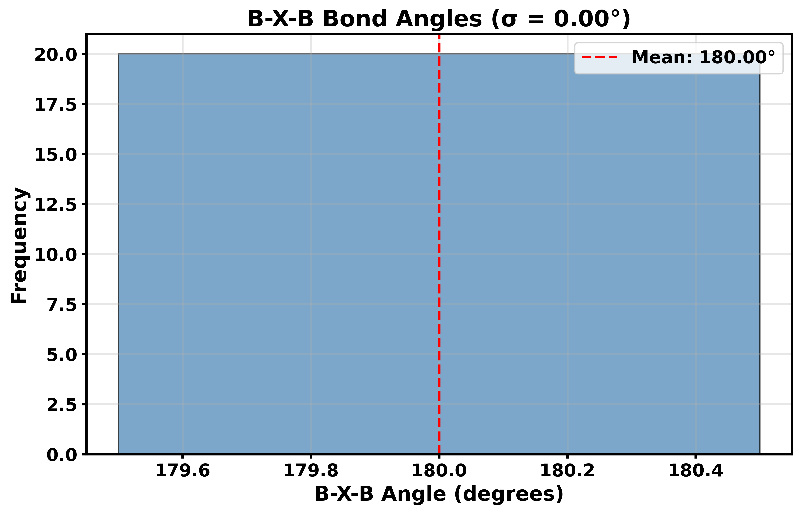
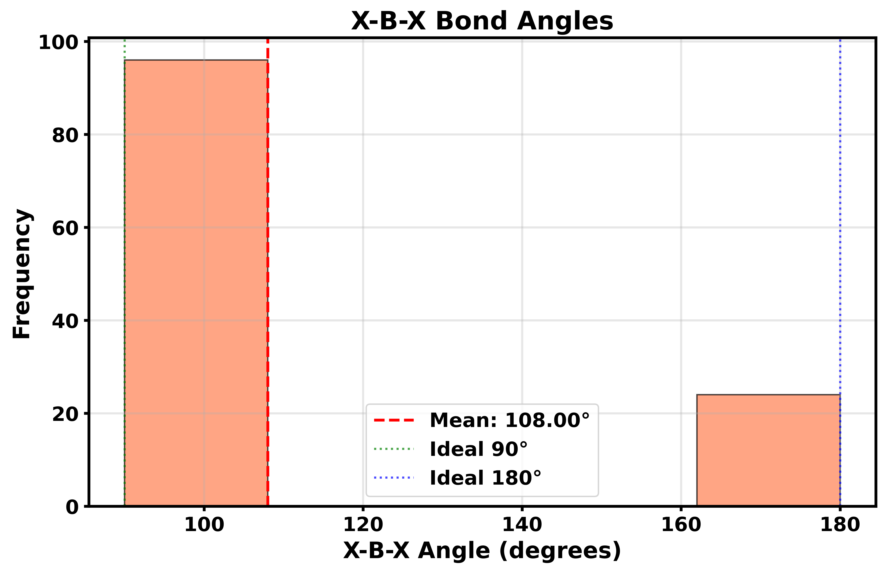
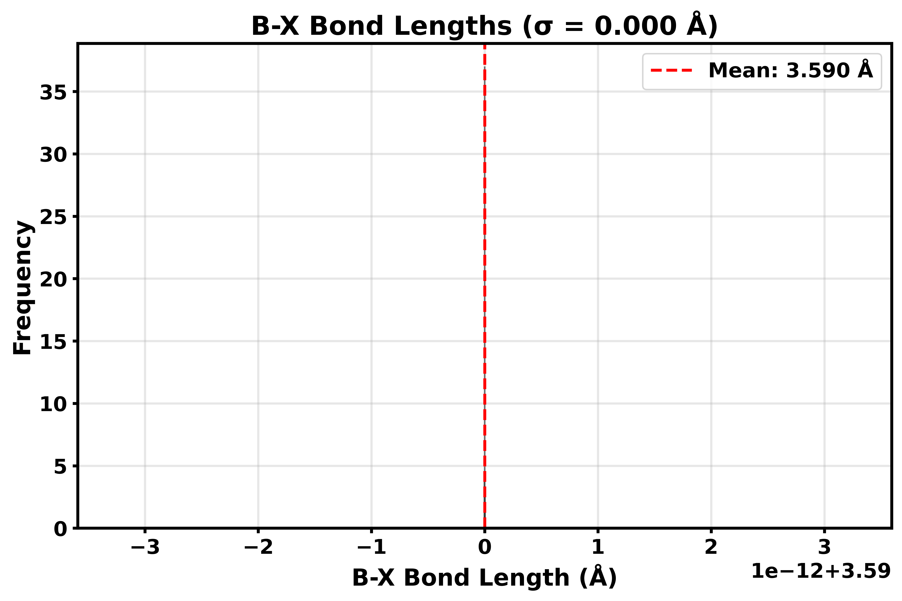
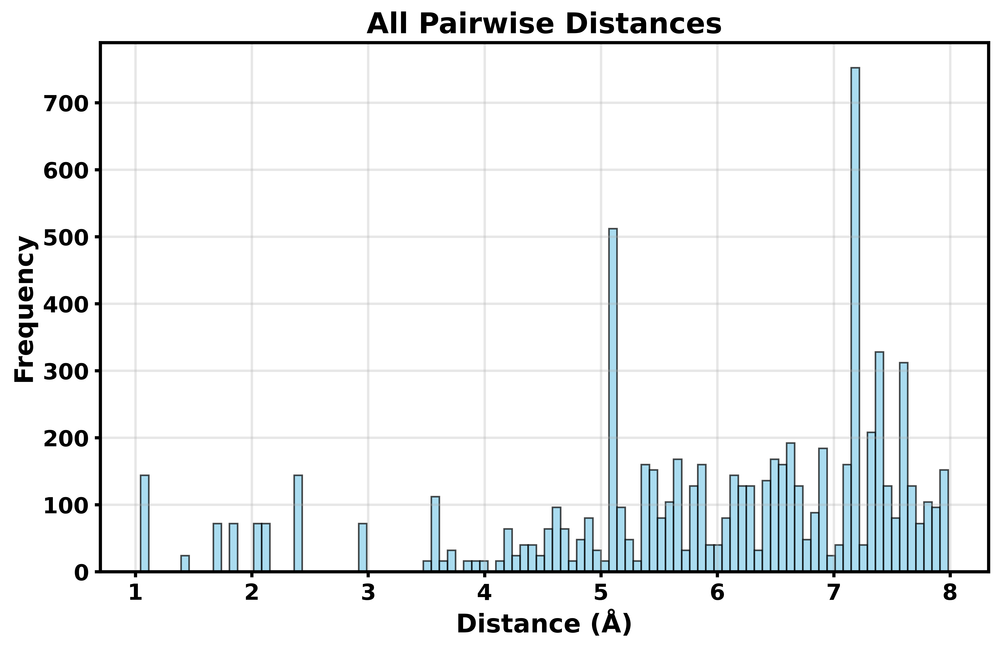
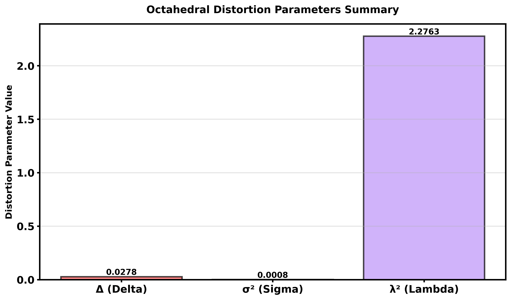

# Example 22: Octahedral Distortion Analysis and Plotting

This example demonstrates how to compute octahedral distortion parameters (Δ, σ, λ) and visualize structural properties using the graph-based analyzer.

## Overview

The q2D analyzer provides convenient methods for:
- **Distortion parameters**: `compute_delta()`, `compute_sigma()`, `compute_lambda()`
- **Per-octahedron data**: `get_octahedral_distortions()` for detailed analysis
- **Layer-based analysis**: Filter by layer or group results by layer
- **Angle data**: `get_bxb_angles()` and `get_octahedral_distortions()` for angle data
- **Distance data**: `get_octahedral_distortions()` for bond length data
- **RDF data**: `get_partial_rdf()` for radial distribution function data

## New: Layer-Based Analysis

The distortion API now supports octahedra selection and layer-based grouping, leveraging the graph structure:

```python
# Global distortion (all octahedra)
delta = analyzer.compute_delta()

# Per-layer distortion
delta_by_layer = analyzer.compute_delta(group_by='layer')
# → {'0': 0.0234, '1': 0.0189, 'global': 0.0211}

# Single layer
delta_layer0 = analyzer.compute_delta(layer='0')

# Specific octahedra
delta_subset = analyzer.compute_delta(octahedra=['octahedron_0', 'octahedron_1'])

# Detailed per-octahedron data
oct_data = analyzer.get_octahedral_distortions()
for oct_id, metrics in oct_data.items():
    print(f"{oct_id} (Layer {metrics['layer']}): Δ={metrics['delta']:.4f}")
```

## Basic Usage

```python
from q2D_Materials.analyzer.core.analyzer_class import q2D_analyzer

# Load and analyze structure
analyzer = q2D_analyzer("MAPbI3.cif")
analyzer.analyze()

# Compute octahedral distortion parameters
delta = analyzer.compute_delta()     # Bond length distortion
sigma = analyzer.compute_sigma()     # Bond length variance
lambda_param = analyzer.compute_lambda()  # Bond angle variance

print(f"Δ (delta):  {delta:.4f}")
print(f"σ² (sigma): {sigma:.6f}")
print(f"λ² (lambda): {lambda_param:.4f}")
```

## Octahedral Distortion Parameters

### Delta (Δ) - Bond Length Distortion

Delta measures the mean absolute deviation of B-X bond lengths from the average:

```python
delta = analyzer.compute_delta()
print(f"Bond length distortion: {delta:.4f}")
```

- **Ideal octahedra**: Δ ≈ 0
- **Higher values**: More distorted octahedra

### Sigma (σ²) - Bond Length Variance

Sigma squared is the normalized variance of B-X bond lengths:

```python
sigma = analyzer.compute_sigma()
print(f"Bond length variance: {sigma:.6f}")
```

### Lambda (λ²) - Bond Angle Variance

Lambda squared measures deviation of X-B-X angles from ideal (90° or 180°):

```python
lambda_param = analyzer.compute_lambda()
print(f"Bond angle variance: {lambda_param:.4f}")
```

## Plotting Bond Angles

### B-X-B Angles

Get B-X-B angle data and create custom plots:

```python
import matplotlib.pyplot as plt

# Get B-X-B angle data
bxb_data = analyzer.get_bxb_angles()
angles = bxb_data['bxb_angles']
mean_angle = bxb_data['bxb_mean']
std_angle = bxb_data['bxb_std']

# Create custom plot
fig, ax = plt.subplots(figsize=(10, 6))
ax.hist(angles, bins=60, alpha=0.7, color='steelblue', edgecolor='black')
ax.axvline(mean_angle, color='red', linestyle='--', linewidth=2,
           label=f'Mean: {mean_angle:.2f}°')
ax.set_xlabel('B-X-B Angle (degrees)', fontsize=12)
ax.set_ylabel('Frequency', fontsize=12)
ax.set_title(f'B-X-B Bond Angles (σ = {std_angle:.2f}°)', fontsize=14)
ax.legend()
ax.grid(alpha=0.3)
plt.tight_layout()
plt.savefig("bxb_angles.png", dpi=300, bbox_inches='tight')
plt.close()
```

**Return type:** `get_bxb_angles()` returns a dict with `bxb_angles` (array), `bxb_mean`, `bxb_std`



### X-B-X Angles

Get X-B-X angle data and create custom plots:

```python
import matplotlib.pyplot as plt
from q2D_Materials.analyzer.characterization.distortions import _compute_octahedral_distortions

# Get X-B-X angle data
distortions = _compute_octahedral_distortions(analyzer)
xbx_angles = distortions['bond_angles']
mean_angle = distortions['mean_angle']

# Create custom plot with ideal angle markers
fig, ax = plt.subplots(figsize=(10, 6))
ax.hist(xbx_angles, bins=80, alpha=0.7, color='coral', edgecolor='black')
ax.axvline(mean_angle, color='red', linestyle='--', linewidth=2,
           label=f'Mean: {mean_angle:.2f}°')
ax.axvline(90, color='green', linestyle=':', linewidth=1.5,
           label='Ideal 90°', alpha=0.7)
ax.axvline(180, color='blue', linestyle=':', linewidth=1.5,
           label='Ideal 180°', alpha=0.7)
ax.set_xlabel('X-B-X Angle (degrees)', fontsize=12)
ax.set_ylabel('Frequency', fontsize=12)
ax.set_title('X-B-X Bond Angles', fontsize=14)
ax.legend()
ax.grid(alpha=0.3)
plt.tight_layout()
plt.savefig("xbx_angles.png", dpi=300, bbox_inches='tight')
plt.close()
```

**Return type:** `_compute_octahedral_distortions()` returns a dict with `bond_angles` (array), `mean_angle`, `bond_lengths`, `mean_bond_length`



## Plotting Bond Lengths

### B-X Bond Lengths

Get B-X bond length data and create custom plots:

```python
import matplotlib.pyplot as plt
from q2D_Materials.analyzer.characterization.distortions import _compute_octahedral_distortions
import numpy as np

# Get B-X bond length data
distortions = _compute_octahedral_distortions(analyzer)
bond_lengths = distortions['bond_lengths']
mean_length = distortions['mean_bond_length']

# Create custom plot
fig, ax = plt.subplots(figsize=(10, 6))
ax.hist(bond_lengths, bins=40, alpha=0.7, color='mediumseagreen', edgecolor='black')
ax.axvline(mean_length, color='red', linestyle='--', linewidth=2,
           label=f'Mean: {mean_length:.3f} Å')
ax.set_xlabel('B-X Bond Length (Å)', fontsize=12)
ax.set_ylabel('Frequency', fontsize=12)
std_dist = np.std(bond_lengths)
ax.set_title(f'B-X Bond Lengths (σ = {std_dist:.3f} Å)', fontsize=14)
ax.legend()
ax.grid(alpha=0.3)
plt.tight_layout()
plt.savefig("bx_distances.png", dpi=300, bbox_inches='tight')
plt.close()
```



### All Pairwise Distances

Get all pairwise distances and create custom plots:

```python
import matplotlib.pyplot as plt
from ase.neighborlist import neighbor_list

# Get all pairwise distances
i, j, d = neighbor_list('ijd', analyzer.cell, cutoff=8.0)

# Create custom plot
fig, ax = plt.subplots(figsize=(10, 6))
ax.hist(d, bins=100, alpha=0.7, color='skyblue', edgecolor='black')
ax.set_xlabel('Distance (Å)', fontsize=12)
ax.set_ylabel('Frequency', fontsize=12)
ax.set_title('All Pairwise Distances', fontsize=14)
ax.grid(alpha=0.3)
plt.tight_layout()
plt.show()
```



## Plotting Radial Distribution Functions

### Auto-detect Element Pairs

Get RDF data (auto-detects B-X pairs if element_pairs is None) and create custom plots:

```python
import matplotlib.pyplot as plt

# Get RDF data (auto-detects B-X pairs)
rdf_data = analyzer.get_partial_rdf(max_dist=12.0)

# Create custom plot
fig, ax = plt.subplots(figsize=(12, 7))
colors = plt.cm.tab10(np.linspace(0, 1, len([k for k in rdf_data.keys() if k.endswith('_rdf')])))

idx = 0
for key in sorted(rdf_data.keys()):
    if key.endswith('_rdf'):
        pair_key = key.replace('_rdf', '')
        x_key = f"{pair_key}_x"
        if x_key in rdf_data:
            label = f"{pair_key[0]}-{pair_key[1]}" if len(pair_key) == 2 else pair_key
            ax.plot(rdf_data[x_key], rdf_data[key], 
                   label=label, color=colors[idx], linewidth=2)
            idx += 1

ax.set_xlabel('Distance (Å)', fontsize=12)
ax.set_ylabel('g(r)', fontsize=12)
ax.set_title('Partial Radial Distribution Functions', fontsize=14)
ax.legend(loc='best')
ax.grid(alpha=0.3)
ax.set_xlim(0, 12.0)
plt.tight_layout()
plt.savefig("rdf.png", dpi=300, bbox_inches='tight')
plt.close()
```

### Specify Element Pairs

Get RDF data for specific element pairs and create custom plots:

```python
import matplotlib.pyplot as plt

# Get RDF data for specific pairs
rdf_data = analyzer.get_partial_rdf(
    element_pairs=[["Pb", "I"], ["Pb", "Pb"], ["I", "I"]],
    max_dist=10.0
)

# Create custom plot
fig, ax = plt.subplots(figsize=(10, 6))
colors = plt.cm.tab10(np.linspace(0, 1, 3))
pairs = [("PbI", "Pb-I"), ("PbPb", "Pb-Pb"), ("II", "I-I")]

for idx, (pair_key, pair_label) in enumerate(pairs):
    x_key = f"{pair_key}_x"
    rdf_key = f"{pair_key}_rdf"
    if x_key in rdf_data and rdf_key in rdf_data:
        ax.plot(rdf_data[x_key], rdf_data[rdf_key], 
               label=pair_label, color=colors[idx], linewidth=2)

ax.set_xlabel('Distance (Å)', fontsize=12)
ax.set_ylabel('g(r)', fontsize=12)
ax.set_title('Partial Radial Distribution Functions', fontsize=14)
ax.legend(loc='best')
ax.grid(alpha=0.3)
ax.set_xlim(0, 10.0)
plt.tight_layout()
plt.show()
```

**Return type:** `get_partial_rdf()` returns a dict with `{pair}_x` and `{pair}_rdf` arrays

## Complete Example

```python
from q2D_Materials.analyzer.core.analyzer_class import q2D_analyzer
import matplotlib.pyplot as plt

# Load structure
analyzer = q2D_analyzer("perovskite_structure.cif")
analyzer.analyze()

print(f"Structure type: {analyzer.structure_type}")
print(f"Number of octahedra: {len(analyzer.get_octahedra())}")
print()

# Compute distortion parameters
delta = analyzer.compute_delta()
sigma = analyzer.compute_sigma()
lambda_param = analyzer.compute_lambda()

print("Octahedral Distortion Parameters:")
print(f"  Δ (delta):  {delta:.4f}")
print(f"  σ² (sigma): {sigma:.6f}")
print(f"  λ² (lambda): {lambda_param:.4f}")
print()

# Create a figure with multiple subplots
fig = plt.figure(figsize=(15, 10))

# Plot 1: B-X-B angles
from q2D_Materials.analyzer.characterization.distortions import _compute_octahedral_distortions
bxb_data = analyzer.get_bxb_angles()
angles = bxb_data['bxb_angles']
if angles is not None and len(angles) > 0:
    ax1 = plt.subplot(2, 3, 1)
    ax1.hist(angles, bins=50, alpha=0.7, color='steelblue', edgecolor='black')
    ax1.axvline(bxb_data['bxb_mean'], color='red', linestyle='--', linewidth=2)
    ax1.set_xlabel('B-X-B Angle (degrees)')
    ax1.set_ylabel('Frequency')
    ax1.set_title('B-X-B Angles', fontsize=12, fontweight='bold')
    ax1.grid(alpha=0.3)

# Plot 2: X-B-X angles
distortions = _compute_octahedral_distortions(analyzer)
xbx_angles = distortions['bond_angles']
if len(xbx_angles) > 0:
    ax2 = plt.subplot(2, 3, 2)
    ax2.hist(xbx_angles, bins=50, alpha=0.7, color='coral', edgecolor='black')
    ax2.axvline(distortions['mean_angle'], color='red', linestyle='--', linewidth=2)
    ax2.set_xlabel('X-B-X Angle (degrees)')
    ax2.set_ylabel('Frequency')
    ax2.set_title('X-B-X Angles', fontsize=12, fontweight='bold')
    ax2.grid(alpha=0.3)

# Plot 3: B-X bond lengths
bond_lengths = distortions['bond_lengths']
if len(bond_lengths) > 0:
    ax3 = plt.subplot(2, 3, 3)
    ax3.hist(bond_lengths, bins=50, alpha=0.7, color='mediumseagreen', edgecolor='black')
    ax3.axvline(distortions['mean_bond_length'], color='red', linestyle='--', linewidth=2)
    ax3.set_xlabel('B-X Bond Length (Å)')
    ax3.set_ylabel('Frequency')
    ax3.set_title('B-X Bond Lengths', fontsize=12, fontweight='bold')
    ax3.grid(alpha=0.3)

# Plot 4: All distances
from ase.neighborlist import neighbor_list
i, j, d = neighbor_list('ijd', analyzer.cell, cutoff=8.0)
ax4 = plt.subplot(2, 3, 4)
ax4.hist(d, bins=50, alpha=0.7, color='skyblue', edgecolor='black')
ax4.set_xlabel('Distance (Å)')
ax4.set_ylabel('Frequency')
ax4.set_title('All Pairwise Distances', fontsize=12, fontweight='bold')
ax4.grid(alpha=0.3)

# Plot 5: RDF
rdf_data = analyzer.get_partial_rdf(max_dist=10.0)
ax5 = plt.subplot(2, 3, 5)
colors = plt.cm.tab10(np.linspace(0, 1, len([k for k in rdf_data.keys() if k.endswith('_rdf')])))
idx = 0
for key in sorted(rdf_data.keys()):
    if key.endswith('_rdf'):
        pair_key = key.replace('_rdf', '')
        x_key = f"{pair_key}_x"
        if x_key in rdf_data:
            ax5.plot(rdf_data[x_key], rdf_data[key], 
                    label=f"{pair_key[0]}-{pair_key[1]}" if len(pair_key) == 2 else pair_key,
                    color=colors[idx], linewidth=2)
            idx += 1
ax5.set_xlabel('Distance (Å)')
ax5.set_ylabel('g(r)')
ax5.set_title('Radial Distribution Function', fontsize=12, fontweight='bold')
ax5.legend(loc='best', fontsize=8)
ax5.grid(alpha=0.3)
ax5.set_xlim(0, 10.0)

# Plot 6: Glazer pattern (if applicable)
plt.subplot(2, 3, 6)
try:
    glazer = analyzer.get_glazer_pattern()
    plt.text(0.5, 0.5, f"Glazer: {glazer['notation']}",
             ha='center', va='center', fontsize=16)
    plt.axis('off')
except Exception:
    plt.text(0.5, 0.5, "Glazer pattern\nnot detected",
             ha='center', va='center', fontsize=14)
    plt.axis('off')

plt.tight_layout()
plt.savefig("complete_analysis.png", dpi=300)
plt.show()
```




## Accessing Raw Data

You can also access the raw data for custom analysis:

```python
from q2D_Materials.analyzer.characterization.distortions import _compute_octahedral_distortions

# Get full distortion data
distortion_data = _compute_octahedral_distortions(analyzer)

print(f"Bond lengths: {distortion_data['bond_lengths']}")
print(f"Bond angles: {distortion_data['bond_angles']}")
print(f"Mean bond length: {distortion_data['mean_bond_length']:.3f} Å")
print(f"Mean angle: {distortion_data['mean_angle']:.2f}°")

# Get B-X-B angle data
bxb_data = analyzer.get_bxb_angles()
print(f"B-X-B angles: {bxb_data['bxb_angles']}")
print(f"Mean: {bxb_data['bxb_mean']:.2f}°")
print(f"Std: {bxb_data['bxb_std']:.2f}°")

# Get RDF data
rdf_data = analyzer.get_partial_rdf(
    element_pairs=[["Pb", "I"]],
    max_dist=10.0
)
print(f"RDF x-values: {rdf_data['PbI_x']}")
print(f"RDF values: {rdf_data['PbI_rdf']}")
```

## Integration with Characterization Query

You can also use these methods with the characterization query builder:

```python
# Get characterization query
query = analyzer.get_characterization()

# Access via query (future enhancement)
# result = query.distortions().delta().execute()
```

## Layer-Based Analysis Examples

### Compare Surface vs Internal Layers

```python
from q2D_Materials.analyzer.core.analyzer_class import q2D_analyzer

analyzer = q2D_analyzer("DJ_perovskite.cif")
analyzer.analyze()

# Get layer information
layers_info = analyzer.get_layers()
surface_layers = [lid for lid, info in layers_info.items()
                  if info['position'] == 'surface']
central_layers = [lid for lid, info in layers_info.items()
                  if info['position'] == 'central']

# Compare distortions
delta_surface = analyzer.compute_delta(layers=surface_layers)
delta_central = analyzer.compute_delta(layers=central_layers)
print(f"Surface layers: Δ = {delta_surface:.4f}")
print(f"Central layers: Δ = {delta_central:.4f}")

# Plot angle distributions by layer - Get data and create custom subplots
from q2D_Materials.analyzer.characterization.distortions import _compute_octahedral_distortions
distortions_by_layer = _compute_octahedral_distortions(analyzer, group_by='layer')
layer_ids = [k for k in distortions_by_layer.keys() if k != 'global']
n_layers = len(layer_ids)

if n_layers > 0:
    import matplotlib.pyplot as plt
    ncols = min(3, n_layers)
    nrows = (n_layers + ncols - 1) // ncols
    fig, axes = plt.subplots(nrows, ncols, figsize=(12, 8))
    if n_layers == 1:
        axes = [axes]
    else:
        axes = axes.flatten() if nrows > 1 else axes
    
    colors = plt.cm.tab10(np.linspace(0, 1, n_layers))
    
    for idx, layer_id in enumerate(sorted(layer_ids)):
        ax = axes[idx]
        layer_data = distortions_by_layer[layer_id]
        angles = layer_data['bond_angles']
        mean_angle = layer_data['mean_angle']
        
        if len(angles) > 0:
            ax.hist(angles, bins=50, alpha=0.7, color=colors[idx], edgecolor='black')
            ax.axvline(mean_angle, color='red', linestyle='--', linewidth=1.5,
                      label=f'Mean: {mean_angle:.2f}°')
            ax.axvline(90, color='green', linestyle=':', linewidth=1, alpha=0.6)
            ax.axvline(180, color='blue', linestyle=':', linewidth=1, alpha=0.6)
            ax.set_xlabel('X-B-X Angle (°)', fontsize=10)
            ax.set_ylabel('Frequency', fontsize=10)
            ax.set_title(f'Layer {layer_id}', fontsize=11)
            ax.legend(fontsize=8)
            ax.grid(alpha=0.3)
    
    # Hide unused subplots
    for idx in range(n_layers, len(axes)):
        axes[idx].set_visible(False)
    
    plt.tight_layout()
    plt.show()
```

### Per-Layer Distortion Analysis

```python
analyzer = q2D_analyzer("multilayer_perovskite.cif")
analyzer.analyze()

print("Layer-wise Distortion Analysis:")
print("=" * 60)

# Get all three distortion parameters grouped by layer
delta_by_layer = analyzer.compute_delta(group_by='layer')
sigma_by_layer = analyzer.compute_sigma(group_by='layer')
lambda_by_layer = analyzer.compute_lambda(group_by='layer')

for layer_id in sorted([k for k in delta_by_layer.keys() if k != 'global']):
    print(f"\nLayer {layer_id}:")
    print(f"  Δ (bond length distortion): {delta_by_layer[layer_id]:.4f}")
    print(f"  σ² (bond length variance):   {sigma_by_layer[layer_id]:.6f}")
    print(f"  λ² (bond angle variance):    {lambda_by_layer[layer_id]:.4f}")

print(f"\nGlobal (all layers):")
print(f"  Δ:  {delta_by_layer['global']:.4f}")
print(f"  σ²: {sigma_by_layer['global']:.6f}")
print(f"  λ²: {lambda_by_layer['global']:.4f}")
```

### Detailed Per-Octahedron Analysis

```python
analyzer = q2D_analyzer("structure.cif")
analyzer.analyze()

# Get detailed metrics for each octahedron
oct_data = analyzer.get_octahedral_distortions()

print("Per-Octahedron Distortion Metrics:")
print("=" * 80)

for oct_id, metrics in oct_data.items():
    print(f"\n{oct_id} (Layer {metrics['layer']}, B-site: {metrics['central_atom_symbol']}):")
    print(f"  Central atom index: {metrics['central_atom_index']}")
    print(f"  Δ = {metrics['delta']:.4f}")
    print(f"  σ² = {metrics['sigma']:.6f}")
    print(f"  λ² = {metrics['lambda']:.4f}")
    print(f"  Mean B-X bond length: {metrics['mean_bond_length']:.3f} Å")
    print(f"  Mean X-B-X angle: {metrics['mean_angle']:.2f}°")
    print(f"  Bond lengths: {metrics['bond_lengths']}")

# Filter by specific layer
layer0_oct = analyzer.get_octahedral_distortions(layer='0')
print(f"\nLayer 0 contains {len(layer0_oct)} octahedra")
```

### Layer-Specific Plotting

```python
analyzer = q2D_analyzer("structure.cif")
analyzer.analyze()

# Plot angles for specific layer - Get data and plot
from q2D_Materials.analyzer.characterization.distortions import _compute_octahedral_distortions
distortions_layer0 = _compute_octahedral_distortions(analyzer, layer='0')
xbx_angles = distortions_layer0['bond_angles']
if len(xbx_angles) > 0:
    import matplotlib.pyplot as plt
    fig1, ax = plt.subplots(figsize=(8, 6))
    ax.hist(xbx_angles, bins=60, alpha=0.7, color='coral', edgecolor='black')
    ax.axvline(distortions_layer0['mean_angle'], color='red', linestyle='--', linewidth=2)
    ax.set_xlabel('X-B-X Angle (degrees)')
    ax.set_ylabel('Frequency')
    ax.set_title('Layer 0 X-B-X Angles')
    ax.grid(alpha=0.3)
    plt.tight_layout()
    plt.savefig('layer0_xbx_angles.png', dpi=300, bbox_inches='tight')
    plt.close()

# Compare multiple layers with group_by - Get data and create subplots
distortions_by_layer = _compute_octahedral_distortions(analyzer, group_by='layer')
layer_ids = [k for k in distortions_by_layer.keys() if k != 'global']
n_layers = len(layer_ids)

if n_layers > 0:
    ncols = min(3, n_layers)
    nrows = (n_layers + ncols - 1) // ncols
    fig2, axes = plt.subplots(nrows, ncols, figsize=(15, 10))
    if n_layers == 1:
        axes = [axes]
    else:
        axes = axes.flatten() if nrows > 1 else axes
    
    colors = plt.cm.tab10(np.linspace(0, 1, n_layers))
    
    for idx, layer_id in enumerate(sorted(layer_ids)):
        ax = axes[idx]
        layer_data = distortions_by_layer[layer_id]
        angles = layer_data['bond_angles']
        mean_angle = layer_data['mean_angle']
        
        if len(angles) > 0:
            ax.hist(angles, bins=50, alpha=0.7, color=colors[idx], edgecolor='black')
            ax.axvline(mean_angle, color='red', linestyle='--', linewidth=1.5)
            ax.set_xlabel('X-B-X Angle (°)')
            ax.set_ylabel('Frequency')
            ax.set_title(f'Layer {layer_id}')
            ax.grid(alpha=0.3)
    
    for idx in range(n_layers, len(axes)):
        axes[idx].set_visible(False)
    
    plt.tight_layout()
    plt.savefig('all_layers_xbx_angles.png', dpi=300, bbox_inches='tight')
    plt.close()

# Plot distances for surface layers only - Get data and plot
layers_info = analyzer.get_layers()
surface_layers = [lid for lid, info in layers_info.items()
                  if info['position'] == 'surface']

distortions_surface = _compute_octahedral_distortions(analyzer, layers=surface_layers)
bond_lengths = distortions_surface['bond_lengths']
if len(bond_lengths) > 0:
    fig3, ax = plt.subplots(figsize=(10, 6))
    ax.hist(bond_lengths, bins=50, alpha=0.7, color='mediumseagreen', edgecolor='black')
    ax.axvline(distortions_surface['mean_bond_length'], color='red', linestyle='--', linewidth=2)
    ax.set_xlabel('B-X Bond Length (Å)')
    ax.set_ylabel('Frequency')
    ax.set_title('Surface Layers B-X Bond Lengths')
    ax.grid(alpha=0.3)
    plt.tight_layout()
    plt.savefig('surface_bx_distances.png', dpi=300, bbox_inches='tight')
    plt.close()
```

### Statistical Analysis Across Layers

```python
import numpy as np
import matplotlib.pyplot as plt

analyzer = q2D_analyzer("structure.cif")
analyzer.analyze()

# Get per-octahedron data
oct_data = analyzer.get_octahedral_distortions()

# Group by layer
layer_deltas = {}
for oct_id, metrics in oct_data.items():
    layer_id = metrics['layer']
    if layer_id not in layer_deltas:
        layer_deltas[layer_id] = []
    layer_deltas[layer_id].append(metrics['delta'])

# Plot delta distribution across layers
fig, ax = plt.subplots(figsize=(10, 6))
positions = []
data = []
labels = []

for layer_id in sorted(layer_deltas.keys()):
    positions.append(int(layer_id))
    data.append(layer_deltas[layer_id])
    labels.append(f"Layer {layer_id}")

bp = ax.boxplot(data, positions=positions, labels=labels, patch_artist=True)
for patch in bp['boxes']:
    patch.set_facecolor('lightblue')

ax.set_xlabel('Layer', fontsize=12)
ax.set_ylabel('Δ (Bond Length Distortion)', fontsize=12)
ax.set_title('Octahedral Distortion Distribution by Layer', fontsize=14)
ax.grid(axis='y', alpha=0.3)
plt.tight_layout()
plt.savefig('distortion_by_layer.png', dpi=300)
plt.show()
```

## API Summary

### Distortion Computation Methods
| Method | Description | Parameters | Returns |
|--------|-------------|------------|---------|
| `compute_delta()` | Bond length distortion (Δ) | `octahedra`, `layer`, `layers`, `group_by` | float or dict |
| `compute_sigma()` | Bond length variance (σ²) | `octahedra`, `layer`, `layers`, `group_by` | float or dict |
| `compute_lambda()` | Bond angle variance (λ²) | `octahedra`, `layer`, `layers`, `group_by` | float or dict |
| `get_octahedral_distortions()` | Detailed per-octahedron metrics | `octahedra`, `layer`, `layers` | dict |

### Data Extraction Methods
| Method | Description | Returns |
|--------|-------------|---------|
| `get_bxb_angles()` | Get B-X-B angle data | dict with `bxb_angles` (array), `bxb_mean`, `bxb_std` |
| `get_octahedral_distortions()` | Get per-octahedron distortion data | dict with `bond_angles`, `bond_lengths`, `delta`, `sigma`, `lambda` per octahedron |
| `_compute_octahedral_distortions()` | Get aggregated distortion data | dict with `bond_angles`, `bond_lengths`, `mean_angle`, `mean_bond_length` |
| `get_partial_rdf()` | Get RDF data | dict with `{pair}_x` and `{pair}_rdf` arrays |

**Note:** Use these methods to extract data, then create custom plots with matplotlib for full control over visualization.

### Selection Parameters

All distortion and plotting methods support:
- **`octahedra`** (list): Specific octahedra IDs (e.g., `['octahedron_0', 'octahedron_1']`)
- **`layer`** (str): Single layer ID (e.g., `'0'`)
- **`layers`** (list): Multiple layer IDs (e.g., `['0', '1']`)
- **`group_by`** (str): Set to `'layer'` to group results by layer

### Key Features
- **Graph-based**: All methods use the graph structure from `analyzer.analyze()`
- **Layer-aware**: Filter octahedra by layer or analyze each layer separately
- **Automatic detection**: Element pairs auto-detected from octahedra
- **Flexible plotting**: Customizable bins, sizes, and save options
- **Standard metrics**: Industry-standard distortion parameters (Δ, σ, λ)
- **Per-octahedron access**: Get detailed metrics for each octahedron with layer info
