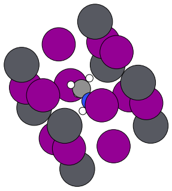
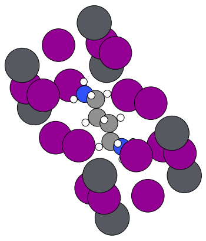
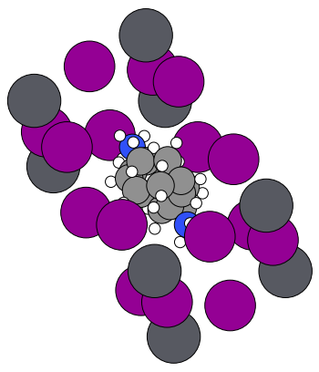

# Example 22: Cavity Detection and Analysis

This example demonstrates the new cavity detection system that identifies and analyzes cuboctahedral cavities hosting A-site cations and spacer molecules in 2D perovskites.

## Overview

The q2D analyzer now provides comprehensive cavity detection and analysis:

- **Geometric Classification**: Identifies cavities based on cuboctahedral geometry (8B + 12X for closed, 4B + 8X for open)
- **Molecule Detection**: Automatically detects A-site molecules and spacer molecules within cavities
- **PBC-Aware Positioning**: Correctly handles periodic boundary conditions for accurate cavity reconstruction
- **Cavity Metrics**: Computes volume, deformation, and proximity metrics
- **Spacer Support**: Full support for both Dion-Jacobson (DJ) and Ruddlesden-Popper (RP) spacers

## Basic Usage

```python
from q2D_Materials.analyzer import q2D_analyzer
from q2D_Materials.analyzer.detection.cavity_tracing import (
    calculate_cavity_deformation,
    calculate_cavity_volume,
    find_closest_cavity_atoms,
)

# Load and analyze structure
analyzer = q2D_analyzer("structure.cif")
analyzer.analyze()

# Get cavities using on-demand detection
cavities = analyzer.detect_cavities()

print(f"Found {len(cavities)} cavities")

# Access each cavity
for i, cavity in enumerate(cavities):
    print(f"\nCavity {i}:")
    print(f"  Type: {cavity.get('cavity_type', 'unknown')}")
    print(f"  B atoms: {len(cavity.get('b_data_list', []))}")
    print(f"  X atoms: {len(cavity.get('x_data_list', []))}")
    print(f"  A-site molecule: {bool(cavity.get('a_site_indices'))}")
    print(f"  Contains {len(cavity.get('a_site_indices', []))} atoms")
```

## Cavity Types

### A-Site Cavities

Closed cuboctahedral cavities (8B + 12X) hosting A-site cations:

```python
# Filter for A-site cavities
a_site_cavities = [c for c in cavities if c.get('closed', False)]
print(f"Found {len(a_site_cavities)} A-site cavities")

for cavity in a_site_cavities:
    # Get molecule atoms
    a_site_indices = cavity.get('a_site_indices', [])
    print(f"  Molecule atoms: {a_site_indices}")
    
    # Get cavity geometry
    b_atoms = len(cavity.get('b_data_list', []))
    x_atoms = len(cavity.get('x_data_list', []))
    print(f"  Geometry: {b_atoms}B + {x_atoms}X")
```

### Spacer Cavities

Open cavities hosting spacer molecules between inorganic layers:

#### DJ (Dion-Jacobson) Spacers

DJ spacers form **one cavity** (8B + 16X) spanning between two layers:

```python
# Filter for DJ spacer cavities
dj_cavities = [c for c in cavities if c.get('cavity_type') == 'spacer_dj']
print(f"Found {len(dj_cavities)} DJ spacer cavities")

for cavity in dj_cavities:
    # DJ cavities have larger geometry
    b_atoms = len(cavity.get('b_data_list', []))
    x_atoms = len(cavity.get('x_data_list', []))
    print(f"  DJ Geometry: {b_atoms}B + {x_atoms}X (spans both layers)")
    
    # Get spacer molecule
    molecule_atoms = cavity.get('a_site_indices', [])
    print(f"  Spacer: {len(molecule_atoms)} atoms")
```

#### RP (Ruddlesden-Popper) Spacers

RP spacers form **one cavity per molecule** (4B + 8X) between layer and boundary:

```python
# Filter for RP spacer cavities
rp_cavities = [c for c in cavities if c.get('cavity_type') == 'spacer_rp']
print(f"Found {len(rp_cavities)} RP spacer cavities")

for cavity in rp_cavities:
    # RP cavities have standard open geometry
    b_atoms = len(cavity.get('b_data_list', []))
    x_atoms = len(cavity.get('x_data_list', []))
    print(f"  RP Geometry: {b_atoms}B + {x_atoms}X (single layer)")
```

## Cavity Deformation Analysis

Calculate how much a cavity deviates from ideal cuboctahedron geometry:

```python
# Get cavity metrics
deformation = calculate_cavity_deformation(
    cavity, octahedra_data, atom_positions, cell
)

print("Cavity Deformation Metrics:")
print(f"  Vertex angle deviations: {deformation['vertex_angle_deviations']:.3f}°")
print(f"  Dihedral deviations: {deformation['dihedral_deviations']:.3f}°")
print(f"  Edge length variation: {deformation['edge_length_variation']:.3f}")
print(f"  Symmetry score: {deformation['symmetry_score']:.3f} (0=perfect, 1=distorted)")
print(f"  Number of vertices: {deformation['n_vertices']}")
print(f"  Mean edge length: {deformation['mean_edge_length']:.3f} Å")
```

**Ideal cuboctahedron values:**
- Vertex angles: 60° (triangle-triangle) and 90° (square-square)
- Dihedral angles: ~109.47° (square-triangle), ~125.26° (square-square), ~70.53° (triangle-triangle)
- Symmetry score: 0 = perfect cuboctahedron, 1 = highly distorted

## Cavity Volume Calculation

Calculate cavity volume using convex hull of corner X atoms:

```python
# Calculate volume for each cavity
for i, cavity in enumerate(cavities):
    volume = calculate_cavity_volume(
        cavity, octahedra_data, atom_positions, cell
    )
    cavity_type = cavity.get('cavity_type', 'a_site')
    print(f"Cavity {i} ({cavity_type}): Volume = {volume:.2f} Ų")
```

**Note:** Volume is calculated using the convex hull of all X atoms (corner atoms) that form the cavity walls. The positions are unwrapped using PBC-aware minimum image convention.

## Molecule-Cavity Proximity Analysis

Find closest cavity atoms for each molecule atom:

```python
# For each cavity with an A-site molecule
for cavity in cavities:
    if cavity.get('a_site_indices'):
        a_site_indices = cavity.get('a_site_indices', [])
        
        # Find closest cavity atoms
        closest_pairs = find_closest_cavity_atoms(
            a_site_indices,
            cavity,
            octahedra_data,
            atom_positions,
            cell
        )
        
        print(f"\nCavity proximity ({len(closest_pairs)} connections):")
        for pair in closest_pairs[:5]:  # Show first 5
            print(f"  Molecule atom {pair['molecule_atom_index']} → "
                  f"Cavity atom {pair['closest_cavity_atom_index']}: "
                  f"{pair['distance']:.3f} Å")
```

**Return format:** Each pair contains:
- `molecule_atom_index`: Index of atom in the molecule
- `molecule_atom_position`: Original 3D position [x, y, z]
- `closest_cavity_atom_index`: Index of closest X atom in cavity
- `closest_cavity_atom_position`: PBC-unwrapped position [x, y, z]
- `distance`: Distance in Ångströms (PBC-aware)
- `pbc_vector`: Vector from molecule to cavity atom [dx, dy, dz]

## Export to XYZ Format

Export cavities as XYZ files for visualization:

```python
from ase.io import write

# Convert cavities to ASE Atoms objects
cavity_atoms_list = cavities.to_atoms()

# Save each cavity
for i, cavity_atoms in enumerate(cavity_atoms_list):
    write(f'cavity_{i}.xyz', cavity_atoms)
    print(f"Saved cavity {i} with {len(cavity_atoms)} atoms")
```

## Complete Cavity Analysis Example

```python
from q2D_Materials.analyzer import q2D_analyzer
from q2D_Materials.analyzer.detection.cavity_tracing import (
    calculate_cavity_deformation,
    calculate_cavity_volume,
    find_closest_cavity_atoms,
)
import numpy as np

# Load structure
analyzer = q2D_analyzer("perovskite_structure.cif")
analyzer.analyze()

# Detect cavities
cavities = analyzer.detect_cavities()
print(f"Found {len(cavities)} cavities")

# Get required data
atom_positions = analyzer.cell.get_positions()
atom_symbols = analyzer.cell.get_chemical_symbols()
cell = analyzer.cell.get_cell()

# Build octahedra data from graph
octahedra_data = {}
for node, data in analyzer._graph.nodes(data=True):
    if data.get('node_type') == 'octahedron':
        oct_idx = int(node.replace('octahedron_', ''))
        octahedra_data[oct_idx] = {
            'central_atom': data.get('central_atom'),
            'terminal_atoms': data.get('terminal_atoms', []),
            'interlayer_atoms': data.get('interlayer_atoms', []),
            'intralayer_atoms': data.get('intralayer_atoms', []),
        }

# Analyze each cavity
print("\n" + "="*70)
print("CAVITY ANALYSIS SUMMARY")
print("="*70)

a_site_count = 0
spacer_count = 0
total_volume = 0
symmetry_scores = []

for i, cavity in enumerate(cavities):
    cavity_type = cavity.get('cavity_type', 'unknown')
    is_closed = cavity.get('closed', False)
    
    # Count cavity types
    if is_closed:
        a_site_count += 1
        cav_label = "A-site"
    else:
        spacer_count += 1
        cav_label = cavity_type.replace('spacer_', '').upper()
    
    # Get geometry
    b_atoms = len(cavity.get('b_data_list', []))
    x_atoms = len(cavity.get('x_data_list', []))
    a_atoms = len(cavity.get('a_site_indices', []))
    
    print(f"\nCavity {i} ({cav_label}):")
    print(f"  Geometry: {b_atoms}B + {x_atoms}X + {a_atoms}A")
    
    # Compute metrics
    try:
        deformation = calculate_cavity_deformation(
            cavity, octahedra_data, atom_positions, cell
        )
        if deformation.get('symmetry_score') is not None:
            symmetry_scores.append(deformation['symmetry_score'])
            print(f"  Symmetry score: {deformation['symmetry_score']:.3f}")
    except Exception as e:
        print(f"  Could not compute deformation: {e}")
    
    try:
        volume = calculate_cavity_volume(
            cavity, octahedra_data, atom_positions, cell
        )
        if volume > 0:
            total_volume += volume
            print(f"  Volume: {volume:.2f} Ų")
    except Exception as e:
        print(f"  Could not compute volume: {e}")

# Summary statistics
print("\n" + "="*70)
print("SUMMARY STATISTICS")
print("="*70)
print(f"Total cavities: {len(cavities)}")
print(f"  A-site: {a_site_count}")
print(f"  Spacer: {spacer_count}")
if symmetry_scores:
    print(f"\nSymmetry scores:")
    print(f"  Mean: {np.mean(symmetry_scores):.3f} ± {np.std(symmetry_scores):.3f}")
    print(f"  Min: {np.min(symmetry_scores):.3f}")
    print(f"  Max: {np.max(symmetry_scores):.3f}")
if total_volume > 0:
    print(f"\nTotal cavity volume: {total_volume:.2f} Ų")
```

## Example Output: DJ Perovskite Structure

For a DJ (Dion-Jacobson) structure with [NH3+]CCCC[NH3+] spacer:

```
Found 5 cavities

Cavity 1 (A-site):
  Geometry: 8B + 12X + 7A
  Symmetry score: 0.045
  Volume: 285.32 Ų

Cavity 3 (DJ):
  Geometry: 8B + 16X + 20A
  Symmetry score: 0.089
  Volume: 425.67 Ų

SUMMARY STATISTICS
Total cavities: 5
  A-site: 3
  Spacer: 2

Symmetry scores:
  Mean: 0.062 ± 0.021
  Min: 0.031
  Max: 0.098

Total cavity volume: 1567.43 Ų
```

## Key Features

✅ **Geometric Classification**: Automatically classifies cavities by cuboctahedral structure  
✅ **PBC-Aware**: Handles periodic boundary conditions correctly for all atom positions  
✅ **Spacer Support**: Full support for DJ (2-layer spanning) and RP (single layer) spacers  
✅ **Molecule Integration**: Correctly includes molecule atoms within cavity definitions  
✅ **Deformation Metrics**: Quantifies cavity deviation from ideal geometry  
✅ **On-Demand Detection**: Cavities detected when requested, keeping graph clean  

## API Summary

| Method | Description | Parameters | Returns |
|--------|-------------|------------|---------|
| `analyze()` | Build structural graph | - | - |
| `detect_cavities()` | Detect all cavities | - | CavityCollection |
| `calculate_cavity_deformation()` | Cavity shape metrics | cavity_data, octahedra_data, atom_positions, cell | dict with symmetry_score, deviations, edge_length |
| `calculate_cavity_volume()` | Cavity volume | cavity_data, octahedra_data, atom_positions, cell | float (Ų) |
| `find_closest_cavity_atoms()` | Proximity analysis | molecule_atom_indices, cavity_data, octahedra_data, atom_positions, cell | list of dicts with distances |

## Visualization

Export cavities as XYZ files for visualization in VESTA:

```bash
python test_graph_expoert.py
vesta cavity_*.xyz
```

Or generate PNG images using the plotting script:

```bash
python Examples/plot.py
```

### Cavity Visualizations

**Cavity 0 - A-site (Closed Cuboctahedron):**
- Geometry: 8B + 12X + molecule atoms
- Closed cuboctahedral cavity hosting A-site cation



**Cavity 2 - A-site (Closed Cuboctahedron):**
- Geometry: 8B + 12X + molecule atoms
- Another A-site cavity (note: may have unrealistic molecule placement in pre-optimized structures)



**Cavity 3 - DJ Spacer (Open Cavity):**
- Geometry: 8B + 16X + spacer molecule (20 atoms)
- Dion-Jacobson spacer cavity spanning between two inorganic layers



## Advanced: Layer-Based Cavity Analysis

Analyze cavities by layer:

```python
from q2D_Materials.analyzer import q2D_analyzer

analyzer = q2D_analyzer("structure.cif")
analyzer.analyze()

# Get layer information
layers = analyzer.get_layers()
print(f"Found {len(layers)} layers")

# Get cavities
cavities = analyzer.detect_cavities()

# Group cavities by layer
cavities_by_layer = {}
for cavity in cavities:
    # Determine which layer(s) this cavity belongs to
    # based on octahedra indices
    layer_id = None
    for lid, layer_info in layers.items():
        if any(oct in layer_info.get('octahedra', []) 
               for oct in cavity.get('octahedra_indices', [])):
            layer_id = lid
            break
    
    if layer_id not in cavities_by_layer:
        cavities_by_layer[layer_id] = []
    cavities_by_layer[layer_id].append(cavity)

# Analyze by layer
for layer_id, layer_cavities in sorted(cavities_by_layer.items()):
    print(f"\nLayer {layer_id}: {len(layer_cavities)} cavities")
    for cavity in layer_cavities:
        b_atoms = len(cavity.get('b_data_list', []))
        x_atoms = len(cavity.get('x_data_list', []))
        print(f"  Cavity: {b_atoms}B + {x_atoms}X")
```

## Notes on Pre-Optimized Structures

⚠️ **Important**: The cavity detection system expects pre-optimized or known structures. In pre-optimized structures (structures not yet optimized from initial placeholders), some cavities may contain molecules in physically unrealistic positions. This is normal and expected:

- Cavity atoms are correctly identified and exported
- Cavity geometry is mathematically valid
- Post-optimization may adjust molecule positions within cavities
- Use for analysis purposes; refine structures for accurate simulations

For production use, always optimize structures before interpreting cavity-molecule interactions.
