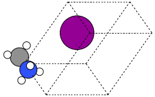
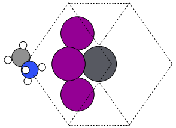
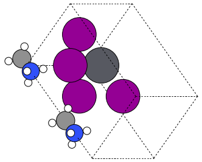
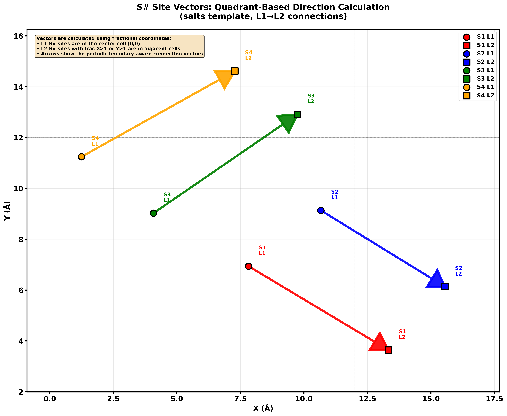

# 2. Creating Custom Templates

You only need two patterns to master templates: a cubic stack (clear layers, easy visuals) and a Jagodzinski stack (compact strings for many variants). Goal: stay brief, keep the story visual, and explain why we care—fast stacking experiments without rewriting geometry.

## What matters
- Templates say **where** atoms go; your inputs say **what** goes there.
- Layers stack along **c**; you pick the order via `layer_sequence` (list or string, e.g., `L1-L2-L3-L1`).
- One template can host many sequences—great for exploring faults or thickness without new files.
- Spacer layers use `S#`; consecutive layers with `S#` form a DJ gap. XY expansion relabels `S#` per image (S1→S3…) so pairings stay unique.

## Tiny anatomy (used in both examples)
```json
{
  "name": "template_name",
  "named_layers": { "L1": [["A", 0.0, 0.0], ["X", 0.5, 0.5]] },
  "layer_sequence": ["L1", "L2"],
  "lattice_multipliers": [ax, ay]
}
```
Required: `name`, `named_layers`, `layer_sequence`, `lattice_multipliers`; optional: `angles`, `layer_spacing`. Layer entries are `[site, x, y]` with `site` in `A/B/X`.

### Understanding `BX_dist` and `lattice_multipliers`

The `BX_dist` parameter represents the **actual B–X bond distance** (in Angstroms) between the B-site cation and X-site anion. The `lattice_multipliers` in your template determine how this bond distance scales to the unit cell lattice parameters:

**Lattice parameter calculation:**
- `a = lattice_multipliers[0] × BX_dist`
- `b = lattice_multipliers[1] × BX_dist`

**For cubic perovskites:** In the cubic template, B atoms are at (0.5, 0.5) and X atoms are at (0.5, 0.0) or (0.0, 0.5) in fractional coordinates. The distance in fractional coordinates is 0.5, so:
- Actual B–X distance = `0.5 × a = a/2`
- Therefore: `a = 2 × BX_dist`

The `cubic` template uses `lattice_multipliers: [2.0, 2.0]` to ensure that when you specify `BX_dist=3.2` Å (for example, Pb–I), the resulting structure has:
- Lattice parameter `a = 2.0 × 3.2 = 6.4` Å
- Actual B–X bond distances in the structure = `a/2 = 3.2` Å ✓

**For other templates:** The multiplier depends on the specific geometry. The `reduced` template uses `2.828...` (which is `2 × √2`) for a different geometric arrangement, while hexagonal or other symmetries will have different multipliers based on their unit cell geometry.

**Key point:** `BX_dist` always represents the **actual bond distance**. The template multipliers are chosen to ensure the geometric relationship between lattice parameters and bond distances matches the template's fractional coordinates.

---

## Example 1 — Cubic template, stacking told in words
**Why care**: simple reference geometry; you can thicken or fault by only changing the sequence string.

**Storyboard (imagine 3 frames in a 3D viewer)**
- Frame 1: drop the A/X checkerboard (L1) on the plane.
- Frame 2: place the B-centered layer (L2) above it.
- Frame 3: repeat L1+L2 to grow the block. Export these three VASP files and animate; that’s the stacking picture.

Rendered frames (isometric): each comes from the same template with only `layer_sequence` changing—frame 1 uses just `["L1"]`, frame 2 stacks `["L1","L2"]`, frame 3 extends to `["L1","L2","L1"]`.  
  

Template (minimal):
```json
{
  "name": "cubic",
  "named_layers": {
    "L1": [["A", 0.0, 0.0], ["X", 0.5, 0.5]],
    "L2": [["B", 0.5, 0.5], ["X", 0.0, 0.5], ["X", 0.5, 0.0]]
  },
  "layer_sequence": ["L1", "L2"],
  "lattice_multipliers": [2.0, 2.0]
}
```

**Note:** The multiplier `2.0` ensures that `BX_dist` equals the actual B–X bond distance: with `a = 2.0 × BX_dist`, the distance from B at (0.5, 0.5) to X at (0.5, 0.0) is `a/2 = BX_dist` (see "Understanding BX_dist and lattice_multipliers" above).

Use it and write the three storyboard frames:
```python
from ase.io import write
from q2D_Materials.core.creator import q2D_creator

q2d = q2D_creator()
base = dict(structure_type='bulk', A_ions='MA', B_ions='Pb', X_ions='I',
            xy_expansion=(1, 1), template='cubic')

f1 = q2d.create_structure(**base, layer_sequence=["L1"])
f2 = q2d.create_structure(**base, layer_sequence=["L1", "L2"])
f3 = q2d.create_structure(**base, layer_sequence=["L1", "L2", "L1", "L2"])

write("cubic_f1.vasp", f1)
write("cubic_f2.vasp", f2)
write("cubic_f3.vasp", f3)
# Load f1→f2→f3 as three frames in your 3D viewer to show stacking growth.
```

---

## Example 2 — Jagodzinski string storytelling
**Why care**: single-letter layers let you “spell” many stacking orders (`ABcAaBb`) without cloning templates—perfect for polytypes and stacking-fault scans.

Rendered frames (isometric): same template, different strings—frame 1 uses `"A"`, frame 2 `"aC"`, frame 3 `"aCc"`.  
  

Template:
```json
{
  "name": "jagodzinski_demo",
  "named_layers": {
    "A": [["A", 0.0, 0.0], ["X", 0.5, 0.5]],
    "B": [["B", 0.5, 0.5], ["X", 0.0, 0.5]],
    "c": [["A", 0.333, 0.666], ["X", 0.833, 0.166]],
    "a": [["B", 0.0, 0.0]]
  },
  "layer_sequence": ["A", "B"],  // default; override per call
  "lattice_multipliers": [1.5, 1.5]
}
```

Use compact string sequences:
```python
stack = q2d.create_structure(
    structure_type='bulk',
    A_ions='MA', B_ions='Pb', X_ions='I',
    xy_expansion=(1, 1),
    template='jagodzinski_demo',
    layer_sequence="ABcAaBb"  # same as ["A","B","c","A","a","B","b"]
)
write("jago_stack.vasp", stack)
```

---

## Minimal validation loop
```python
test = q2d.create_structure(
    structure_type='bulk',
    A_ions='MA', B_ions='Pb', X_ions='I',
    xy_expansion=(1, 1),
    template='cubic',
    layer_sequence="L1L2"  # any string/list using defined layers
)
print(len(test))  # sanity check: expected site count
```

Next: keep templates short, tell the stacking story with 2–3 frames, and vary only `layer_sequence` (strings like `L1L2L3L1`) to explore new geometries without rewriting JSON.

## Spacer-aware notes
- Add `S#` entries on two consecutive layers to host DJ spacers.
- XY expansion auto-renames `S#` so each copy is unique; pairing is by label, not name.
- Gaps between spacer layers use the spacer N–N distance (fallback `2*BX_dist`).

### How the cubic template encodes S#
The same `cubic.json` that drives the simple L1/L2 stacks also carries two extra layers—`M1` and `RP1`—each containing `S1` sites:

```json
"M1": [
  ["S1", 0.0, 0.0],
  ["X", 0.5, 0.5]
],
"RP1": [
  ["X", 0.0, 0.0],
  ["S1", 0.5, 0.5]
]
```

- When your `layer_sequence` inserts **two consecutive layers that both include `S#` (M1→RP1, RP1→M1, etc.)** the population step treats the first as the **ground** and the next as the **sky**. Because both layers reuse the same label (`S1`) the code can align the same anchor pair no matter how many times the sequence repeats.
- `RP1` sits between perovskite slabs (`RP2` is the spacer-only bridge), so `layer_sequence="RP"` expands to `L2-M1-RP1-RP2-RP1-M1`. That means every RP block automatically creates two S# pairs (M1↔RP1) for the organic/atomic spacer to occupy.
- XY expansion duplicates each `S1` into `S2`, `S3`, … so every image cell has a unique label. The populate logic then cycles through the `spacer` list (or reuses the single entry) while preserving which ground/sky positions belong together.

Net effect: you never hard-code spacer coordinates in Python. Defining `S#` rows inside `cubic.json` is enough for Ruddlesden–Popper and Dion–Jacobson flows to know where to anchor spacers, how to orient double NH₃ molecules, and how to offset mono spacers on each side of the slab.

### Quadrant-based S# vector calculation (salts template)

The **salts template** demonstrates how fractional coordinates determine spacer connection directions across periodic boundaries. This is crucial for templates where S# sites need to connect layers diagonally or across unit cell edges.

**How it works:**
1. S# sites are defined with fractional coordinates `(x_frac, y_frac)` in the template JSON
2. When pairing S# sites between layers (e.g., L1 S1 with L2 S1), the system:
   - Converts both positions to fractional coordinates
   - Determines which periodic cell each site is in using `floor()` of fractional coords
   - Calculates the vector accounting for periodic cell offsets

**Example from `salts.json`:**
- **L1 S1** at `(0.652, 0.578)`: fractional `(0.652, 0.578)` → cell `(0, 0)` [center]
- **L2 S1** at `(1.111, 0.303)`: fractional `(1.111, 0.303)` → cell `(1, 0)` [right]
- **Result**: Vector points from L1 S1 to L2 S1 in the `(1,0)` periodic cell (diagonal right)

- **L1 S3** at `(0.34, 0.752)`: fractional `(0.34, 0.752)` → cell `(0, 0)` [center]
- **L2 S3** at `(0.812, 1.076)`: fractional `(0.812, 1.076)` → cell `(0, 1)` [up]
- **Result**: Vector points to periodic cell `(0,1)`, creating vertical-up connection

**Visualization:**


The visualization shows:
- **Circles**: L1 S# positions (ground anchors)
- **Squares**: L2 S# positions (sky anchors)
- **Arrows**: Direction vectors calculated using quadrant-based PBC logic
- **Dashed grid**: Unit cell boundaries showing periodic images

This allows templates to specify spacer connections that span unit cell boundaries, creating complex packing patterns and diagonal connections as needed. The system automatically handles periodic wrapping, so you can place S# sites at any fractional coordinate and the correct connection vector will be calculated.
