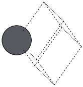
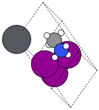
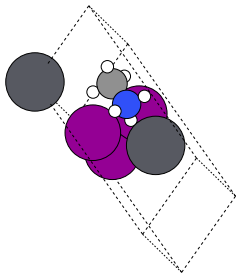

# 2. Creating Custom Templates (short & practical)

You only need two patterns to master templates: a cubic stack (clear layers, easy visuals) and a Jagodzinski stack (compact strings for many variants). Goal: stay brief, keep the story visual, and explain why we care—fast stacking experiments without rewriting geometry.

## What matters
- Templates say **where** atoms go; your inputs say **what** goes there.
- Layers stack along **c**; you pick the order via `layer_sequence` (list or string, e.g., `L1-L2-L3-L1`).
- One template can host many sequences—great for exploring faults or thickness without new files.
- Spacer layers use `S#`; consecutive layers with `S#` form a DJ gap. XY expansion relabels `S#` per image (S1→S3…) so pairings stay unique.

## Tiny anatomy (used in both examples)
```json
{
  "name": "template_name",
  "named_layers": { "L1": [["A", 0.0, 0.0], ["X", 0.5, 0.5]] },
  "layer_sequence": ["L1", "L2"],
  "lattice_multipliers": [ax, ay]
}
```
Required: `name`, `named_layers`, `layer_sequence`, `lattice_multipliers`; optional: `angles`, `layer_spacing`. Layer entries are `[site, x, y]` with `site` in `A/B/X`.

---

## Example 1 — Cubic template, stacking told in words
**Why care**: simple reference geometry; you can thicken or fault by only changing the sequence string.

**Storyboard (imagine 3 frames in a 3D viewer)**
- Frame 1: drop the A/X checkerboard (L1) on the plane.
- Frame 2: place the B-centered layer (L2) above it.
- Frame 3: repeat L1+L2 to grow the block. Export these three VASP files and animate; that’s the stacking picture.

Rendered frames (isometric): each comes from the same template with only `layer_sequence` changing—frame 1 uses just `["L1"]`, frame 2 stacks `["L1","L2"]`, frame 3 extends to `["L1","L2","L1"]`.  
  

Template (minimal):
```json
{
  "name": "cubic",
  "named_layers": {
    "L1": [["A", 0.0, 0.0], ["X", 0.5, 0.5]],
    "L2": [["B", 0.5, 0.5], ["X", 0.0, 0.5], ["X", 0.5, 0.0]]
  },
  "layer_sequence": ["L1", "L2"],
  "lattice_multipliers": [2.0, 2.0]
}
```

Use it and write the three storyboard frames:
```python
from ase.io import write
from q2D_Materials.core.creator import q2D_creator

q2d = q2D_creator()
base = dict(structure_type='bulk', A_ions='MA', B_ions='Pb', X_ions='I',
            xy_expansion=(1, 1), template='cubic')

f1 = q2d.create_perovskite(**base, layer_sequence=["L1"])
f2 = q2d.create_perovskite(**base, layer_sequence=["L1", "L2"])
f3 = q2d.create_perovskite(**base, layer_sequence=["L1", "L2", "L1", "L2"])

write("cubic_f1.vasp", f1)
write("cubic_f2.vasp", f2)
write("cubic_f3.vasp", f3)
# Load f1→f2→f3 as three frames in your 3D viewer to show stacking growth.
```

---

## Example 2 — Jagodzinski string storytelling
**Why care**: single-letter layers let you “spell” many stacking orders (`ABcAaBb`) without cloning templates—perfect for polytypes and stacking-fault scans.

Rendered frames (isometric): same template, different strings—frame 1 uses `"A"`, frame 2 `"aC"`, frame 3 `"aCc"`.  
  

Template:
```json
{
  "name": "jagodzinski_demo",
  "named_layers": {
    "A": [["A", 0.0, 0.0], ["X", 0.5, 0.5]],
    "B": [["B", 0.5, 0.5], ["X", 0.0, 0.5]],
    "c": [["A", 0.333, 0.666], ["X", 0.833, 0.166]],
    "a": [["B", 0.0, 0.0]]
  },
  "layer_sequence": ["A", "B"],  // default; override per call
  "lattice_multipliers": [1.5, 1.5]
}
```

Use compact string sequences:
```python
stack = q2d.create_perovskite(
    structure_type='bulk',
    A_ions='MA', B_ions='Pb', X_ions='I',
    xy_expansion=(1, 1),
    template='jagodzinski_demo',
    layer_sequence="ABcAaBb"  # same as ["A","B","c","A","a","B","b"]
)
write("jago_stack.vasp", stack)
```

---

## Minimal validation loop
```python
test = q2d.create_perovskite(
    structure_type='bulk',
    A_ions='MA', B_ions='Pb', X_ions='I',
    xy_expansion=(1, 1),
    template='cubic',
    layer_sequence="L1L2"  # any string/list using defined layers
)
print(len(test))  # sanity check: expected site count
```

Next: keep templates short, tell the stacking story with 2–3 frames, and vary only `layer_sequence` (strings like `L1L2L3L1`) to explore new geometries without rewriting JSON.

## Spacer-aware notes
- Add `S#` entries on two consecutive layers to host DJ spacers.
- XY expansion auto-renames `S#` so each copy is unique; pairing is by label, not name.
- Gaps between spacer layers use the spacer N–N distance (fallback `2*BX_dist`).
