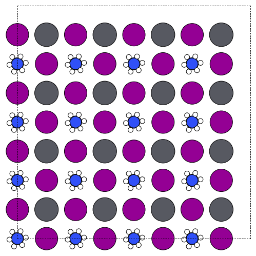
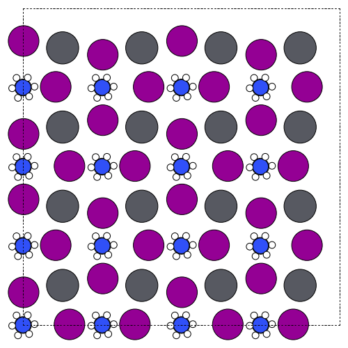

# 3. Glazer tilting — rotations in plain language

Glazer tilting is just rotating the X-site anions around each B-site center. You choose angles `[x, y, z]` (degrees) and a sign pattern `['+', '-', '0']` that says whether adjacent octahedra rotate in-phase (`+`), out-of-phase (`-`), or not at all (`0`). Zero angle and `'0'` go together.

### One minimal example
```python
from q2D_Materials.core.creator import q2D_creator
q2d = q2D_creator()

untilted = q2d.create_structure(
    structure_type="bulk",
    A_ions="MA", B_ions="Pb", X_ions="I",
    xy_expansion=(1, 1), template="cubic",
)

tilting = q2d.create_structure(
    structure_type="bulk",
    A_ions="MA", B_ions="Pb", X_ions="I",
    xy_expansion=(1, 1), template="cubic",
    glazer_angles=[0, 0, 10],    # +10° about z
    glazer_pattern=["0", "0", "+"],
)
```

### Using Space Groups and Notations
You can now specify the `glazer_pattern` as a string using either standard Glazer notation (e.g., `"a-b+a-"`) or by specifying a target space group (e.g., `"Pnma"`). When using a string, `glazer_angles` are optional (defaults to 10°).

```python
# Using Glazer notation string
pnma_style = q2d.create_structure(
    ...,
    glazer_pattern="a-b+a-",  # Suggests [10, 10, 10] angles
)

# Using Space Group symbol (case insensitive)
pnma_by_group = q2d.create_structure(
    ...,
    glazer_pattern="Pnma",    # Resolves to a-b+a-
)
```

**Common Space Group to Glazer Notation Mapping:**

| Space Group | Glazer Notation | System |
|-------------|----------------|--------|
| `Pm-3m` | `a0a0a0` | Cubic |
| `I4/mcm` | `a0a0c-` | Tetragonal |
| `P4/mbm` | `a0a0c+` | Tetragonal |
| `Imma` | `a0b-b-` | Orthorhombic |
| `Pnma` | `a-b+a-` | Orthorhombic |
| `Cmcm` | `a0b+c+` | Orthorhombic |
| `R-3c` | `a-a-a-` | Rhombohedral |

### See it (top-down, 4×4 cell)
- First frame: no Glazer tilt (reference) — `glazer_angles=[0,0,0]`
- Second frame: positive tilt about z — `glazer_angles=[0,0,10]`, `glazer_pattern=['0','0','+']`
 

### Picking patterns and cells
- `+` means neighbors spin the same way; `-` means alternate; `0` means no spin.
- Out-of-phase (`-`) patterns usually need a larger supercell (e.g., 2×2) to accommodate the alternation.
- Angles are typically small (0–10°) for perovskites.

### Combining with everything else
Tilting is applied after the template is built, so it works with any template (cubic, reduced, custom) and with Jagodzinski stacks, spacers, or pattern mixing. Just ensure your `glazer_pattern` matches where angles are nonzero.

Regenerate the frames:
```bash
nix develop -c python3 Examples/plot.py
```
