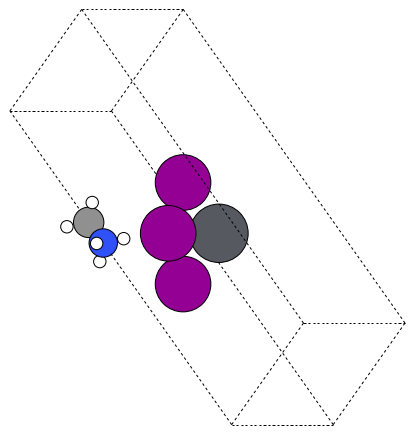
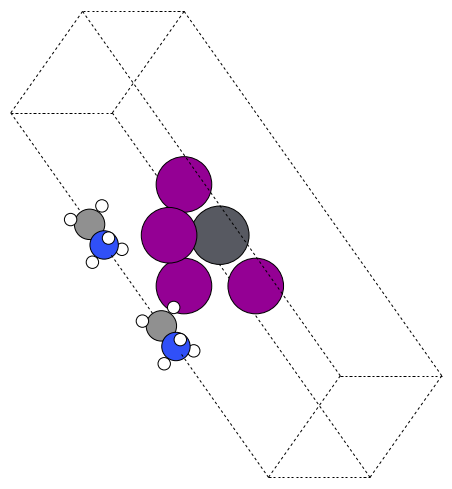

# 5. Monolayers — what changes when you go 2D

A monolayer call is the bulk creator with a few extra switches: `structure_type="monolayer"`, `vacuum` padding, and optional `thickness` for L1/L2 stacking. Spacers (Ap-sites) and penetration are there when you need organic caps; otherwise, it’s the same template-driven geometry.

### The picture
- Templates still define the inorganic slab (cubic, reduced, custom).
- `thickness` repeats your `layer_sequence` along c (e.g., 2 → L1-L2-L1).
- `vacuum` adds empty space above/below; keep ~12–20 Å for isolated slabs.
- Spacers replace external L1 A-sites with Ap-sites when provided.
- Penetration shifts those A/Ap sites along z relative to the inorganic layer.

### Two quick structures
```python
from q2D_Materials.core.creator import q2D_creator
q2d = q2D_creator()

mono1 = q2d.create_structure(
    structure_type="monolayer",
    A_ions="MA", B_ions="Pb", X_ions="I",
    xy_expansion=(1, 1), template="cubic",
    vacuum=15.0, thickness=1,
)

mono2 = q2d.create_structure(
    structure_type="monolayer",
    A_ions="MA", B_ions="Pb", X_ions="I",
    xy_expansion=(1, 1), template="cubic",
    vacuum=15.0, thickness=2,   # L1-L2-L1 stacking
)
```

### See it
 

### When you add spacers and penetration
- Provide `passivator="CCCC[NH3+]"` (SMILES) or a list; external L1 A-sites become Ap-sites and get populated by passivators.
- `passivator=None` (default): No Ap-sites are created. External L1 A-sites remain as regular A-sites and get populated with A-ions (not left as holes).
- `penetration` is a float or list (fractions of `BX_dist`) cycling over external A/Ap sites; positive moves out, negative moves in.

### Practical tips
- Start with `thickness=1`, no spacers, to validate geometry; then layer on spacers/penetration.
- Use reduced templates for lighter cells; cubic for symmetry or clearer visualizations.
- Keep `vacuum` consistent when comparing variants.

Regenerate the frames:
```bash
nix develop -c python3 Examples/plot.py
```
