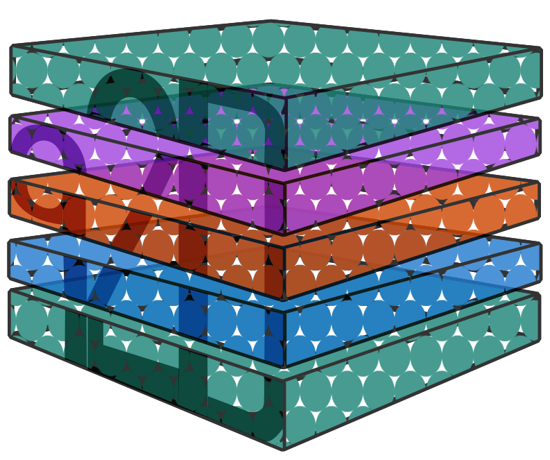
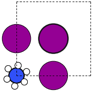
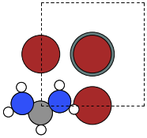
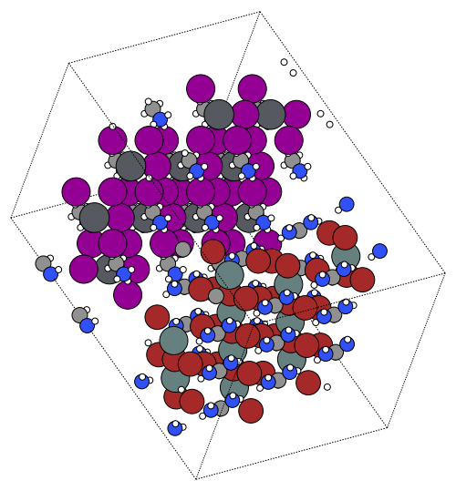

# 6. Twisted bilayers — the fast intuition

Twisting just rotates one monolayer against another, expands both into a common supercell, and stacks them with a chosen gap. You feed two monolayers (or one for self-twist), give the (m, n) integers for the commensurate angle, and pick an interlayer distance. Everything else is bookkeeping.

### Minimal twist
```python
from q2D_Materials.core.creator import q2D_creator
q2d = q2D_creator()

# Two simple monolayers
mono1 = q2d.create_structure(
    structure_type="monolayer",
    A_ions="MA", B_ions="Pb", X_ions="I",
    xy_expansion=(1, 1), template="cubic", vacuum=12.0,
)
mono2 = q2d.create_structure(
    structure_type="monolayer",
    A_ions="FA", B_ions="Sn", X_ions="Br",
    xy_expansion=(1, 1), template="cubic", vacuum=12.0,
)

# Twist with (m, n) = (3, 1)
bilayer = q2d.twist(
    monolayers=[mono1, mono2],
    twist_angles=[(3, 1)],       # one entry: second layer relative to first
    interlayer_distances=[8.0],  # Å gap between layers
    vacuum=12.0,
)
```

### See it
  

### How the pieces fit
- `(m, n)` sets the commensurate angle: θ = arctan(2mn/(m²-n²)), m > n.
- The helper finds the common XY supercell (LCM of the monolayers’ expansions), expands both, then applies the rotation.
- `interlayer_distances` sets the inorganic gap; `vacuum` adds space above/below the bilayer.

### Practical guidance
- Small (m, n) → large angles, tiny cells (fast, less realistic). Large (m, n) → small angles, big cells (slow, more realistic).
- Keep interlayer distance 6–12 Å for typical vdW stacks; increase if layers collide.
- For self-twist, just supply one monolayer twice or use the monolayer’s `.twist()` if provided.
- Combine with everything from monolayers: spacers, penetration, Glazer tilts, mixed compositions—the twist step doesn’t care.

Regenerate the frames:
```bash
python3 Examples/plot.py
```
