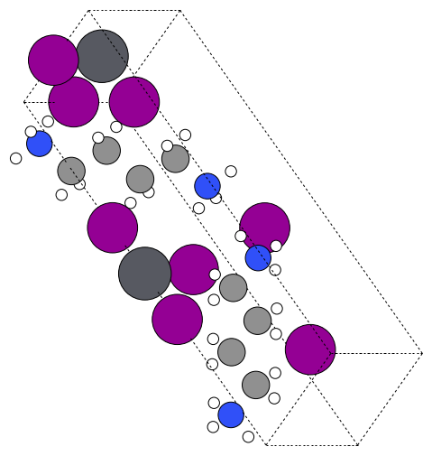
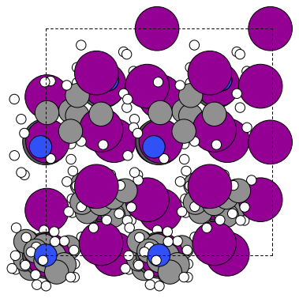
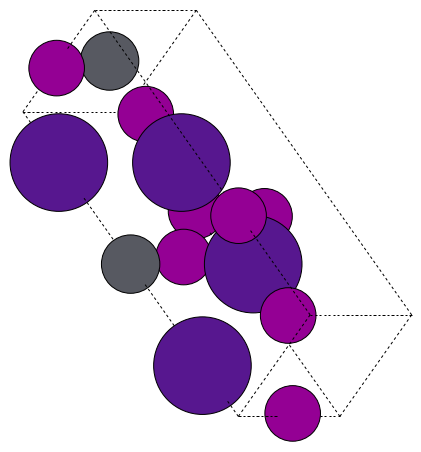

# 8. Ruddlesden–Popper (RP) spacers

RP stacks interleave perovskite slabs with `S#` spacer planes. Every time two consecutive floors both expose `S#` metadata, the population step locks them together as a ground/sky pair and either stretches a double spacer across or plants a mono spacer on each side. This guide shows how to drive that workflow and how the S# registry behaves.

## Minimal build
```python
from q2D_Materials.core.creator import q2D_creator

q2d = q2D_creator()
rp = q2d.create_perovskite(
    structure_type="bulk",
    template="cubic",
    layer_sequence="RP",     # expands to the RP slab ordering
    thickness=3,
    xy_expansion=(1, 1),
    A_ions="MA", B_ions="Pb", X_ions="I",
    sharp_spacer="[NH3+]CCCC[NH3+]",  # SMILES or Atoms; lists cycle across S# labels
    glazer_angles=[0, 0, 8],
    glazer_pattern=["0", "0", "+"],
    penetration=0.3,         # optional Ap/S# z-shift
)
```

### Why it works
- Templates already encode which layers expose S# anchors. The refactored populate flow processes floors ground-by-ground, so the “ground” (floor _n_) and “sky” (floor _n_+1) pairing logic stays local and robust.
- Double NH₃ spacers align their two nitrogens with the matching S# anchors; mono or atomic spacers place one molecule per anchor, with tails pointing toward the opposing slab.
- Penetration values now shift the S# floors symmetrically around the BX distance, so both mono and double spacers respect the requested offsets.

## Exploring the parameter space
`tests/test_creator_rp.py` is a compact cookbook: it sweeps multiple Glazer patterns, supercells, spacer choices (molecular lists cycle per `S#`), and penetrations. Use it as a template when you need to scan RP configurations or generate `.vasp` exports in batch.

Key knobs:
- `layer_sequence="RP"`: expands to the canonical RP floor ordering.
- `sharp_spacer`: accepts SMILES strings, ASE `Atoms`, or lists. Lists cycle through `S1`, `S2`, … as the ground/sky tracker iterates floors.
- `glazer_angles` / `glazer_pattern`: tilts the slabs before spacer placement; top views reveal how tilts stagger the anchoring grid.
- `penetration`: single float or list. Lists rotate per Ap site while S# floors use the first entry, letting you bias spacer anchoring above/below the slabs.

## Gallery (rendered via `Examples/plot.py`)







Regenerate the scenes with:
```bash
python Examples/plot.py
```
which writes the PNGs into `Examples/images/`. The script mirrors the scenarios in `tests/test_creator_rp.py`, so you can tweak either file to script new RP studies.
