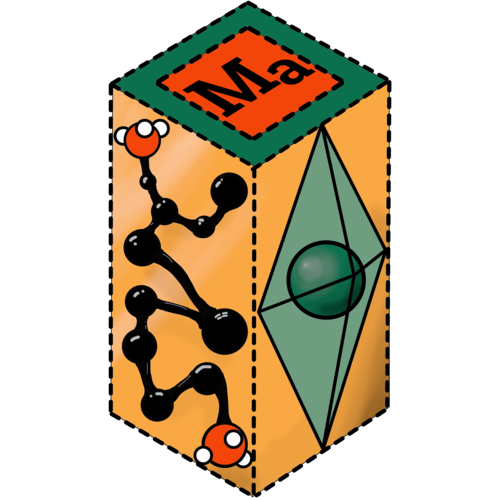

# q2D-Materials Creator Tutorial

Complete guide to creating perovskite structures from simple bulk to complex mixed 2D structures.

## Table of Contents

1. [Getting Started](#getting-started)
2. [Ion Recommender](#ion-recommender)
3. [Simple Bulk Perovskites](#simple-bulk-perovskites)
4. [Bulk with Supercells](#bulk-with-supercells)
5. [Double Perovskites](#double-perovskites)
6. [Pattern-Based Mixed Compositions](#pattern-based-mixed-compositions)
7. [2D Perovskites - Monolayer](#2d-perovskites---monolayer)
8. [2D Perovskites - Ruddlesden-Popper (RP)](#2d-perovskites---ruddlesden-popper-rp)
9. [2D Perovskites - Dion-Jacobson (DJ)](#2d-perovskites---dion-jacobson-dj)
10. [Spacer Molecules](#spacer-molecules)
11. [Complete Parameter Reference](#complete-parameter-reference)
12. [Pattern-Based Mixing Guide](#pattern-based-mixing-guide)
13. [Advanced Examples](#advanced-examples)
14. [Visualization](#visualization)
15. [Saving Structures](#saving-structures)
16. [Troubleshooting](#troubleshooting)

## Getting Started

### Installation

```bash
# Using Nix (recommended)
nix develop

# Or using pip
pip install ase numpy rdkit
```

### Basic Initialization

```python
from q2D_Materials.core.creator import q2D_creator

# Initialize empty creator
q2d = q2D_creator()
```

The `q2D_creator` class is initialized without parameters. All composition parameters (`A_ions`, `B_ions`, `X_ions`) must be provided when calling `create_perovskite()`.

## Ion Recommender

The `recommend()` method helps you discover compatible ions for perovskite structures based on occurrence frequency in the perovskite database. This is especially useful when you know one component (X, B, or spacer) and want to find commonly used combinations.

### Basic Usage

```python
q2d = q2D_creator()

# Get recommendations based on X-site anion
recommendations = q2d.recommend(X='Cl', top_n=5)
print("Recommended B-site cations:", [r['abbreviation'] for r in recommendations['B']])
print("Recommended A-site cations:", [r['abbreviation'] for r in recommendations['A']])
print("Recommended spacers:", [r['abbreviation'] for r in recommendations['spacer']])
```

### Recommendation Based on X-Site Anion

When you specify an X-site anion, the recommender suggests commonly used B-site cations, A-site cations, and spacers:

```python
# Get recommendations for Cl-based perovskites
recs = q2d.recommend(X='Cl', top_n=10)

# Access recommendations
for b_ion in recs['B']:
    print(f"{b_ion['abbreviation']}: {b_ion['common_name']} ({b_ion['occurrences']} occurrences)")

# Output example:
# Pb: Lead (42297.0 occurrences)
# Sn: Tin (1223.0 occurrences)
# Bi: Bismuth (366.0 occurrences)
```

### Recommendation Based on B-Site Cation

When you specify a B-site cation, get recommendations for compatible X-site anions, A-site cations, and spacers:

```python
# Get recommendations for Pb-based perovskites
recs = q2d.recommend(B='Pb', top_n=5)

print("Compatible X-site anions:")
for x_ion in recs['X']:
    print(f"  {x_ion['abbreviation']}: {x_ion['common_name']} ({x_ion['occurrences']} occurrences)")
```

### Recommendation Based on Spacer

When you specify a spacer molecule, get recommendations for A-site cations, B-site cations, and X-site anions:

```python
# Get recommendations for PEA (phenylethylammonium) spacer
recs = q2d.recommend(spacer='PEA', top_n=5)

print("Compatible A-site cations:", [r['abbreviation'] for r in recs['A']])
print("Compatible B-site cations:", [r['abbreviation'] for r in recs['B']])
print("Compatible X-site anions:", [r['abbreviation'] for r in recs['X']])
```

### Understanding Spacers vs A-Site Cations

The recommender automatically distinguishes spacers from A-site cations based on molecular size:
- **Spacers**: A-site ions with **>10 atoms** in their molecular formula (e.g., PEA, BA, AVA)
- **A-site cations**: All A-site ions, including those that can also be spacers (≤10 atoms)

```python
recs = q2d.recommend(X='I', top_n=10)

# A-site list includes all A-site cations (small and large)
print("All A-site cations:", [r['abbreviation'] for r in recs['A']])
# Output: ['MA', 'FA', 'Cs', 'BA', 'PEA', ...]

# Spacer list includes only large molecules (>10 atoms)
print("Spacers only:", [r['abbreviation'] for r in recs['spacer']])
# Output: ['BA', 'PEA', 'AVA', 'HIA', 'PDMA', ...]
```

### Recommendation Parameters

```python
recommendations = q2d.recommend(
    X='Cl',           # or B='Pb', or spacer='PEA' (at least one required)
    top_n=10,         # Number of recommendations per category (default: 10)
    min_occurrences=1 # Minimum occurrence count in database (default: 1)
)
```

### Recommendation Output Format

Each recommendation entry contains detailed information:

```python
recs = q2d.recommend(X='Cl', top_n=1)

sample = recs['B'][0]
print(sample)
# {
#     'abbreviation': 'Pb',
#     'common_name': 'Lead',
#     'occurrences': 42297.0,
#     'molecular_formula': 'Pb+2',
#     'smile': '[Pb+2]',
#     'ion_type': 'B'
# }
```

### Using Recommendations to Create Structures

You can use recommendations directly in structure creation:

```python
# Get recommendations
recs = q2d.recommend(X='Cl', top_n=3)

# Use the top recommended B-site cation
top_B = recs['B'][0]['abbreviation']  # e.g., 'Pb'
top_A = recs['A'][0]['abbreviation']  # e.g., 'MA'

# Create structure with recommended ions
structure = q2d.create_perovskite(
    'bulk',
    A_ions=top_A,
    B_ions=top_B,
    X_ions='Cl',
    supercell_size=(1, 1, 1)
)
```

### Alternative Abbreviations

The recommender supports alternative abbreviations and is case-insensitive:

```python
# All of these work:
recs1 = q2d.recommend(X='cl')      # lowercase
recs2 = q2d.recommend(X='CL')      # uppercase
recs3 = q2d.recommend(spacer='pea') # lowercase
recs4 = q2d.recommend(B='pb')      # lowercase

# Alternative abbreviations also work (e.g., 'GU' for Guanidinium)
recs5 = q2d.recommend(X='I', top_n=5)
```

### Filtering by Occurrence Count

Filter out rare combinations by setting a minimum occurrence threshold:

```python
# Only show ions with at least 100 occurrences
recs = q2d.recommend(X='Cl', top_n=10, min_occurrences=100)

# This filters out less common combinations
print("Well-established combinations:", [r['abbreviation'] for r in recs['B']])
```

## Simple Bulk Perovskites

### Single Unit Cell

The simplest bulk perovskite structure:

```python
from q2D_Materials.core.creator import q2D_creator

q2d = q2D_creator()

# Create single unit cell
bulk = q2d.create_perovskite('bulk', 
    A_ions='MA', B_ions='Pb', X_ions='I',
    supercell_size=(1, 1, 1))
from ase.io import write
write('MAPbI3_unit_cell.vasp', bulk)
```

### Bulk with Custom B-X Distance

```python
# Specify B-X bond distance explicitly
bulk = q2d.create_perovskite(
    'bulk',
    A_ions='MA', B_ions='Pb', X_ions='I',
    supercell_size=(1, 1, 1),
    BX_dist=3.18  # Angstrom (auto-calculated if None)
)
```

## Bulk with Supercells

### Simple Supercell

Create larger bulk structures:

```python
# 2×2×2 supercell
bulk_supercell = q2d.create_perovskite('bulk', 
    A_ions='MA', B_ions='Pb', X_ions='I',
    supercell_size=(2, 2, 2))
from ase.io import write
write('MAPbI3_2x2x2.vasp', bulk_supercell)

# 3×3×3 supercell
bulk_large = q2d.create_perovskite('bulk',
    A_ions='MA', B_ions='Pb', X_ions='I',
    supercell_size=(3, 3, 3))
from ase.io import write
write('MAPbI3_3x3x3.vasp', bulk_large)
```

### Rectangular Supercells

```python
# Non-cubic supercell
bulk_rect = q2d.create_perovskite('bulk',
    A_ions='MA', B_ions='Pb', X_ions='I',
    supercell_size=(2, 3, 1))
from ase.io import write
write('MAPbI3_2x3x1.vasp', bulk_rect)
```

## Double Perovskites

Create alternating B-site cation structures:

```python
# Double perovskite with Pb and Sn
double = q2d.create_perovskite(
    'bulk',
    A_ions='MA', B_ions='Pb', X_ions='I',
    supercell_size=(2, 2, 2),  # Required for double perovskite
    Bp='Sn'  # Second B-site cation
)
from ase.io import write
write('MAPbSnI3_double.vasp', double)
```

The double perovskite creates an alternating pattern of B and Bp cations.

## Pattern-Based Mixed Compositions

### Mixed A-Site Cations

```python
# Mix Cs, MA, and FA in a pattern
mixed_A = q2d.create_perovskite(
    'bulk',
    A_ions=['Cs', 'MA', 'FA', 'Cs', 'MA', 'FA', 'Cs', 'MA'],  # Pattern for 8 positions
    B_ions='Pb', X_ions='I',
    supercell_size=(2, 2, 2)  # 8 A-site positions
)
```

### Mixed B-Site Cations

```python
# Alternating Pb and Sn
mixed_B = q2d.create_perovskite(
    'bulk',
    A_ions='MA', X_ions='I',
    B_ions=['Pb', 'Sn'],  # Pattern cycles: Pb-Sn-Pb-Sn-...
    supercell_size=(2, 2, 2)
)
```

### Mixed X-Site Anions

```python
# Mixed halides: Br-I-I pattern
mixed_X = q2d.create_perovskite(
    'bulk',
    A_ions='MA', B_ions='Pb',
    X_ions=['Br', 'I', 'I'],  # Pattern cycles: Br-I-I-Br-I-I
    supercell_size=(1, 1, 2)  # 6 X-site positions
)
```

### Complete Mixed Composition

```python
# Mix all sites simultaneously
mixed_all = q2d.create_perovskite(
    'bulk',
    supercell_size=(2, 2, 2),
    A_ions=['Cs', 'MA', 'FA', 'Cs', 'MA', 'FA', 'Cs', 'MA'],
    B_ions=['Pb', 'Sn'],
    X_ions=['Br', 'I', 'I'],
    BX_dist=3.18
)
from ase.io import write
write('mixed_perovskite.vasp', mixed_all)
```

## 2D Perovskites - Monolayer

Single-layer 2D structures with vacuum. Monolayers support **flexible attachment options**: spacers can be attached to the top, bottom, or both sides of the inorganic layer.

### Simple Monolayer

```python
monolayer = q2d.create_perovskite(
    'monolayer',
    A_ions='MA', B_ions='Pb', X_ions='I',
    spacer_molecule='[NH3+]CCCCC[NH3+]',  # Divalent spacer
    supercell=[1, 1, 1]
)
from ase.io import write
write('MAPbI3_monolayer.vasp', monolayer)
```

### Monolayer with Flexible Attachment

```python
# Monolayer with top attachment only
monolayer_top = q2d.create_perovskite(
    'monolayer',
    A_ions='MA', B_ions='Pb', X_ions='I',
    spacer_molecule='[NH3+]CCCCC[NH3+]',
    supercell=[1, 1, 1],
    vacuum=12,
    attachment_end='top'  # Attach only to top
)

# Monolayer with bottom attachment only
monolayer_bottom = q2d.create_perovskite(
    'monolayer',
    A_ions='MA', B_ions='Pb', X_ions='I',
    spacer_molecule='[NH3+]CCCCC[NH3+]',
    supercell=[1, 1, 1],
    vacuum=12,
    attachment_end='bottom'  # Attach only to bottom
)

# Monolayer with both attachments (default)
monolayer_both = q2d.create_perovskite(
    'monolayer',
    A_ions='MA', B_ions='Pb', X_ions='I',
    spacer_molecule='[NH3+]CCCCC[NH3+]',
    supercell=[1, 1, 1],
    vacuum=12,
    attachment_end='both'  # Attach to both top and bottom (default)
)
```

### Monolayer with All Parameters

```python
monolayer = q2d.create_perovskite(
    structure_type='monolayer',
    
    # Required composition parameters
    A_ions='MA', B_ions='Pb', X_ions='I',
    
    # Required 2D parameters
    spacer_molecule='CN1C=NC2=C1C(=O)N(C(=O)N2C)CC[NH3+]',
    supercell=[1, 1, 1],
    
    # Monolayer-specific parameters
    vacuum=12,  # Vacuum thickness in Angstrom
    attachment_end='both',  # 'top', 'bottom', or 'both' (default: 'both')
    
    # Optional parameters
    penet=0.3,
    BX_dist=None,
)
```

### Monolayer with Atomic Spacers

Monolayer structures can use atomic cations (like Cs, K, Rb) as spacers instead of molecules:

```python
# Monolayer structure with Cs as spacer
monolayer_cs = q2d.create_perovskite(
    'monolayer',
    A_ions='MA', B_ions='Pb', X_ions='I',
    spacer_molecule='Cs',  # Atomic cation
    supercell=[1, 1, 1],
    vacuum=12,
    attachment_end='both'  # Can be 'top', 'bottom', or 'both'
)
```

## 2D Perovskites - Ruddlesden-Popper (RP)

RP structures are **true two-layer structures** with organic spacers between inorganic layers. The top layer is rotated 90° around the Z-axis (in the XY plane) and shifted relative to the bottom layer, creating the characteristic Ruddlesden-Popper phase.

### Simple RP Structure

```python
rp = q2d.create_perovskite(
    'RP',
    A_ions='MA', B_ions='Pb', X_ions='I',
    spacer_molecule='[NH3+]CCCCC=O',  # SMILES string
    supercell=[1, 1, 2]  # [nx, ny, n_layers]
)
from ase.io import write
write('MAPbI3_RP_n2.vasp', rp)
```

### RP with All Parameters

```python
# RP structure with all parameters
rp = q2d.create_perovskite(
    structure_type='RP',
    
    # Required composition parameters
    A_ions='MA', B_ions='Pb', X_ions='I',
    
    # Required 2D parameters
    spacer_molecule='[NH3+]CCCCC=O',  # SMILES, XYZ file, or Atoms object
    supercell=[1, 1, 2],  # [nx, ny, n_layers]
    
    # RP-specific parameters
    spacer_distance=2.0,  # Vacuum gap between opposing spacers (Å)
    interlayer_penet=0.0,  # Interlayer penetration as fraction of molecule length
    
    # Optional parameters
    penet=0.3,  # Spacer penetration into layer (fraction of BX bond)
    BX_dist=None  # Auto-calculated if None from B/X ions
)
```

### RP Structure Details

The RP structure is created by:
1. Creating a bottom layer with spacers attached to both top and bottom
2. Copying the bottom layer to create the top layer
3. **Rotating the top layer 90° around the Z-axis** (in the XY plane)
4. Shifting the top layer vertically by `z_length/2`
5. Combining both layers

The `interlayer_penet` parameter controls the interlocking of Ap cations between layers (as a fraction of molecule length).

### RP with Mixed Compositions

When using pattern-based mixing, `BX_dist` is automatically recalculated from the first ions in your pattern:

```python
rp_mixed = q2d.create_perovskite(
    'RP',
    spacer_molecule='[NH3+]CCCCC=O',
    supercell=[2, 2, 2],
    A_ions=['Cs', 'MA', 'FA', 'MA'],  # Pattern-based mixing
    B_ions=['Pb', 'Sn'],  # Pattern-based mixing
    X_ions=['Br', 'I'],  # Pattern-based mixing
    spacer_distance=2.0,
    penet=0.3,
    BX_dist=None  # Auto-calculated from first ions (Pb-Br in this case)
)
```

**Important:** When you provide `A_ions`, `B_ions`, or `X_ions` as lists, the code treats them as patterns for mixed compositions. Provide single values (strings) for uniform compositions.

### RP with Atomic Spacers

RP structures can use atomic cations (like Cs, K, Rb) as spacers instead of molecules. Atomic spacers are positioned at the BX bond height with proper inter-slab separation based on ionic radius:

```python
# RP structure with Cs as spacer
rp_cs = q2d.create_perovskite(
    'RP',
    A_ions='MA', B_ions='Pb', X_ions='I',
    spacer_molecule='Cs',  # Atomic cation
    supercell=[1, 1, 2],
    spacer_distance=2.0
)
from ase.io import write
write('MAPbI3_RP_Cs.vasp', rp_cs)
```

**Atomic Spacer Positioning:**
- Atomic spacers are positioned at the BX bond height
- Bottom spacers: `z = 0 + 0.5 × ionic_radius` (half ionic radius above bottom)
- Top spacers: `z = n × lv2 - 0.5 × ionic_radius` (half ionic radius below top)
- Inter-slab separation: `2 × ionic_radius` (provides proper spacing between layers)

**Example with different atomic spacers:**

```python
# RP with Cs (ionic radius: 1.88 Å)
rp_cs = q2d.create_perovskite('RP', 
    A_ions='MA', B_ions='Pb', X_ions='I',
    spacer_molecule='Cs', supercell=[1, 1, 2])

# RP with Rb (ionic radius: 1.72 Å)
rp_rb = q2d.create_perovskite('RP',
    A_ions='MA', B_ions='Pb', X_ions='I',
    spacer_molecule='Rb', supercell=[1, 1, 2])

# RP with K (ionic radius: 1.64 Å)
rp_k = q2d.create_perovskite('RP',
    A_ions='MA', B_ions='Pb', X_ions='I',
    spacer_molecule='K', supercell=[1, 1, 2])
```

## 2D Perovskites - Dion-Jacobson (DJ)

DJ structures have divalent organic spacers connecting adjacent layers.

### Simple DJ Structure

```python
dj = q2d.create_perovskite(
    'DJ',
    A_ions='MA', B_ions='Pb', X_ions='I',
    spacer_molecule='[NH3+]CCCCC[NH3+]',  # Divalent spacer
    supercell=[1, 1, 2]
)
from ase.io import write
write('MAPbI3_DJ_n2.vasp', dj)
```

### DJ with All Parameters

```python
dj = q2d.create_perovskite(
    structure_type='DJ',
    
    # Required composition parameters
    A_ions=['Cs', 'MA', 'FA', 'MA'],  # Pattern-based mixing
    B_ions=['Pb', 'Sn'],  # Pattern-based mixing
    X_ions=['Br', 'I'],  # Pattern-based mixing
    
    # Required 2D parameters
    spacer_molecule='[NH3+]CCCCC[NH3+]',  # SMILES, XYZ file, or Atoms object
    supercell=[2, 2, 2],  # [nx, ny, n_layers]
    
    # Spacer penetration
    penet=0.3,  # Fraction of BX bond that spacer penetrates into layer
    
    # Spacer rotation (applied as Rx → Ry → Rz)
    Ap_Rx=0.0,  # Rotation around x-axis in degrees
    Ap_Ry=0.0,  # Rotation around y-axis in degrees
    Ap_Rz=0.0,  # Rotation around z-axis in degrees
    
    # Double perovskite
    Bp='Sn',  # Second B-site cation
    
    # B-X bond distance
    BX_dist=None  # Auto-calculated if None from B/X ions
)
```

### DJ with Rotation

```python
# Rotate spacer molecules
dj_rotated = q2d.create_perovskite(
    'DJ',
    A_ions='MA', B_ions='Pb', X_ions='I',
    spacer_molecule='[NH3+]CCCCC[NH3+]',
    supercell=[1, 1, 2],
    Ap_Rx=15.0,  # 15° rotation around x-axis
    Ap_Ry=0.0,
    Ap_Rz=0.0
)
```

## Spacer Molecules

Spacer molecules can be provided in multiple formats:

### SMILES Strings

```python
# Using SMILES string (requires RDKit)
dj = q2d.create_perovskite(
    'DJ',
    A_ions='MA', B_ions='Pb', X_ions='I',
    spacer_molecule='[NH3+]CCCCC[NH3+]',  # Pentanediammonium
    supercell=[1, 1, 2]
)
```

### XYZ Files

```python
# Using XYZ file path
dj = q2d.create_perovskite(
    'DJ',
    A_ions='MA', B_ions='Pb', X_ions='I',
    spacer_molecule='spacer.xyz',  # Path to XYZ file
    supercell=[1, 1, 2]
)
```

### ASE Atoms Objects

```python
from ase.io import read

# Load molecule from file
spacer = read('spacer.xyz')

# Use directly
dj = q2d.create_perovskite(
    'DJ',
    A_ions='MA', B_ions='Pb', X_ions='I',
    spacer_molecule=spacer,  # ASE Atoms object
    supercell=[1, 1, 2]
)
```

### Atomic Cations

```python
# Using atomic cations as spacers (for RP and monolayer)
rp_cs = q2d.create_perovskite(
    'RP',
    A_ions='MA', B_ions='Pb', X_ions='I',
    spacer_molecule='Cs',  # Atomic cation
    supercell=[1, 1, 2]
)

monolayer_cs = q2d.create_perovskite(
    'monolayer',
    A_ions='MA', B_ions='Pb', X_ions='I',
    spacer_molecule='Cs',  # Atomic cation
    supercell=[1, 1, 1]
)
```

### Pattern-Based Mixed Spacers

For supercells with multiple spacer positions, you can provide a list:

```python
# Different spacers at different positions
mixed_spacers = q2d.create_perovskite(
    'DJ',
    A_ions='MA', B_ions='Pb', X_ions='I',
    spacer_molecule=[
        '[NH3+]CCCCC[NH3+]',  # First spacer
        'spacer2.xyz',        # Second spacer
        '[NH3+]CCCCCC[NH3+]'  # Third spacer
    ],
    supercell=[2, 2, 2]  # Multiple positions, pattern will cycle
)
```

## Complete Parameter Reference

### Bulk Perovskites

| Parameter | Type | Description | Default |
|-----------|------|-------------|---------|
| `structure_type` | str | Must be `'bulk'` | Required |
| `supercell_size` | tuple | `(nx, ny, nz)` - Supercell dimensions. Required for mixed compositions. | `(1, 1, 1)` |
| `A_ions` | str/list | **Required.** A-site cation(s). Single value or list pattern. | Required |
| `B_ions` | str/list | **Required.** B-site cation(s). Single value or list pattern. | Required |
| `X_ions` | str/list | **Required.** X-site anion(s). Single value or list pattern. | Required |
| `Bp` | str | Second B-site cation for double perovskites. | `None` |
| `BX_dist` | float | B-X bond distance in Angstrom (auto-calculated if None). | `None` |

### 2D Perovskites (RP, DJ, Monolayer)

| Parameter | Type | Description | Default |
|-----------|------|-------------|---------|
| `structure_type` | str | `'RP'`, `'DJ'`, or `'monolayer'` | Required |
| `spacer_molecule` | str/Atoms/list | **Required**. Spacer molecule(s) as SMILES, XYZ file, Atoms object, or atomic cation (for RP/monolayer). | Required |
| `supercell` | list | **Required**. `[nx, ny, n_layers]` where `n_layers` is number of octahedral layers. | Required |
| `A_ions` | str/list | **Required.** A-site cation(s) pattern. | Required |
| `B_ions` | str/list | **Required.** B-site cation(s) pattern. | Required |
| `X_ions` | str/list | **Required.** X-site anion(s) pattern. | Required |
| `penet` | float | Spacer penetration into inorganic layer (fraction of BX bond). | `0.3` |
| `spacer_distance` | float | Vacuum gap between opposing spacers for RP (Å). | `2.0` |
| `interlayer_penet` | float | Interlayer penetration for RP (fraction of molecule length). | `0.0` |
| `vacuum` | float | Vacuum thickness for monolayer (Å). | `12` |
| `attachment_end` | str | For monolayer only: `'top'`, `'bottom'`, or `'both'`. | `'both'` |
| `Ap_Rx` | float | Rotation around x-axis in degrees (applied as Rx→Ry→Rz). | `0.0` |
| `Ap_Ry` | float | Rotation around y-axis in degrees. | `0.0` |
| `Ap_Rz` | float | Rotation around z-axis in degrees. | `0.0` |
| `Bp` | str | Second B-site cation for double perovskites. | `None` |
| `BX_dist` | float | B-X bond distance (auto-calculated if None). | `None` |
| `wrap` | bool | Wrap atoms to unit cell. | `False` |

## Pattern-Based Mixing Guide

Pattern-based mixing assigns ions sequentially to positions. If the pattern list is shorter than the number of positions, it cycles through the list.

### Understanding Position Counts

**Bulk Perovskites:**
- **A-sites**: `nx × ny × nz` positions
- **B-sites**: `nx × ny × nz` positions  
- **X-sites**: `3 × nx × ny × nz` positions (3 anions per unit cell)

**2D Perovskites:**
- **A-sites**: `(n_layers - 1) × 2 × nx × ny` positions (if n_layers > 1)
- **B-sites**: `2 × n_layers × nx × ny` positions
- **X-sites**: `(2 + 8 × n_layers) × nx × ny` positions
- **Spacers**: `len(z_levels) × 2 × nx × ny` positions
  - DJ: 1 z-level → `2 × nx × ny` positions
  - RP: 2 z-levels → `4 × nx × ny` positions

### Pattern Examples

#### Example 1: Cycling Pattern

```python
q2d = q2D_creator()

# For 2×2×2 = 8 A-sites, pattern of 3 will cycle:
# Cs-MA-FA-Cs-MA-FA-Cs-MA
mixed = q2d.create_perovskite('bulk',
    A_ions=['Cs', 'MA', 'FA'],  # Pattern of 3
    B_ions='Pb', X_ions='I',
    supercell_size=(2, 2, 2)  # 8 positions
)
```

#### Example 2: Alternating Pattern

```python
# For 1×1×2 = 6 X-sites, pattern of 2 will cycle:
# Br-I-Br-I-Br-I
mixed_halides = q2d.create_perovskite('bulk',
    A_ions='MA', B_ions='Pb',
    X_ions=['Br', 'I'],  # Pattern of 2
    supercell_size=(1, 1, 2)  # 6 positions
)
```

#### Example 3: Exact Match

```python
# Pattern matches exactly with positions
# For 2×2×2 = 8 A-sites, provide 8 values
exact = q2d.create_perovskite('bulk',
    A_ions=['Cs', 'MA', 'FA', 'Cs', 'MA', 'FA', 'Cs', 'MA'],  # 8 values
    B_ions='Pb', X_ions='I',
    supercell_size=(2, 2, 2)  # 8 positions
)
```

#### Example 4: 2D Pattern Mixing

```python
# For DJ with supercell=[2, 2, 2] and n_layers=2:
# A-sites: (2-1) × 2 × 2 × 2 = 8 positions
# B-sites: 2 × 2 × 2 × 2 = 16 positions
# X-sites: (2 + 8 × 2) × 2 × 2 = 72 positions
# Spacers: 1 × 2 × 2 × 2 = 8 positions

dj_mixed = q2d.create_perovskite('DJ',
    A_ions=['Cs', 'MA'],  # 2 values, cycles 4 times for 8 positions
    B_ions=['Pb', 'Sn'],  # 2 values, cycles 8 times for 16 positions
    X_ions=['Br', 'I'],   # 2 values, cycles 36 times for 72 positions
    spacer_molecule='[NH3+]CCCCC[NH3+]',
    supercell=[2, 2, 2]
)
```

### Tips for Pattern Design

1. **Calculate positions first**: Determine how many positions you need based on supercell size
2. **Use short patterns**: Patterns automatically cycle, so `['A', 'B']` works for any even number of positions
3. **Visualize the pattern**: For complex patterns, create a small test structure first
4. **Check position counts**: Use the formulas above to verify your pattern length

## Advanced Examples

### Example 1: Complex Mixed Bulk

```python
q2d = q2D_creator()

complex_bulk = q2d.create_perovskite(
    'bulk',
    A_ions=['Cs', 'MA', 'FA'],  # Cycles 9 times
    B_ions=['Pb', 'Sn', 'Ge'],  # Cycles 9 times
    X_ions=['Br', 'I', 'Cl', 'I'],  # Cycles for 81 X-sites
    supercell_size=(3, 3, 3),  # 27 unit cells
    BX_dist=3.18
)
from ase.io import write
write('complex_bulk.vasp', complex_bulk)
```

### Example 2: RP with Atomic Spacers and Mixed Composition

```python
# RP structure with Cs atomic spacer and mixed A/B/X sites
rp_complex = q2d.create_perovskite(
    'RP',
    A_ions=['Cs', 'MA'],
    B_ions=['Pb', 'Sn'],
    X_ions=['Br', 'I'],
    spacer_molecule='Cs',  # Atomic cation
    supercell=[2, 2, 2],
    spacer_distance=2.0
)
from ase.io import write
write('RP_Cs_mixed.vasp', rp_complex)
```

### Example 3: RP with All Features

```python
rp_complete = q2d.create_perovskite(
    'RP',
    A_ions=['Cs', 'MA'],
    B_ions=['Pb', 'Sn'],
    X_ions=['Br', 'I'],
    spacer_molecule='[NH3+]CCCCC=O',
    supercell=[2, 2, 3],  # 3 layers
    spacer_distance=2.5,  # Larger gap
    interlayer_penet=0.1,  # Interlayer penetration
    penet=0.25,  # Less penetration
    BX_dist=3.18
)
from ase.io import write
write('RP_complete.vasp', rp_complete)
```

### Example 4: Monolayer with Different Attachments

```python
# Compare monolayers with different attachment configurations
monolayer_top = q2d.create_perovskite(
    'monolayer',
    A_ions='MA', B_ions='Pb', X_ions='I',
    spacer_molecule='[NH3+]CCCCC[NH3+]',
    supercell=[1, 1, 1],
    vacuum=12,
    attachment_end='top'
)

monolayer_bottom = q2d.create_perovskite(
    'monolayer',
    A_ions='MA', B_ions='Pb', X_ions='I',
    spacer_molecule='[NH3+]CCCCC[NH3+]',
    supercell=[1, 1, 1],
    vacuum=12,
    attachment_end='bottom'
)

monolayer_both = q2d.create_perovskite(
    'monolayer',
    A_ions='MA', B_ions='Pb', X_ions='I',
    spacer_molecule='[NH3+]CCCCC[NH3+]',
    supercell=[1, 1, 1],
    vacuum=12,
    attachment_end='both'
)
```

## Visualization

You can visualize structures using the built-in viewer:

```python
# View structure interactively
q2d.view_structure(bulk)

# Or use ASE directly
from ase.visualize import view
view(bulk)
```

## Saving Structures

Use ASE's write functions to save structures in any supported format:

```python
from ase.io import write

# Save as VASP format
write('structure.vasp', bulk)

# Other formats
write('structure.xyz', bulk)  # XYZ format
write('structure.cif', bulk)  # CIF format

# For VASP with sorting and direct (fractional) coordinates
from ase.io.vasp import write_vasp
write_vasp('POSCAR', bulk, sort=True, direct=True)
```

## Troubleshooting

### Common Issues

1. **"RDKit is not installed"**: Install RDKit for SMILES support:
   ```bash
   pip install rdkit-pypi
   ```

2. **Pattern length mismatch**: Patterns automatically cycle, but verify position counts match your expectations

3. **Invalid SMILES string**: Use `validate_smiles()` function to check SMILES strings before use

4. **Large structures**: For very large supercells, consider starting with smaller test structures

### Getting Help

For more information, see the main [README.md](../README.md) or check the source code documentation.
