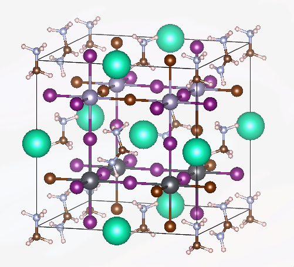
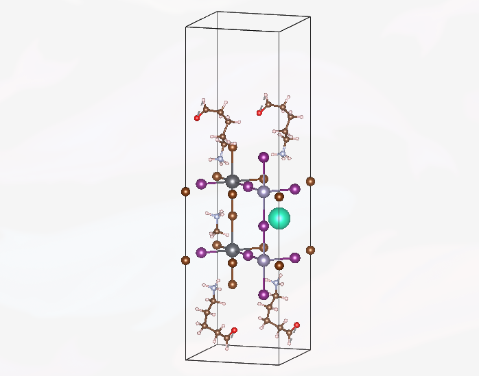

# q2D-Materials: Quasi-2D Perovskite Structure Generation

Another Python package for creating bulk and quasi-2D perovskite structures with support for mixed compositions and molecular spacers.

## Quick Start

### Installation

```bash
# Using Nix (recommended)
nix develop

# Or using pip
pip install ase numpy rdkit
```


**Why Nix?** For computational chemistry and materials science, reproducibility is critical—your results should be independent of your system's Python version or library installations. Nix ensures that everyone working with q2D-Materials uses identical environments with the exact same versions of ASE, RDKit, NumPy, and all dependencies, eliminating the classic "works on my machine" problem. This is especially valuable when sharing structures with collaborators or reproducing published results, as molecular structure generation is sensitive to numerical precision and library versions.

### Basic Usage

```python
from q2D_Materials.core.creator import q2D_creator

# Initialize creator with composition
q2d = q2D_creator(B='Pb', X='I', A='MA', name='MAPbI3') # This return the ase object

# You can use any way to save or modify it with ase:
from ase.io import write
write("MAPbI3", q2d) # Cif, Vasp, etc ...
```

## Examples

### Bulk Perovskite with All Parameters



```python
from q2D_Materials.core.creator import q2D_creator

# Initialize creator
q2d = q2D_creator(B='Pb', X='I', A='MA', name='MAPbI3')

# Create bulk perovskite with all available parameters
bulk = q2d.create_perovskite(
    structure_type='bulk',
    
    # Supercell size (required for mixed compositions, optional for uniform)
    supercell_size=(2, 2, 2),  # (nx, ny, nz)
    
    # Pattern-based mixed compositions (lists cycle if shorter than positions)
    A_ions=['Cs', 'MA', 'FA', 'Cs', 'MA', 'FA', 'Cs', 'MA'],  # 8 positions
    B_ions=['Pb', 'Sn'],  # Alternating pattern
    X_ions=['Br', 'I', 'I'],  # Pattern cycles: Br-I-I-Br-I-I-...
    
    # Double perovskite
    Bp='Sn',  # Second B-site cation (creates alternating B/Bp pattern)
    
    # B-X bond distance
    BX_dist=3.18  # Angstrom (auto-calculated from ionic radii if None)
)

# Save structure
from ase.io import write
write('MAPbI3_bulk_complete.vasp', bulk)
```

### Ruddlesden-Popper (RP) Structure with All Parameters



```python
from q2D_Materials.core.creator import q2D_creator

# Initialize creator
q2d = q2D_creator(B='Pb', X='I', A='MA', name='MAPbI3')

# Create RP structure with all available parameters
rp = q2d.create_perovskite(
    structure_type='RP',
    
    # Spacer molecule (required for 2D)
    spacer_molecule='[NH3+]CCCCC=O',  # SMILES, XYZ file, or Atoms object
    
    # Supercell dimensions (required for 2D)
    supercell=[1, 1, 2],  # [nx, ny, n_layers] where n_layers is octahedral layers
    
    # Pattern-based mixed compositions (optional)
    A_ions=['Cs', 'MA', 'FA', 'MA'],  # Pattern for A-site cations
    B_ions=['Pb', 'Sn'],  # Pattern for B-site cations
    X_ions=['Br', 'I'],  # Pattern for X-site anions
    
    # RP-specific parameters
    spacer_distance=2.0,  # Vacuum gap between opposing spacers (Å)
    
    # Spacer penetration
    penet=0.3,  # Fraction of BX bond that spacer penetrates into layer
    
    # B-X bond distance
    BX_dist=None  # Auto-calculated if None
)

# Save structure
from ase.io import write
write('MAPbI3_RP_complete.vasp', rp)
```

## Supported Structure Types

- **Bulk**: 3D perovskite structures with optional supercells and mixed compositions
- **RP (Ruddlesden-Popper)**: 2D layered structures with organic spacers
- **DJ (Dion-Jacobson)**: 2D layered structures with divalent organic spacers
- **Monolayer**: Single-layer 2D structures with vacuum support adsorbates and rotations.

## Documentation

For a detailed tutorials and detailed parameter reference, see [Examples/Creator.md](Examples/Creator.md).

## License

MIT License
