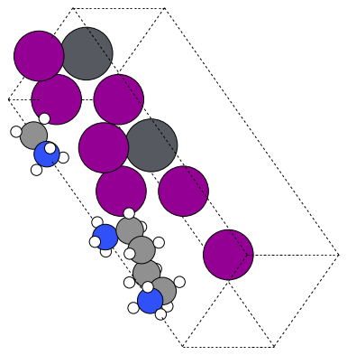

# q2D-Materials: Quasi-2D Perovskite Structure Generation

q2D-Materials is a Python package designed to generate bulk and quasi-2D perovskite structures with support for mixed compositions and molecular alignment. Our vision is to give you complete structural liberty: rather than locking you into hardcoded geometries, we employ a flexible template system based on layer stacking. While we include pre-defined templates for standard phases like Dion-Jacobson or Ruddlesden-Popper, we designed this framework to be hacked. We encourage you to define your own custom templates (see Examples/2_Templates.md) to build exactly the architecture your research demands.

## Quick Start

### Installation

```bash
# Using Nix (recommended)
nix develop

# Or using pip
pip install ase numpy rdkit
```


**Why Nix?** We favor reproducibility: one command, same deps for everyone.

### Basic Usage

```python
from q2D_Materials.core.creator import q2D_creator
from ase.io import write

q2d = q2D_creator()

bulk = q2d.create_perovskite(
    structure_type="bulk",
    A_ions="MA", B_ions="Pb", X_ions="I",
    xy_expansion=(1, 1),          # tiling in xy
    template="cubic",             # geometry choice
)

write("MAPbI3.vasp", bulk, sort=True)
```

## Examples

### Bulk Perovskite with All Parameters

```python
from q2D_Materials.core.creator import q2D_creator
from ase.io import write

q2d = q2D_creator()

bulk = q2d.create_perovskite(
    structure_type="bulk",
    A_ions=['Cs', 'MA', 'FA', 'Cs', 'MA', 'FA', 'Cs', 'MA'],  # pattern cycles over A-sites
    B_ions=['Pb', 'Sn'],                                      # alternating B/B'
    X_ions=['Br', 'I', 'I'],                                  # pattern cycles over X-sites
    xy_expansion=(2, 2),                                      # tiling in-plane
    template="cubic",
    Bp='Sn',                                                  # optional second B-site
    BX_dist=3.18,                                             # override bond length if desired
)

write('MAPbI3_bulk_complete.vasp', bulk, sort=True)
```

### Monolayer

```python
from q2D_Materials.core.creator import q2D_creator
from ase.io import write

q2d = q2D_creator()

mono = q2d.create_perovskite(
    structure_type="monolayer",
    A_ions="MA", B_ions="Pb", X_ions="I",
    xy_expansion=(1, 1),
    template="cubic",
    thickness=2,            # repeats layer_sequence along c
    vacuum=15.0,            # Å of vacuum padding
    spacer=None,            # or a SMILES / Atoms for Ap-sites
    penetration=0.0,        # shift external A/Ap sites along z (fraction of BX)
)

write('MAPbI3_mono.vasp', mono, sort=True)
```

### Twist (two monolayers, one angle)

```python
from q2D_Materials.core.creator import q2D_creator
from ase.io import write

q2d = q2D_creator()

mono1 = q2d.create_perovskite(structure_type="monolayer", A_ions="MA", B_ions="Pb", X_ions="I", xy_expansion=(1,1), template="cubic", vacuum=12.0)
mono2 = q2d.create_perovskite(structure_type="monolayer", A_ions="FA", B_ions="Sn", X_ions="Br", xy_expansion=(1,1), template="cubic", vacuum=12.0)

bilayer = q2d.twist(
    monolayers=[mono1, mono2],
    twist_angles=[(3, 1)],        # (m, n) tuple sets the angle
    interlayer_distances=[8.0],   # Å gap
    vacuum=12.0,
)

write('twisted_bilayer.vasp', bilayer, sort=True)
```

## Supported Structure Types

- **Bulk**: 3D perovskites (tiling via `xy_expansion`, optional `Bp`, Glazer tilts)
- **Monolayer**: 2D slabs with `thickness`, `vacuum`, `spacer`, `penetration`
- **Twist**: Build twisted stacks from monolayers via `twist(...)`

## Ion Recommender

Get recommendations for compatible ions based on database occurrence:

```python
q2d = q2D_creator()

# Get recommendations based on X = Cl
recommendations = q2d.recommend(X='Cl', top_n=5)
print(recommendations['B'])  # Top 5 B-site cations
print(recommendations['A'])  # Top 5 A-site cations
print(recommendations['spacer'])  # Top 5 spacers
```

## Documentation

The `Examples/` folder holds short, focused guides. Regenerate the visuals anytime with:

```bash
nix develop -c python3 Examples/plot.py
```

- `Examples/1_Creator.md`: Separates template geometry from chemistry inputs; shows pattern cycling and how `layer_sequence` reuses one template.
- `Examples/2_Templates.md`: Builds simple cubic and Jagodzinski templates, keeping layer swaps and stack strings front and center.
- `Examples/3_Glazer.md`: Explains tilts with angle/pattern pairs and shows a top-down comparison of untilted vs rotated octahedra.
- `Examples/4_Jagodzinski.md`: Walks through Jagodzinski stacking strings, the helper that expands `c/h` codes, and how it maps to `layer_sequence`.
- `Examples/5_Monolayer.md`: Highlights what changes in 2D (`structure_type="monolayer"`), vacuum padding, thickness repeats, spacers, and penetration.
- `Examples/6_Twist.md`: Gives a minimal twist workflow, notes how `(m, n)` sets the commensurate angle, and offers practical ranges.
- `Examples/Twist.MD`: Longer twist reference with angle table, spacer examples, and parameter notes.

### Example gallery:
There is some examples of what its possible to do with q2D-Materials.

**Glazer tilt (top-down)**  
 

**Monolayers**  


**Dion–Jacobson spacer**  


**Twisted bilayer**  
  

### Quick start (recap)

```bash
# enter the reproducible env
nix develop

# make a simple cubic bulk and save it
python3 - <<'PY'
from q2D_Materials.core.creator import q2D_creator
from ase.io import write

q2d = q2D_creator()
bulk = q2d.create_perovskite(structure_type="bulk", A_ions="MA", B_ions="Pb", X_ions="I", xy_expansion=(1, 1), template="cubic")
write("MAPbI3.vasp", bulk, sort=True)
PY
```

## License

MIT License